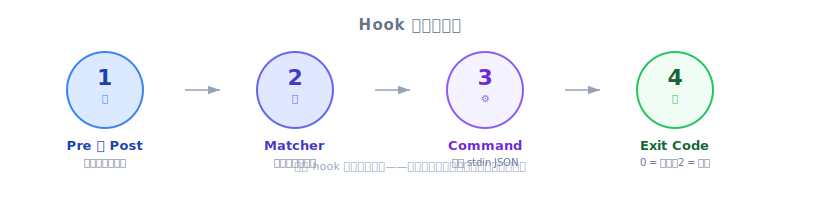

# 定義 Hooks — PM 觀點

| 項目 | 細節 |
|------|---------|
| 考試範圍 | D3 — Claude Code Configuration & Workflows（佔考試 20%） |
| Task Statements | 3.2 (custom commands & hooks), 1.5 (Agent SDK hooks) |
| 課程來源 | claude-code-in-action / 05-hooks / Lesson 15 |

---

## 重點摘要

定義一個 hook 遵循四個步驟，就像在工廠設置品質檢查站：（1）決定在工作完成*前*還是*後*檢查，（2）選擇要監控哪條生產線，（3）撰寫檢查程序，（4）決定批准還是退回。PM 必須理解這個流程，才能撰寫正確的驗收標準，並與工程師溝通什麼可以被*保證*、什麼只是*盡力而為*。

---

## PM 為何需要理解 Hook 定義

當你撰寫 PRD 時，你在指定需求。有些需求*必須* 100% 達成（合規、安全），有些則是*盡力而為*（語氣、格式）。理解四步驟 hook 定義流程幫助你：

1. **指定執行機制** — 不只說「什麼」，還說「怎麼做」
2. **評估工程量** — hook 需要寫腳本，不只是改 prompt
3. **設定合理期望** — hook 是確定性的；prompt 是機率性的

---

## 心智模型：工廠品質檢查站

*圖：定義 Hook 的四步驟流程 — Event → Matcher → Command → Exit Code。*

把 Claude Code 想像成工廠生產線。工具是機器（鑽孔、焊接、噴漆）。Hook 是你安裝的品質檢查站：

| 步驟 | 工廠類比 | Hook 定義 |
|------|----------------|-----------------|
| 1. 前還是後？ | 鑽孔前檢查原料，還是焊接後檢查成品？ | PreToolUse 在動作前封鎖；PostToolUse 在動作後檢查 |
| 2. 哪條線？ | 監控噴漆室和焊接站 | `matcher`：`"Read|Grep"` 選擇要監控的工具 |
| 3. 檢查程序 | 品管員依照檢查清單 | Command 腳本讀取 tool call 資料（JSON）並套用規則 |
| 4. 通過或退回？ | 綠燈（繼續）或紅燈（停線） | Exit code 0（允許）或 2（封鎖） |

> 💡 **PM 決策框架**
>
> 撰寫驗收標準時問自己：「這是綠燈/紅燈需求（hook），還是指導方針（prompt）？」
> - **紅燈**：「系統必須阻止讀取憑證」→ Hook
> - **指導方針**：「系統應以友善語氣回應」→ Prompt

---

## 以商業語言描述四步驟

### 第一步：前還是後？

| 需求類型 | Hook 類型 | 商業範例 |
|-----------------|-----------|-----------------|
| 預防 / 合規 | **PreToolUse** | 未經主管批准，封鎖超過 $500 的退款 |
| 記錄 / 品質檢查 | **PostToolUse** | 記錄每次客戶互動到 CRM |
| 自動修正 | **PostToolUse** | 每次文件編輯後執行拼字檢查 |

> ⚠️ **PM 必知**
>
> 如果你的需求寫「絕不可以」或「必須永遠防止」，在驗收標準中指定 PreToolUse。PostToolUse 無法防止 — 它只在事後反應。

### 第二步：監控哪些操作？

`matcher` 欄位選擇哪些 AI 工具會觸發檢查站。常見情境：

| PM 需求 | 工程師翻譯為 |
|---------------|----------------------|
| 「Claude 不可讀取憑證檔」 | `matcher: "Read|Grep"` |
| 「自動格式化 Claude 寫的每個檔案」 | `matcher: "Write|Edit|MultiEdit"` |
| 「記錄所有 shell 命令」 | `matcher: "Bash"` |
| 「監控所有操作」 | `matcher: ".*"` |

> 💡 **PM 常見疏忽**
>
> PM 經常忘記 `Grep`（搜尋）也能暴露檔案內容，不只 `Read`。務必問工程師：「還有哪些工具可以存取這些資料？」

### 第三步：檢查邏輯

Hook command 收到的是 Claude 要做什麼的詳細資訊 — 不只是「Claude 想讀檔案」，而是具體的「Claude 想用 Read 工具讀取 `/src/config/.env`」。

這種精細度意味著 hook 可以根據檔案路徑、命令內容或任何其他參數做出非常精確的判斷。

### 第四步：裁決

| 裁決 | Exit Code | 接下來發生什麼 |
|---------|-----------|-------------------|
| 批准 | 0 | Tool call 正常執行 |
| 退回 | 2 | Tool call 被封鎖；Claude 收到拒絕原因並調整方法 |

拒絕回饋創造了自我修正迴圈 — Claude 不是靜默失敗；它理解*原因*並嘗試替代方法。

---

## 講師洞察（來自影片）

PM 應注意的講師重點：

1. **工具發現是動態的** — 加入 MCP server 後可用工具會改變。工程師可以問 Claude「列出你可用的工具」來發現什麼可以被監控。
2. **Matcher 使用類 regex 語法** — Pipe 符號 `|` 代表 OR。這是技術細節，但 PM 應知道一個 hook 可以監控多個工具。
3. **stderr 回饋很關鍵** — 當 hook 封鎖動作時，錯誤訊息直接發送給 Claude。好的錯誤訊息幫助 Claude 找替代方案；差的訊息造成困惑。

---

## 反模式（考試常考）

| ❌ 錯誤做法 | ✅ 正確做法 | 為什麼 |
|-------------------|---------------------|-----|
| PRD 寫「必須防止 X」但不指定執行機制 | 驗收標準中指定「透過 PreToolUse hook 執行」 | 不指定的話，工程師可能用 prompt 解法 |
| 假設 PostToolUse 能防止動作 | 預防需求用 PreToolUse | PostToolUse 在動作之後才運行 — 太晚了 |
| 多個工具能做同樣的事卻只監控一個 | 問工程師哪些工具能存取資料 | Grep 和 Read 一樣能讀檔案內容 |
| 略過拒絕訊息 | hook 規格中要求清楚的回饋訊息 | Claude 需要回饋才能自我修正 |

---

## 練習題

### Q1：客戶支援情境（S1）

你正在為 AI 客服代理撰寫 PRD。其中一項需求：「代理絕不可存取儲存在 `.credentials` 目錄的客戶付款資料。」工程師提議將此指令加到 system prompt。你應該建議什麼？

- A. 接受工程師提案 — prompt 指令足以做存取控制
- B. 要求 PreToolUse hook，封鎖對 `.credentials` 路徑的 Read 和 Grep 操作
- C. 要求 PostToolUse hook，記錄 Claude 存取 `.credentials` 檔案的時間
- D. 將限制加到 CLAUDE.md 並設為團隊共用專案設定

答案

**B** — 「絕不可存取」是合規需求，需要確定性執行。PreToolUse hook 在動作發生前封鎖。Read 和 Grep 都必須涵蓋，因為兩者都能暴露檔案內容。

- A 是 prompt-based，有非零失敗率 — 合規需求不可接受
- C 是 PostToolUse — 太晚了，檔案已被讀取
- D 仍是 prompt 指令，不是程式化執行

**PM 重點**：當你在 PRD 寫「絕不可」，你在指定確定性需求。執行機制必須相符 — 用 hook，不是 prompt。

### Q2：開發者生產力情境（S4）

你的團隊希望 Claude Code 在每次檔案編輯後自動執行程式碼格式化。格式化不應封鎖 Claude 的工作 — 只是清理格式。你在需求中應指定什麼方法？

- A. PreToolUse hook 搭配 Write|Edit，在 Claude 寫檔前執行格式化
- B. PostToolUse hook 搭配 Write|Edit|MultiEdit，Claude 編輯後執行格式化，exit code 0
- C. 在 system prompt 加入「永遠格式化你的程式碼」
- D. PostToolUse hook 搭配 Read，Claude 讀取檔案後執行格式化

答案

**B** — 格式化必須在檔案被編輯後進行（PostToolUse）。Matcher 應涵蓋所有編輯操作（Write、Edit、MultiEdit）。Exit code 0 代表「正常繼續」— 不封鎖。

- A 在編輯前執行 — 還沒有東西可以格式化
- C 是 prompt-based，無法保證一致的格式化
- D 指向錯誤的工具 — Read 不修改檔案

**PM 重點**：「每次編輯後自動」+「不應封鎖」= PostToolUse 搭配 exit code 0。這是品質增強，不是合規閘門。

### Q3：程式碼生成情境（S2）

團隊用 Claude Code 產生 API endpoint 程式碼。他們希望確保所有產生的檔案遵循專案命名慣例（`snake_case`）。若檔案不符合慣例，生成應被封鎖。你應該要求什麼 hook 配置？

- A. PostToolUse hook 搭配 Write，檢查命名並記錄警告
- B. PreToolUse hook 搭配 Write，驗證檔名並在不合規時以 exit code 2 封鎖
- C. 在 CLAUDE.md 加入命名慣例範例
- D. PostToolUse hook 搭配 Write，建立後重新命名檔案

答案

**B** — 「應被封鎖」代表預防，需要 PreToolUse。Hook 在 Write 操作執行前檢查 tool input 中的檔名。

- A 是 PostToolUse — 檔案已用錯誤名稱寫入
- C 是 prompt-based 且為機率性的
- D 是事後修補 — 比預防更複雜且更容易出錯

**PM 重點**：「不合規則封鎖」是關鍵句。封鎖需要 PreToolUse。若需求是「不合規則修正」，PostToolUse 才適合。

