# Defining Hooks — 定義 Hooks — 影片逐幀學習指南

| 項目 | 內容 |
|------|------|
| 課程 | claude-code-in-action / 05-hooks / Lesson 15 |
| 影片 | Defining Hooks |
| 字幕數 | 48 段 |
| 格式 | 每段字幕一張截圖 + 雙語字幕（英/中） |

---

### [00:00:00] 第 1 段

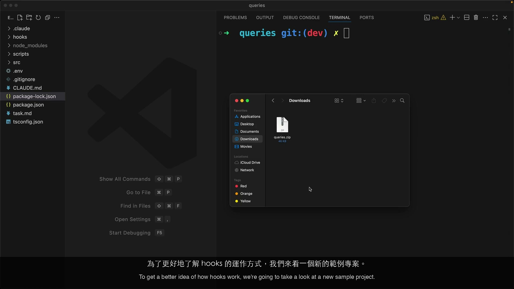

> **EN:** To get a better idea of how hooks work, we're going to take a look at a new sample project.
>
> **ZH:** 為了更好地了解 hooks 的運作方式，我們來看一個新的範例專案。

---

### [00:00:04] 第 2 段

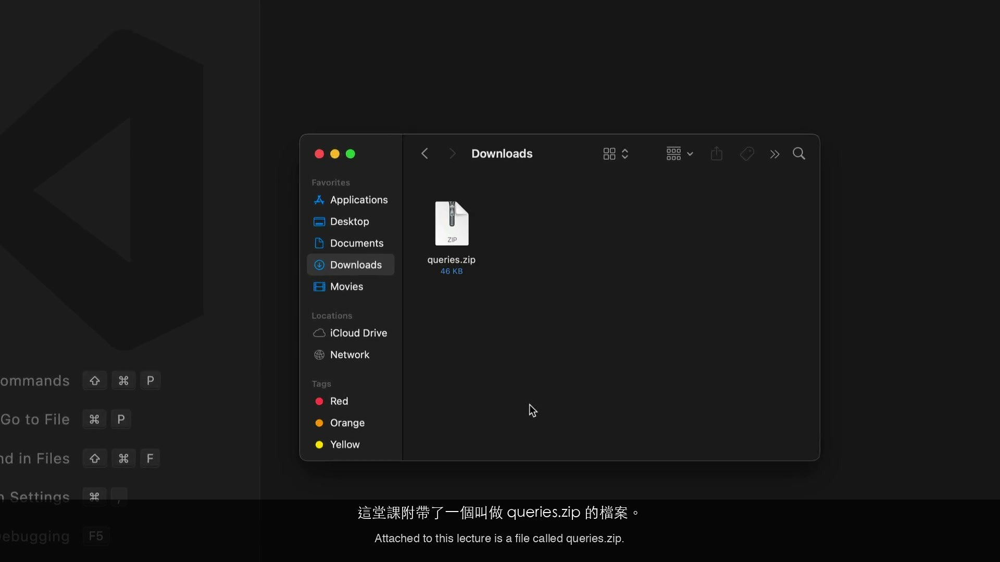

> **EN:** Attached to this lecture is a file called queries.zip.
>
> **ZH:** 這堂課附帶了一個叫做 queries.zip 的檔案。

---

### [00:00:07] 第 3 段

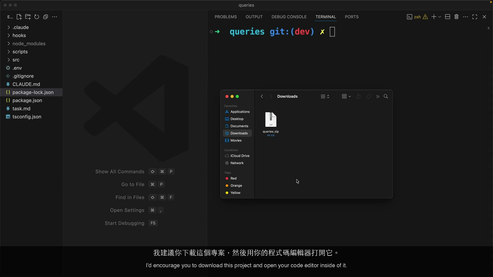

> **EN:** I'd encourage you to download this project and open your code editor inside of it.
>
> **ZH:** 我建議你下載這個專案，然後用你的程式碼編輯器打開它。

---

### [00:00:11] 第 4 段

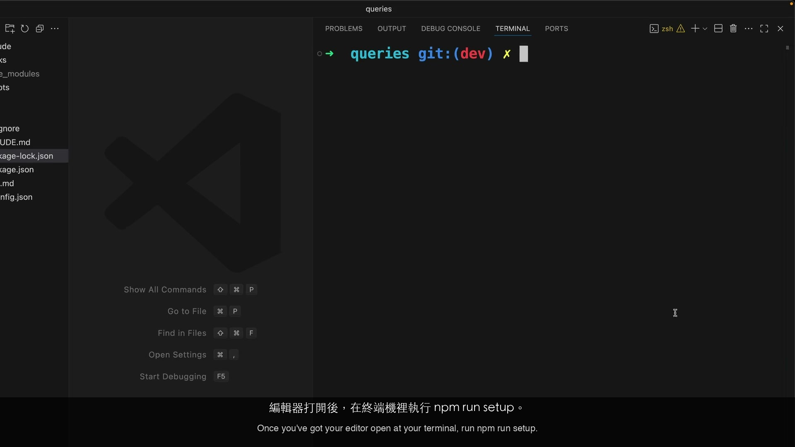

> **EN:** Once you've got your editor open at your terminal, run npm run setup.
>
> **ZH:** 編輯器打開後，在終端機裡執行 npm run setup。

---

### [00:00:16] 第 5 段

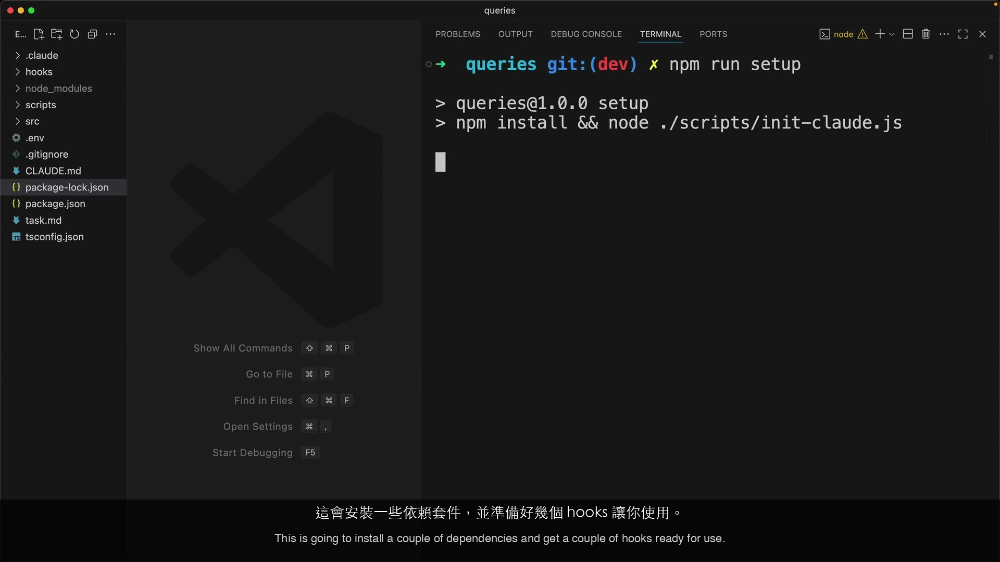

> **EN:** This is going to install a couple of dependencies and get a couple of hooks ready for use.
>
> **ZH:** 這會安裝一些依賴套件，並準備好幾個 hooks 讓你使用。

---

### [00:00:21] 第 6 段

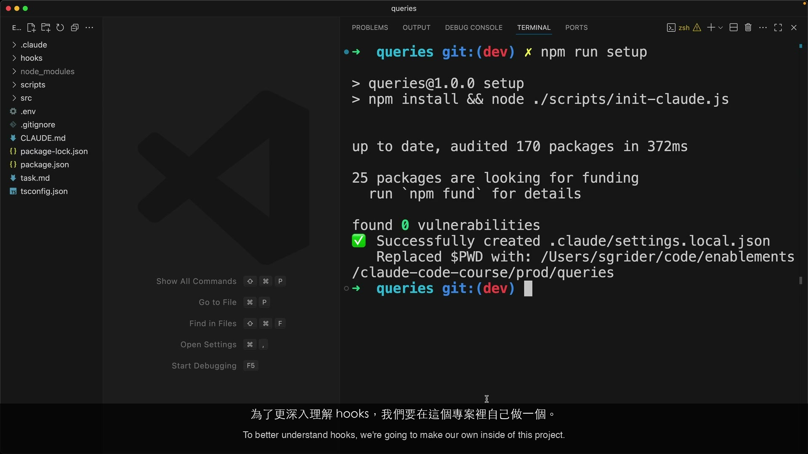

> **EN:** To better understand hooks, we're going to make our own inside of this project.
>
> **ZH:** 為了更深入理解 hooks，我們要在這個專案裡自己做一個。

---

### [00:00:24] 第 7 段

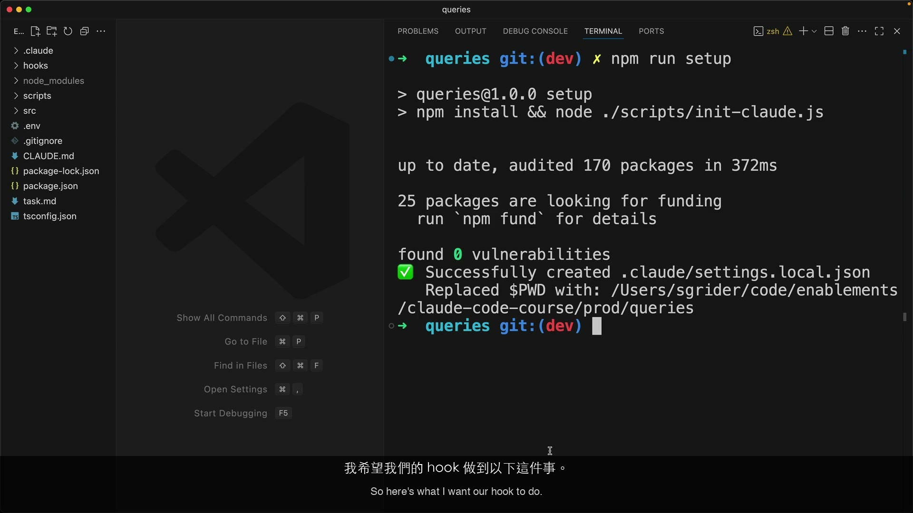

> **EN:** So here's what I want our hook to do.
>
> **ZH:** 我希望我們的 hook 做到以下這件事。

---

### [00:00:26] 第 8 段

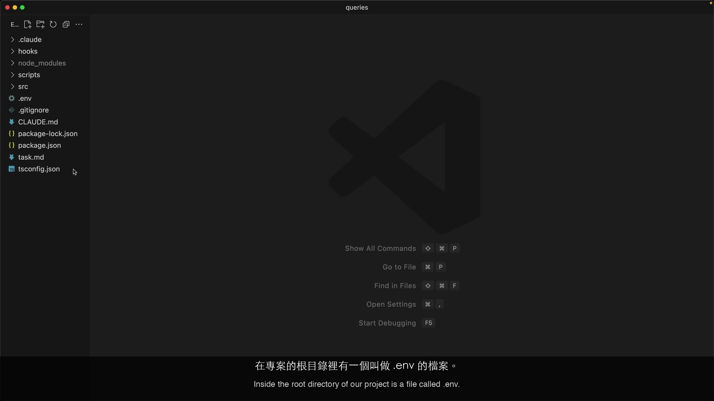

> **EN:** Inside the root directory of our project is a file called .env.
>
> **ZH:** 在專案的根目錄裡有一個叫做 .env 的檔案。

---

### [00:00:30] 第 9 段

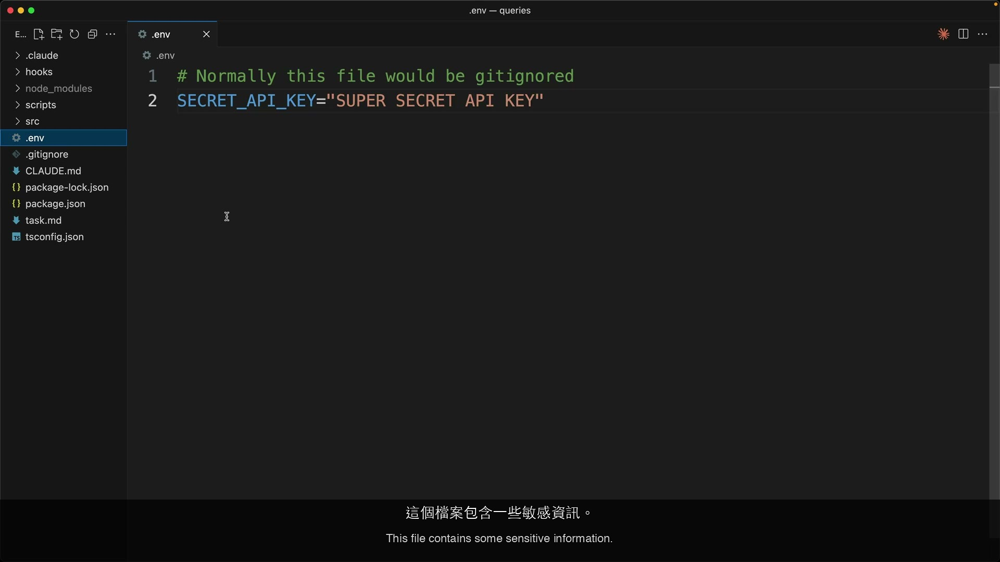

> **EN:** This file contains some sensitive information.
>
> **ZH:** 這個檔案包含一些敏感資訊。

---

### [00:00:34] 第 10 段

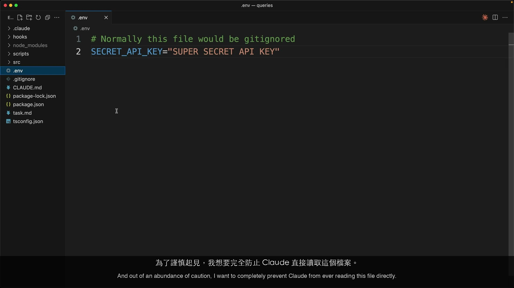

> **EN:** And out of an abundance of caution, I want to completely prevent Claude from ever reading this file directly.
>
> **ZH:** 為了謹慎起見，我想要完全防止 Claude 直接讀取這個檔案。

---

### [00:00:40] 第 11 段

> **EN:** Let me show you a couple of diagrams to help you understand how we're going to put this hook together.
>
> **ZH:** 讓我用幾張圖來幫助你理解我們要怎麼組合這個 hook。

---

### [00:00:44] 第 12 段

> **EN:** Step one is to decide on whether we need a pre-tool use or a post-tool use hook.
>
> **ZH:** 第一步是決定我們需要 pre-tool use 還是 post-tool use hook。

---

### [00:00:49] 第 13 段

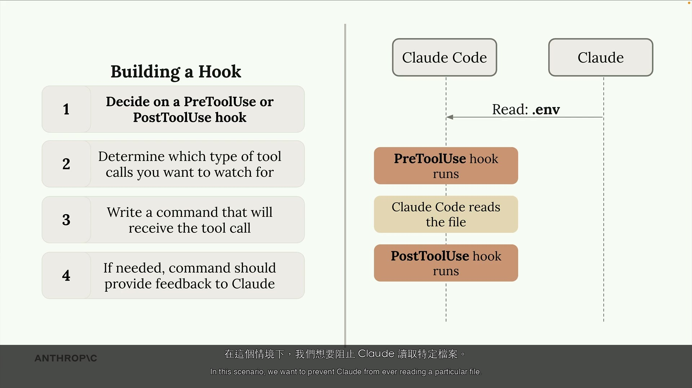

> **EN:** In this scenario, we want to prevent Claude from ever reading a particular file.
>
> **ZH:** 在這個情境下，我們想要阻止 Claude 讀取特定檔案。

---

### [00:00:53] 第 14 段

> **EN:** If we make a post-tool use block, then we will have executed our hook or ran our command after Claude already read the file.
>
> **ZH:** 如果我們用 post-tool use 區塊，那我們的 hook 會在 Claude 已經讀完檔案之後才執行。

---

### [00:01:01] 第 15 段

> **EN:** So in this case, we definitely need a pre-tool use hook to make sure that we can prevent the read operation from occurring.
>
> **ZH:** 所以在這個情況下，我們絕對需要一個 pre-tool use hook，確保我們能在讀取操作發生之前就把它擋下來。

---

### [00:01:07] 第 16 段

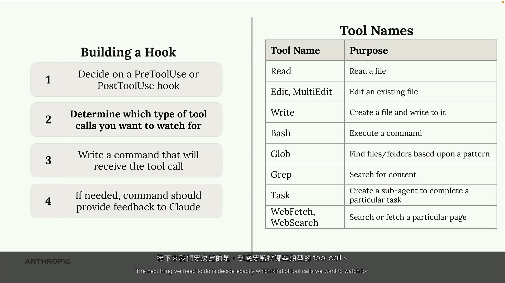

> **EN:** The next thing we need to do is decide exactly which kind of tool calls we want to watch for.
>
> **ZH:** 接下來我們要決定的是，到底要監控哪些類型的 tool call。

---

### [00:01:12] 第 17 段

> **EN:** I've got a list of all the different current tool names on the right-hand side of this diagram.
>
> **ZH:** 在這張圖的右邊，我列出了目前所有不同的 tool 名稱。

---

### [00:01:16] 第 18 段

> **EN:** Now, memorizing all the different tool names that are included inside of Claude code can be really challenging,
>
> **ZH:** 要背下 Claude Code 裡所有不同的 tool 名稱其實蠻有挑戰性的，

---

### [00:01:22] 第 19 段

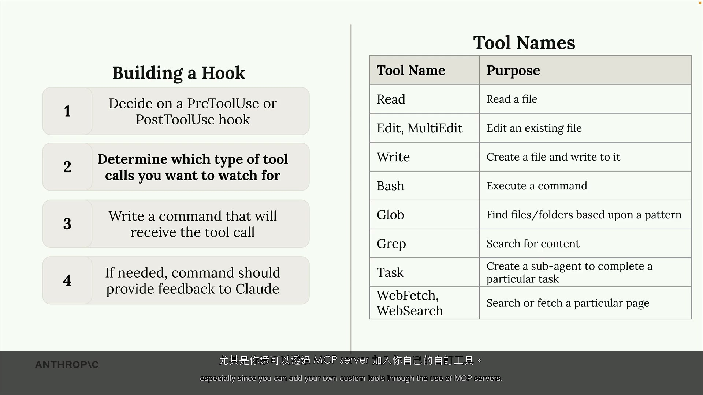

> **EN:** especially since you can add your own custom tools through the use of MCP servers.
>
> **ZH:** 尤其是你還可以透過 MCP server 加入你自己的自訂工具。

---

### [00:01:27] 第 20 段

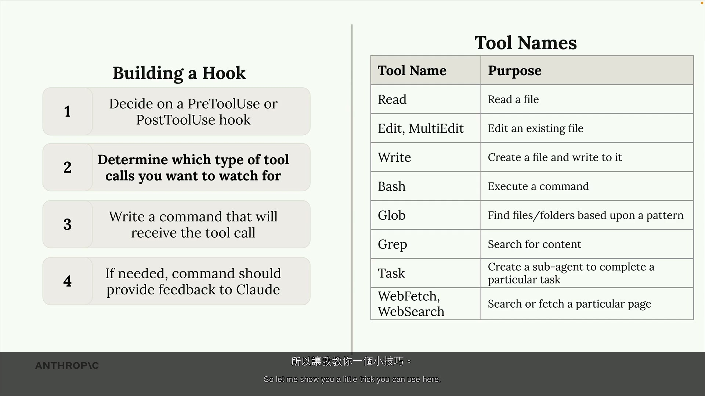

> **EN:** So let me show you a little trick you can use here.
>
> **ZH:** 所以讓我教你一個小技巧。

---

### [00:01:29] 第 21 段

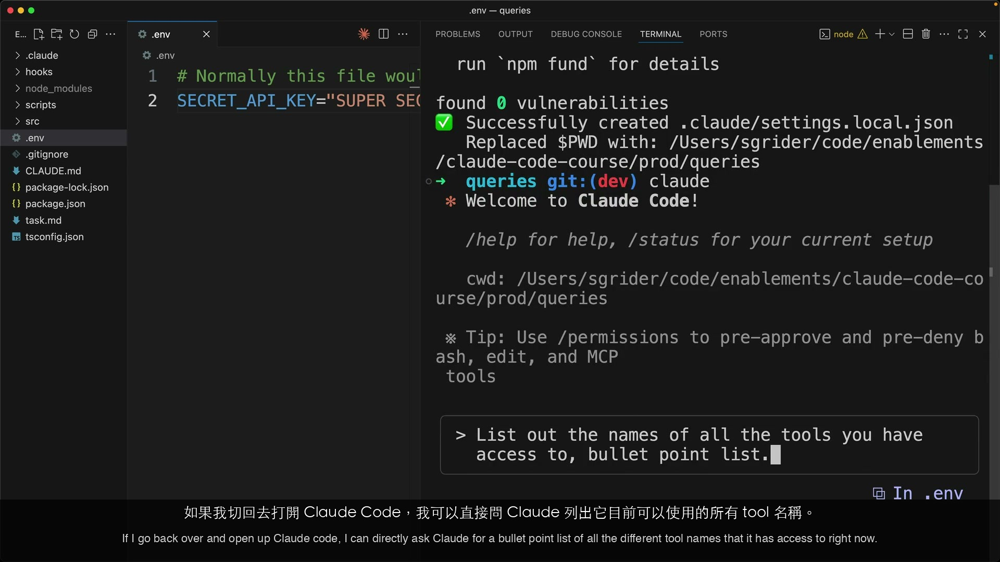

> **EN:** If I go back over and open up Claude code, I can directly ask Claude for a bullet point list of all the different tool names that it has access to right now.
>
> **ZH:** 如果我切回去打開 Claude Code，我可以直接問 Claude 列出它目前可以使用的所有 tool 名稱。

---

### [00:01:38] 第 22 段

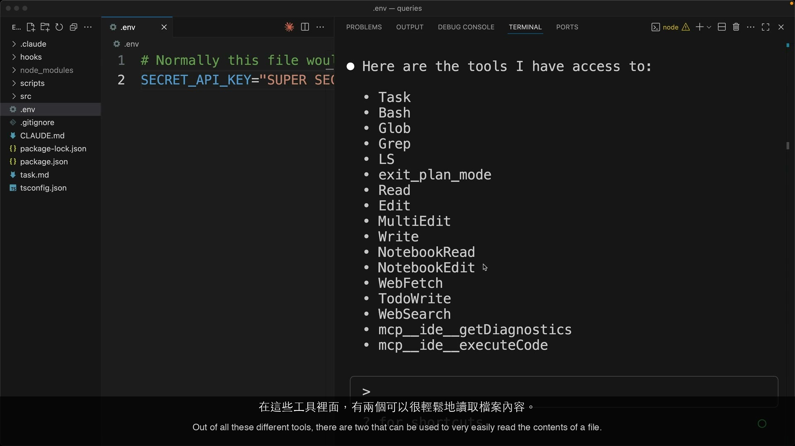

> **EN:** Out of all these different tools, there are two that can be used to very easily read the contents of a file.
>
> **ZH:** 在這些工具裡面，有兩個可以很輕鬆地讀取檔案內容。

---

### [00:01:43] 第 23 段

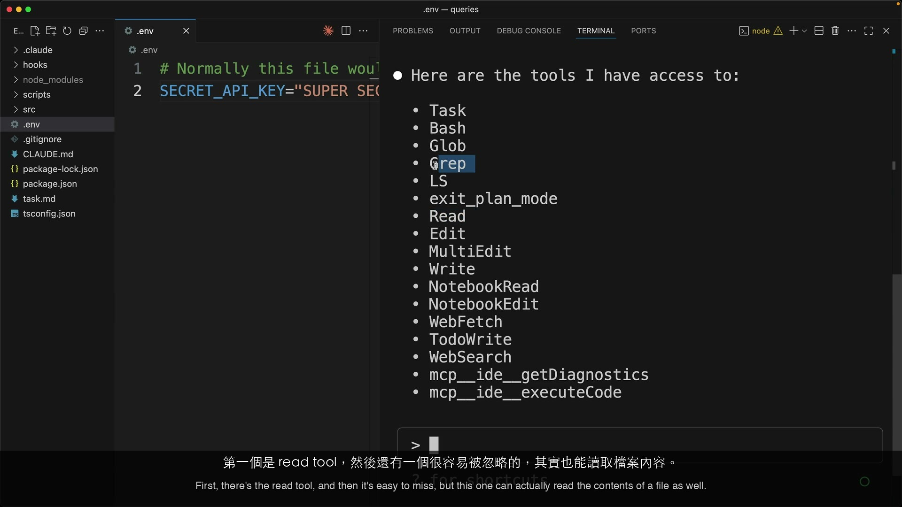

> **EN:** First, there's the read tool, and then it's easy to miss, but this one can actually read the contents of a file as well.
>
> **ZH:** 第一個是 read tool，然後還有一個很容易被忽略的，其實也能讀取檔案內容。

---

### [00:01:48] 第 24 段

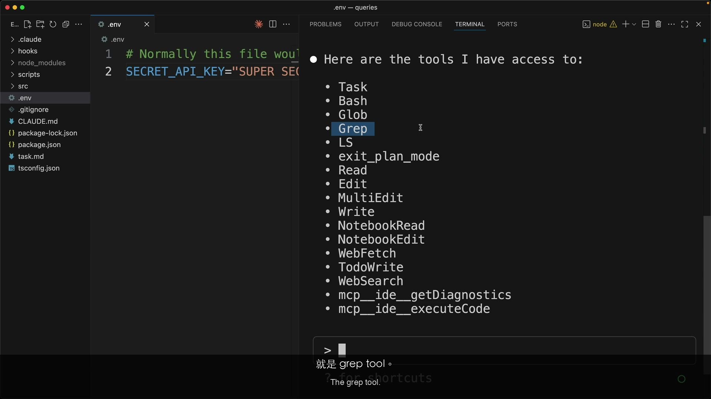

> **EN:** The grep tool.
>
> **ZH:** 就是 grep tool。

---

### [00:01:49] 第 25 段

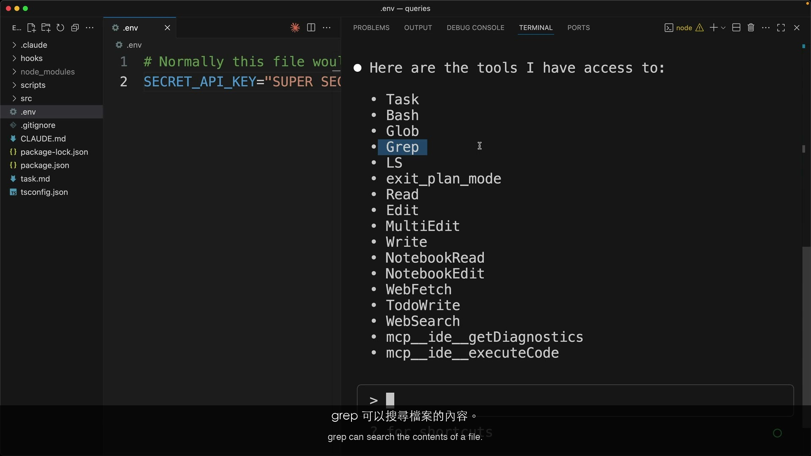

> **EN:** grep can search the contents of a file.
>
> **ZH:** grep 可以搜尋檔案的內容。

---

### [00:01:52] 第 26 段

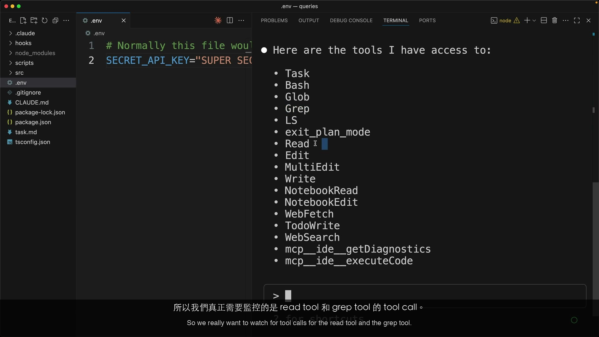

> **EN:** So we really want to watch for tool calls for the read tool and the grep tool.
>
> **ZH:** 所以我們真正需要監控的是 read tool 和 grep tool 的 tool call。

---

### [00:01:57] 第 27 段

> **EN:** Next up, we need to write out a command that is going to receive some information about the tool call that Claude wants to make.
>
> **ZH:** 接下來，我們需要寫一個 command，它會接收 Claude 想要執行的 tool call 的相關資訊。

---

### [00:02:02] 第 28 段

> **EN:** Here's how that part works.
>
> **ZH:** 這部分的運作方式是這樣的。

---

### [00:02:04] 第 29 段

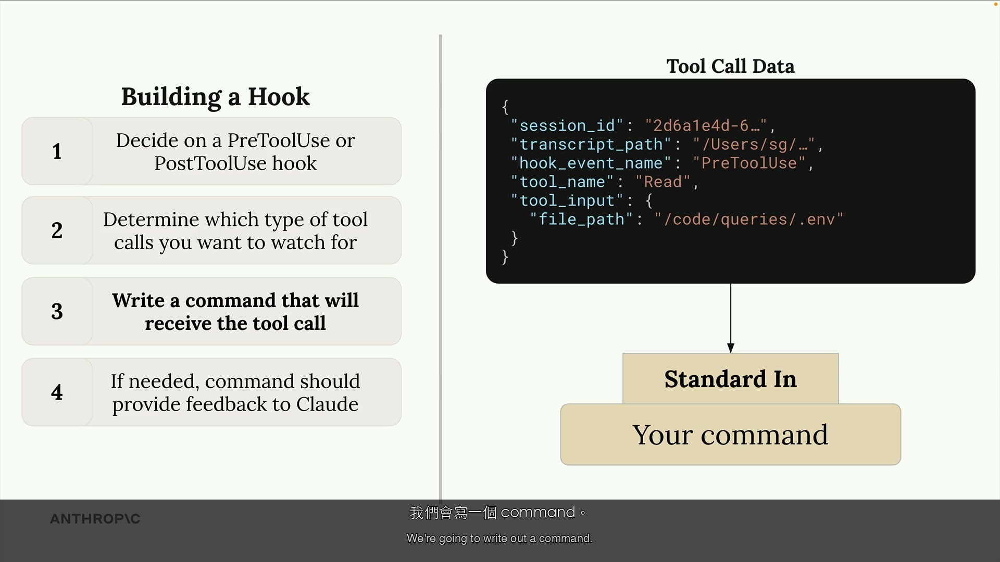

> **EN:** We're going to write out a command.
>
> **ZH:** 我們會寫一個 command。

---

### [00:02:06] 第 30 段

> **EN:** Claude is going to automatically execute it.
>
> **ZH:** Claude 會自動執行它。

---

### [00:02:07] 第 31 段

> **EN:** And then on standard in to that process, Claude is going to feed in some tool called data as JSON.
>
> **ZH:** 然後透過 standard in，Claude 會把一些 tool call 的資料以 JSON 格式餵進去。

---

### [00:02:14] 第 32 段

> **EN:** I've got an example of some tool called data on the top right-hand side.
>
> **ZH:** 在右上角我放了一個 tool call 資料的範例。

---

### [00:02:17] 第 33 段

> **EN:** So it's going to be a big JSON object that has some information about the tool name and the input to that tool.
>
> **ZH:** 它會是一個大的 JSON 物件，包含 tool 名稱和該 tool 的輸入參數。

---

### [00:02:23] 第 34 段

> **EN:** In this case, the tool name is read.
>
> **ZH:** 在這個例子裡，tool 名稱是 read。

---

### [00:02:25] 第 35 段

> **EN:** So Claude is trying to call the read tool, and it might be trying to read specifically a file path pointing to that .env file.
>
> **ZH:** 也就是說 Claude 正在嘗試呼叫 read tool，而且它可能正試圖讀取一個指向那個 .env 檔案的路徑。

---

### [00:02:32] 第 36 段

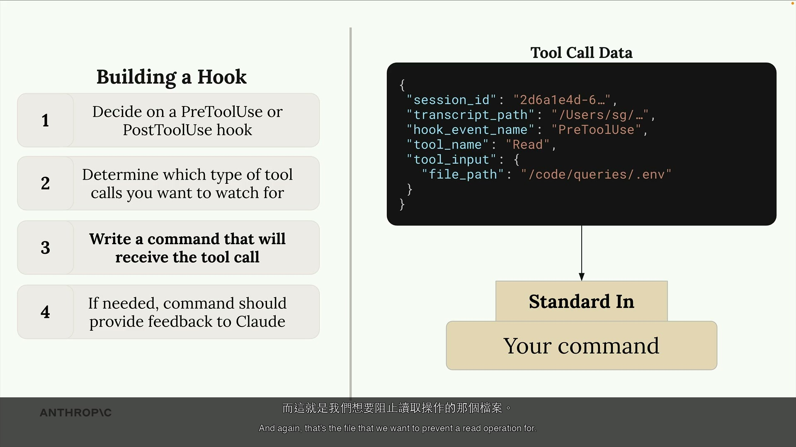

> **EN:** And again, that's the file that we want to prevent a read operation for.
>
> **ZH:** 而這就是我們想要阻止讀取操作的那個檔案。

---

### [00:02:35] 第 37 段

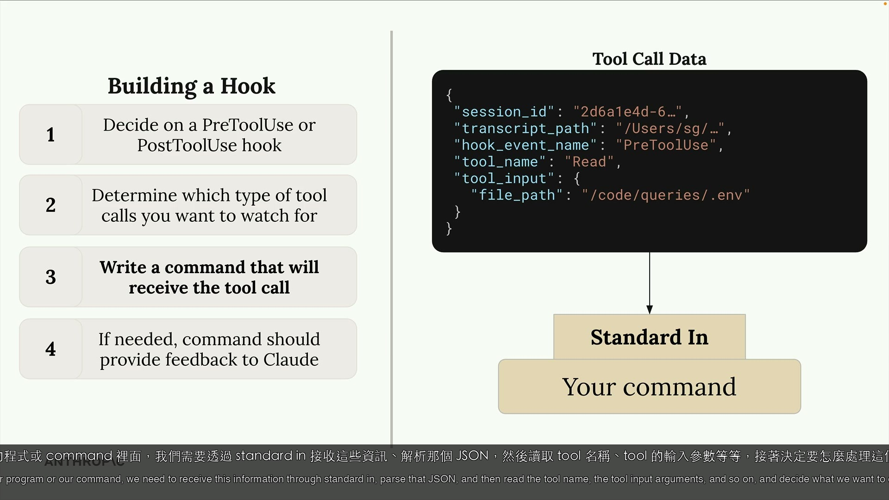

> **EN:** So then inside of our program or our command, we need to receive this information through standard in, parse that JSON, and then read the tool name, the tool input arguments, and so on, and decide what we want to do with this tool call.
>
> **ZH:** 所以在我們的程式或 command 裡面，我們需要透過 standard in 接收這些資訊、解析那個 JSON，然後讀取 tool 名稱、tool 的輸入參數等等，接著決定要怎麼處理這個 tool call。

---

### [00:02:48] 第 38 段

> **EN:** Then on to step four.
>
> **ZH:** 然後進入第四步。

---

### [00:02:50] 第 39 段

> **EN:** In step four, after our command receives that proposed tool called data, we're then going to exit.
>
> **ZH:** 在第四步，當我們的 command 接收到提議的 tool call 資料後，我們就會 exit。

---

### [00:02:56] 第 40 段

> **EN:** And our exit code is going to provide a signal back to Claude code.
>
> **ZH:** 而我們的 exit code 會向 Claude Code 回傳一個訊號。

---

### [00:03:00] 第 41 段

> **EN:** An exit code of zero means everything is okay, and we want to allow this tool call to occur.
>
> **ZH:** exit code 為零代表一切正常，我們允許這個 tool call 執行。

---

### [00:03:05] 第 42 段

> **EN:** An exit code of two, however, is assigned to Claude code that we want to block this tool call.
>
> **ZH:** 但 exit code 為二，則是告訴 Claude Code 我們要封鎖這個 tool call。

---

### [00:03:10] 第 43 段

> **EN:** And that specifically only applies for the pre-tool use hooks, because remember, only in a pre-tool use hook can we actually block a tool call.
>
> **ZH:** 這專門只適用於 pre-tool use hooks，因為記住，只有在 pre-tool use hook 裡我們才能真正封鎖一個 tool call。

---

### [00:03:18] 第 44 段

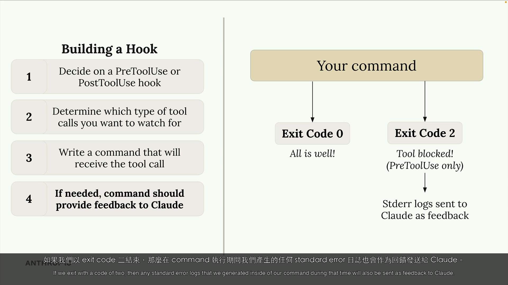

> **EN:** If we exit with a code of two, then any standard error logs that we generated inside of our command during that time will also be sent as feedback to Claude.
>
> **ZH:** 如果我們以 exit code 二結束，那麼在 command 執行期間我們產生的任何 standard error 日誌也會作為回饋發送給 Claude。

---

### [00:03:27] 第 45 段

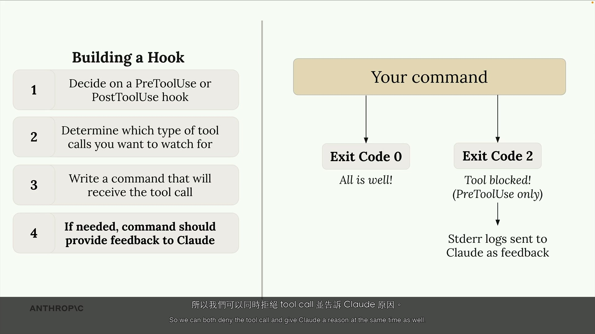

> **EN:** So we can both deny the tool call and give Claude a reason at the same time as well.
>
> **ZH:** 所以我們可以同時拒絕 tool call 並告訴 Claude 原因。

---

### [00:03:32] 第 46 段

> **EN:** So that's the entire process.
>
> **ZH:** 以上就是整個流程。

---

### [00:03:33] 第 47 段

> **EN:** And I know, once again, there's a lot of stuff going on here.
>
> **ZH:** 我知道，這裡又有很多東西要消化。

---

### [00:03:36] 第 48 段

> **EN:** So let's go through this entire process of wiring everything up needed for this hook inside of our project to understand how all these steps come together.
>
> **ZH:** 所以讓我們在專案裡從頭到尾走一遍這個 hook 的完整接線過程，來理解所有步驟是怎麼串在一起的。

---
