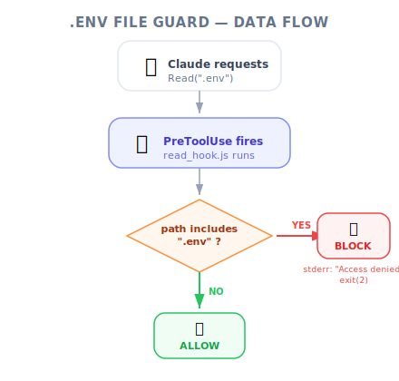
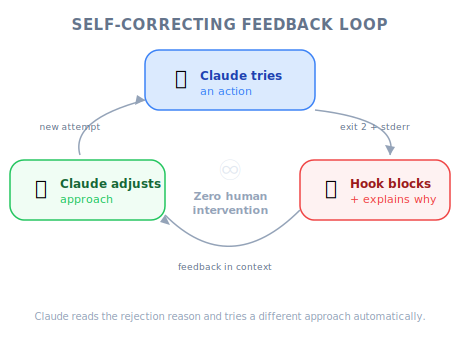

# Implementing a Hook — PM Perspective

| Item | Details |
|------|---------|
| Exam Coverage | D3 — Claude Code Configuration & Workflows (20% of exam) |
| Task Statements | 3.2 (custom commands & hooks), 1.5 (Agent SDK hooks) |
| Course Source | claude-code-in-action / 05-hooks / Lesson 16 |

---

## TL;DR

This lesson demonstrates a complete, working hook implementation — from configuration to testing. PMs do not need to write hooks, but understanding the implementation flow helps you write better acceptance criteria, estimate engineering effort, and verify that security requirements are properly enforced.

---

*Figure: .env file guard data flow — PreToolUse intercepts Read calls and blocks access to sensitive files.*

## The Implementation Flow (No Code Required)

Think of implementing a hook like setting up a new security camera system in a building:

| Step | Building Security | Hook Implementation |
|------|------------------|---------------------|
| 1. Register the camera | Add it to the security control panel | Add hook entry in `settings.local.json` |
| 2. Point it at the right door | Set the camera angle | Set `matcher` to target specific tools |
| 3. Program the alert rules | "Alert if someone enters after 10pm" | Write script: "Block if file path contains .env" |
| 4. Test the system | Walk through the door to verify | Ask Claude to read .env — verify it is blocked |
| 5. Activate | Turn on the system | Restart Claude Code |

> 💡 **PM Insight**
>
> The most important detail: hooks require a **restart** to take effect. This means deploying a new hook to a team is not instantaneous — factor this into your rollout plan.

---

## What PMs Should Verify

When your engineer implements a hook, here is a checklist for your acceptance criteria:

### 1. Coverage Check
- **Does the hook cover all relevant tools?** For file access protection, both `Read` and `Grep` must be covered. Ask: "Can Claude access this data through any other tool?"

### 2. Feedback Quality
- **Does the blocking message explain why?** Claude receives the stderr message. A good message ("You cannot read .env — it contains credentials") helps Claude try alternatives. A bad message ("Blocked") causes confusion.

### 3. Testing Completeness
- **Positive test**: The hook blocks the restricted action
- **Negative test**: The hook allows normal operations to proceed
- **Edge cases**: Absolute paths, relative paths, similar file names

### 4. Settings Level
- **Personal hooks** → `settings.local.json` (not in git)
- **Team hooks** → `settings.json` (committed to git)
- Compliance hooks should always be at team level

> ⚠️ **PM Risk Alert**
>
> If a security hook is in `settings.local.json`, each developer must configure it individually. For compliance requirements, insist on `settings.json` (team-shared).

---

*Figure: Self-correcting feedback loop — Claude tries, hook blocks with explanation, Claude adjusts automatically.*

## The Self-Correcting Feedback Loop

One of the most powerful aspects of hooks for PMs to understand:

1. Claude tries to read `.env`
2. Hook blocks and sends feedback: "You cannot read the .env file"
3. Claude acknowledges: "I was prevented by a read hook from accessing that file"
4. Claude adjusts its approach — no human intervention needed

This means hooks create **autonomous compliance** — the AI agent self-corrects without needing a human to intervene. This is a significant product advantage over prompt-based approaches.

---

## Engineering Effort Estimation

For PMs planning sprints:

| Hook Complexity | Effort | Example |
|----------------|--------|---------|
| Simple file guard | 1-2 hours | Block reading `.env`, `.credentials` |
| Pattern-based blocker | 2-4 hours | Block Bash commands matching a blocklist |
| Conditional logic | 4-8 hours | Block refunds > $500, allow if manager-approved |
| Multi-tool coordination | 1-2 days | Enforce workflow ordering across multiple tools |

---

## Anti-Patterns (Exam Frequently Tested)

| ❌ Wrong Approach | ✅ Correct Approach | Why |
|-------------------|---------------------|-----|
| Assume the hook "just works" after saving | Always restart Claude Code after hook changes | Hooks load at startup only |
| Accept silent blocking (no feedback message) | Require clear, actionable error messages | Without feedback, Claude cannot self-correct |
| Put compliance hooks in personal settings | Put compliance hooks in team-shared settings | Personal settings cannot be enforced across the team |
| Test only the blocking case | Test both blocking and allowing | Overly aggressive hooks break normal workflows |

---

## Practice Questions

### Q1: Customer Support Scenario (S1)

Your team has implemented a PreToolUse hook to prevent the AI support agent from processing refunds over $500. During testing, the hook correctly blocks large refunds. However, the agent responds to customers with "I encountered an error" instead of explaining the policy. What should you recommend?

- A. Add refund policy instructions to the system prompt
- B. Improve the stderr message in the hook to include the policy explanation (e.g., "Refunds over $500 require manager approval — please escalate")
- C. Switch to a PostToolUse hook so the agent can see the refund was blocked
- D. Remove the hook and rely on prompt instructions for a better customer experience

Answer

**B** — The hook's stderr message is forwarded directly to Claude as feedback. A clear, policy-specific message helps Claude explain the situation to the customer accurately.

- A: Prompt instructions do not address the root cause (poor hook feedback)
- C: PostToolUse cannot block — the refund would already be processed
- D: Removing deterministic enforcement for UX reasons creates compliance risk

**PM Takeaway**: Hook feedback quality directly affects customer experience. Write your acceptance criteria to include "the hook must provide a clear policy explanation in its error message."

### Q2: Developer Productivity Scenario (S4)

Your team deployed a PreToolUse hook to block Claude from modifying migration files. An engineer reports that the hook was not active on their machine, and Claude modified a migration file. Investigation reveals the hook was configured in `settings.local.json` on the team lead's machine only. What is the correct fix?

- A. Email all engineers to add the hook to their personal settings
- B. Move the hook configuration to `.claude/settings.json` and commit it to version control
- C. Add "do not modify migration files" to CLAUDE.md as a backup
- D. Configure the hook at the global level (`~/.claude/settings.json`) on all machines

Answer

**B** — Team-shared hooks belong in `.claude/settings.json` (committed to git), ensuring all team members automatically get the configuration.

- A: Manual distribution is error-prone and not scalable
- C: CLAUDE.md is prompt-based — does not provide deterministic enforcement
- D: Global settings require manual setup on each machine and are not version-controlled

**PM Takeaway**: Compliance hooks must be in version-controlled, team-shared settings — not personal configurations.

### Q3: Multi-Agent Research Scenario (S3)

An engineer has implemented a PostToolUse hook that runs a data validator after each API tool call. During testing, the hook correctly validates data, but Claude does not use the validated data in its responses. What is the most likely issue?

- A. The hook should be changed to PreToolUse
- B. The hook's feedback (validated data) is being written to stdout instead of stderr
- C. The matcher is not targeting the correct tools
- D. Claude's context window is too small to include the hook feedback

Answer

**B** — PostToolUse hook feedback must be written to stderr to be included in Claude's context. If the validated data is written to stdout, Claude never sees it.

- A: PreToolUse runs before the data exists — cannot validate
- C: If the hook is running (it detects data correctly), the matcher is fine
- D: Hook feedback is small and does not significantly impact context window

**PM Takeaway**: Verify with your engineer that hook output goes to stderr, not stdout. This is a common implementation mistake that silently breaks the feedback loop.

