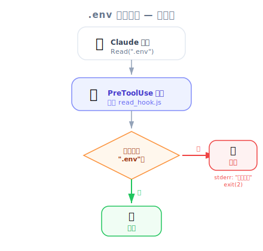
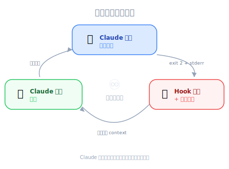

# 实现一个 Hook — PM 视角

| 项目 | 细节 |
|------|---------|
| 考试范围 | D3 — Claude Code Configuration & Workflows（占考试 20%） |
| Task Statements | 3.2 (custom commands & hooks), 1.5 (Agent SDK hooks) |
| 课程来源 | claude-code-in-action / 05-hooks / Lesson 16 |

---

## 重点摘要

*圖：.env 檔案守衛資料流 — PreToolUse 攔截 Read 呼叫，阻擋敏感檔案存取。*

这堂课展示了完整可运行的 hook 实现 — 从配置到测试。PM 不需要写 hook，但理解实现流程帮助你撰写更好的验收标准、估算工程量，并验证安全需求是否正确执行。

---

## 实现流程（不需要写 code）

把实现 hook 想象成在建筑物里安装新的安保摄像头系统：

| 步骤 | 建筑安保 | Hook 实现 |
|------|------------------|---------------------|
| 1. 登记摄像头 | 加到安保控制面板 | 在 `settings.local.json` 加入 hook 设置 |
| 2. 对准正确的门 | 设置摄像头角度 | 设置 `matcher` 指向特定工具 |
| 3. 设置警报规则 | "晚上 10 点后有人进入就警报" | 写脚本："文件路径包含 .env 就封锁" |
| 4. 测试系统 | 走过门口验证 | 请 Claude 读取 .env — 验证被封锁 |
| 5. 启用 | 启动系统 | 重启 Claude Code |

> 💡 **PM 洞察**
>
> 最重要的细节：hook 需要**重启**才会生效。这意味着向团队部署新 hook 不是即时的 — 在你的推出计划中考虑这一点。

---

## PM 应验证的项目

当工程师实现 hook 时，以下是验收标准的检查清单：

### 1. 覆盖检查
- **Hook 涵盖所有相关工具了吗？** 文件访问防护必须涵盖 `Read` 和 `Grep`。

### 2. 反馈质量
- **封锁信息有解释原因吗？** Claude 收到 stderr 信息。好的信息帮助 Claude 尝试替代方案。

### 3. 测试完整性
- **正面测试**：hook 封锁了受限动作
- **负面测试**：hook 允许正常操作继续

### 4. 设置层级

*圖：自我修正回饋迴路 — Claude 嘗試、Hook 攔截並說明原因、Claude 自動調整做法。*

- **个人 hook** → `settings.local.json`（不在 git 中）
- **团队 hook** → `settings.json`（commit 到 git）

> ⚠️ **PM 风险警示**
>
> 如果安全 hook 在 `settings.local.json`，每个开发者必须个别配置。合规需求应坚持用 `settings.json`（团队共用）。

---

## 自我修正反馈回路

1. Claude 尝试读取 `.env`
2. Hook 封锁并发送反馈："You cannot read the .env file"
3. Claude 确认："I was prevented by a read hook from accessing that file"
4. Claude 调整方法 — 不需人工介入

这意味着 hook 创造了**自主合规** — AI 代理自我修正，不需人工介入。

---

## 工程量估算

| Hook 复杂度 | 工时 | 示例 |
|----------------|--------|---------|
| 简单文件防护 | 1-2 小时 | 封锁读取 `.env`、`.credentials` |
| 模式匹配封锁 | 2-4 小时 | 封锁符合黑名单的 Bash 命令 |
| 条件逻辑 | 4-8 小时 | 封锁 > $500 退款，主管批准则允许 |
| 多工具协调 | 1-2 天 | 跨多个工具执行工作流程顺序 |

---

## 反模式（考试常考）

| ❌ 错误做法 | ✅ 正确做法 | 为什么 |
|-------------------|---------------------|-----|
| 假设保存后 hook 就"自动生效" | 改 hook 后一定重启 Claude Code | Hook 只在启动时加载 |
| 接受静默封锁（无反馈信息） | 要求清楚、可行动的错误信息 | 没有反馈 Claude 无法自我修正 |
| 合规 hook 放在个人设置 | 合规 hook 放在团队共用设置 | 个人设置无法跨团队强制执行 |
| 只测试封锁案例 | 同时测试封锁和允许 | 过于激进的 hook 破坏正常工作流程 |

---

## 练习题

### Q1：客户支持场景（S1）

团队实现了 PreToolUse hook 来防止 AI 客服代理处理超过 $500 的退款。测试中 hook 正确封锁了大额退款。但代理回复客户"I encountered an error"而非解释政策。你应建议什么？

- A. 在 system prompt 加入退款政策说明
- B. 改善 hook 的 stderr 信息，包含政策说明
- C. 改用 PostToolUse hook 让代理能看到退款被封锁
- D. 移除 hook，依赖 prompt 指令以获得更好的客户体验

答案

**B** — Hook 的 stderr 信息直接转发给 Claude 作为反馈。清楚的政策信息帮助 Claude 准确向客户解释情况。

- A：Prompt 指令不解决根因
- C：PostToolUse 无法封锁
- D：为 UX 移除确定性执行造成合规风险

**PM 重点**：Hook 反馈质量直接影响客户体验。

### Q2：开发者生产力场景（S4）

团队部署了 PreToolUse hook 来封锁 Claude 修改 migration 文件。一位工程师反馈 hook 在他机器上未启用。调查发现 hook 只配置在 team lead 的 `settings.local.json`。正确的修正方式？

- A. 发邮件给所有工程师，请他们加到个人设置
- B. 将 hook 配置移到 `.claude/settings.json` 并 commit 到版本控制
- C. 在 CLAUDE.md 加入"不要修改 migration 文件"作为备选
- D. 在所有机器的全局设置（`~/.claude/settings.json`）配置 hook

答案

**B** — 团队共用 hook 属于 `.claude/settings.json`（commit 到 git），确保所有团队成员自动获取配置。

- A：手动分发容易出错且不可扩展
- C：CLAUDE.md 是 prompt-based
- D：全局设置需要在每台机器手动设置

**PM 重点**：合规 hook 必须在版本控制的团队共用设置中。

### Q3：多代理研究场景（S3）

工程师实现了 PostToolUse hook，在每次 API tool call 后执行数据验证。测试中 hook 正确验证数据，但 Claude 没有在回应中使用验证后的数据。最可能的问题？

- A. Hook 应改为 PreToolUse
- B. Hook 的反馈（验证后数据）被写到 stdout 而不是 stderr
- C. Matcher 没有指向正确的工具
- D. Claude 的 context window 太小无法包含 hook 反馈

答案

**B** — PostToolUse hook 反馈必须写到 stderr 才会包含在 Claude 的 context 中。

- A：PreToolUse 在数据存在前执行
- C：如果 hook 在运行，matcher 没问题
- D：Hook 反馈很小

**PM 重点**：与工程师确认 hook 输出到 stderr 而非 stdout。这是常见的实现错误。

