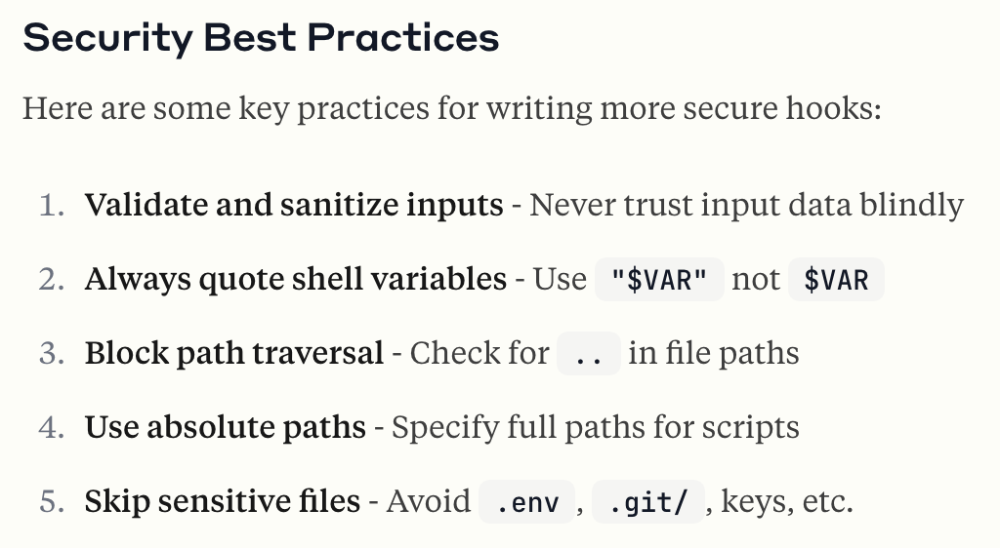

# Gotchas around hooks

> Source: https://anthropic.skilljar.com/claude-code-in-action/312423

You may notice that after running the `npm run dev` command there are two `settings.json` files in the `.claude` directory. Let me explain what's going on there.

The Claude Code documentation lists some recommendations around hooks security:

One of the recommendations is to use absolute paths (rather than relative paths) for scripts. This helps mitigate [path interception](https://attack.mitre.org/techniques/T1574/007/) and [binary planting](https://owasp.org/www-community/attacks/Binary_planting) attacks.

This recommendation also makes it much more challenging to share `settings.json` files. The reason is simple: the absolute path to any of the hook scripts on **your** machine will likely be different from the absolute **path** on my machine, simply because we will probably place the project in separate directories.

To solve this problem, our project has a `settings.example.json` file. Inside of it, the script references contain a `$PWD` placeholder. When we run `npm run setup`, some dependencies are installed, but it also runs an `init-claude.js` script placed inside the scripts directory. This script will replace those `$PWD` placeholder with the absolute path to the project on your machine, copy the `settings.example.json` file, and rename it to `settings.local.json`.

This script allows us to share settings.json files but still use the recommended absolute paths!