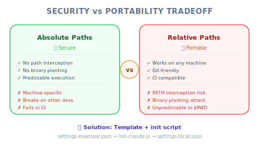
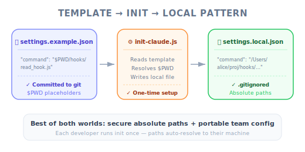

# Gotchas Around Hooks — Engineering Deep Dive

| Item | Detail |
|------|--------|
| Exam Domain | D3 — Claude Code Configuration & Workflows (20%) |
| Task Statements | 3.2 (custom commands & hooks), 1.5 (Agent SDK hooks for tool call interception) |
| Source | claude-code-in-action / 05-hooks / Lesson 17 (text-only) |

---

## One-Liner

Hook scripts should use **absolute paths** for security (preventing path interception and binary planting attacks), but absolute paths break portability across machines — solve this with a `settings.example.json` + init script pattern that replaces `$PWD` placeholders with machine-specific absolute paths.

---

## Context: The Security-Portability Trade-Off

You know how to define and implement hooks (Lessons 15-16). This lesson addresses a real-world deployment problem: the tension between security best practices (absolute paths) and team collaboration (sharing settings files).

> 💡 **iOS/Swift analogy**
>
> This is like the tension between hardcoding a certificate pinning hash (secure but breaks when the cert rotates) vs. loading it from a config (flexible but requires a secure distribution mechanism). You need both security AND portability — the solution is an automated setup step.

---

## The Core Problem

### Why Absolute Paths?

Claude Code's security recommendations state that hook commands should use **absolute paths**:

```json
// ❌ Relative path (security risk)
"command": "node ./hooks/read_hook.js"

// ✅ Absolute path (secure)
"command": "node /Users/alice/projects/queries/hooks/read_hook.js"
```

Absolute paths mitigate two attack vectors:

| Attack | Description | How Absolute Paths Help |
|--------|-------------|------------------------|
| **Path interception** ([MITRE T1574.007](https://attack.mitre.org/techniques/T1574/007/)) | Attacker places a malicious `node` or script in a directory that appears earlier in `$PATH` | Absolute path bypasses `$PATH` resolution entirely |
| **Binary planting** ([OWASP](https://owasp.org/www-community/attacks/Binary_planting)) | Attacker places a malicious file with the same name in the working directory | Absolute path points to the exact file, not a relative lookup |

> ⚠️ **Security is non-negotiable**
>
> The CCA exam treats security best practices as the correct answer. If a question asks about hook command paths, absolute paths are always preferred.

### Why This Breaks Portability

The problem is simple: absolute paths are machine-specific.

```
Alice's machine: /Users/alice/projects/queries/hooks/read_hook.js
Bob's machine:   /home/bob/dev/queries/hooks/read_hook.js
CI server:       /workspace/queries/hooks/read_hook.js
```

If you commit `settings.json` with Alice's absolute path, it breaks on Bob's machine and in CI.

---



*Figure: The security vs. portability tradeoff — absolute paths are secure but machine-specific; template + init script solves both.*

## The Solution: Template + Init Script

The course project solves this with a three-file pattern:



*Figure: Template → Init → Local pattern — committed template with $PWD placeholders, one-time init generates machine-specific config.*

### 1. `settings.example.json` (committed to git)

```json
{
  "hooks": {
    "PreToolUse": [
      {
        "matcher": "Read|Grep",
        "hooks": [
          {
            "type": "command",
            "command": "node $PWD/hooks/read_hook.js"
          }
        ]
      }
    ]
  }
}
```

The `$PWD` placeholder marks where the absolute path should go.

### 2. `scripts/init-claude.js` (committed to git)

This script:
1. Reads `settings.example.json`
2. Replaces all `$PWD` placeholders with the actual working directory
3. Writes the result to `settings.local.json`

### 3. `settings.local.json` (gitignored, generated)

The output file with machine-specific absolute paths. This file is **never committed** — it is regenerated per machine.

### The Workflow

```
Developer clones repo
        ↓
Runs `npm run setup` (or `npm run dev`)
        ↓
init-claude.js executes
        ↓
$PWD → /Users/alice/projects/queries
        ↓
settings.local.json generated with absolute paths
        ↓
Claude Code uses settings.local.json with secure, machine-specific paths
```

> 📝 **Why this matters for teams**
>
> This pattern ensures:
> - **Security**: Every developer uses absolute paths
> - **Portability**: The template works on any machine
> - **Automation**: No manual path editing required
> - **Version control**: The template is tracked; the generated file is not

---

## Two Settings Files Explained

After running `npm run dev`, you will see two `.json` files in the `.claude` directory:

| File | Purpose | In Git? |
|------|---------|---------|
| `settings.json` | Team-shared settings (no hooks with paths, or shared non-path configs) | Yes |
| `settings.local.json` | Generated file with machine-specific absolute paths for hooks | No (gitignored) |

This is why the lesson title mentions "gotchas" — seeing two settings files can be confusing if you do not understand the template-generation pattern.

---

## Anti-Patterns (Exam Frequently Tested)

| ❌ Wrong Approach | ✅ Correct Approach | Why |
|-------------------|---------------------|-----|
| Use relative paths in hook commands | Use absolute paths | Relative paths are vulnerable to path interception and binary planting |
| Commit `settings.local.json` with absolute paths | Commit `settings.example.json` with `$PWD` placeholders | Absolute paths are machine-specific — they break on other machines |
| Manually edit paths for each developer | Use an init script to auto-generate | Manual editing is error-prone and not scalable |
| Skip the security recommendation | Always use absolute paths | CCA exam expects security best practices |
| Put hook paths in `settings.json` (shared) | Put hook paths in `settings.local.json` (generated) | Shared settings should not contain machine-specific paths |

---

## Exam Focus: Settings File Hierarchy + Security

The CCA exam may combine hook security with settings hierarchy questions:

| Settings File | Scope | In Git? | Hook Paths? |
|---------------|-------|---------|-------------|
| `~/.claude/settings.json` | Global (all projects) | No | Absolute (machine-specific) |
| `.claude/settings.json` | Project (team-shared) | Yes | Avoid paths; use for non-path configs |
| `.claude/settings.local.json` | Project (personal) | No | Absolute (generated from template) |

Key exam principles:
- **Security**: Absolute paths prevent path interception attacks
- **Portability**: Template + init script pattern solves the sharing problem
- **Hierarchy**: More local settings take higher priority (same as git config)

---

## Practice Questions

### Q1: Developer Productivity Scenario (S4)

Your team wants to share a PreToolUse hook configuration across all developers. The hook script is located in the project's `hooks/` directory. What is the recommended approach?

- A. Commit `settings.local.json` with relative paths to the hook scripts
- B. Commit `settings.json` with absolute paths to the hook scripts
- C. Commit a `settings.example.json` with `$PWD` placeholders and an init script that generates `settings.local.json` with absolute paths
- D. Have each developer manually create their own `settings.local.json` with their absolute paths

<details><summary>Answer</summary>

**C** — This pattern provides both security (absolute paths) and portability (template works on any machine). The init script automates the generation.

- A: Relative paths are a security risk (path interception, binary planting)
- B: Absolute paths in shared settings break on other machines
- D: Manual setup is error-prone and not scalable
</details>

### Q2: CI/CD Integration Scenario (S5)

Your CI pipeline uses Claude Code with hooks. The pipeline runs on different CI runners with different file system layouts. The hook configuration uses relative paths (`node ./hooks/check.js`). A security audit flags this as a vulnerability. What is the correct fix?

- A. Add the hooks directory to the CI runner's `$PATH`
- B. Use a setup step in CI that generates `settings.local.json` with absolute paths based on the runner's workspace directory
- C. Disable hooks in CI since they are not needed for non-interactive mode
- D. Use `settings.json` with a hardcoded path that matches all CI runners

<details><summary>Answer</summary>

**B** — The setup step mirrors the `init-claude.js` pattern: detect the workspace directory and generate `settings.local.json` with absolute paths.

- A: Modifying `$PATH` does not fix the relative script path vulnerability
- C: Hooks may be needed in CI for compliance checks
- D: CI runners have different workspace paths — hardcoding breaks portability
</details>

### Q3: Code Generation Scenario (S2)

A new developer joins your team and clones the project. They start Claude Code and notice that hooks are not working. They see a `settings.example.json` but no `settings.local.json`. What is the most likely cause and fix?

- A. The hooks feature is disabled by default; they need to enable it in global settings
- B. They need to run the project's setup script (e.g., `npm run setup`) to generate `settings.local.json` from the template
- C. They need to copy `settings.example.json` to `settings.json` manually
- D. Claude Code does not support hooks on their operating system

<details><summary>Answer</summary>

**B** — The `settings.local.json` file is gitignored and must be generated by the init script. Running the setup command (`npm run setup`) triggers the script that replaces `$PWD` placeholders with actual paths.

- A: Hooks are available by default; no global toggle needed
- C: Simply copying without replacing `$PWD` would leave broken placeholder paths
- D: Hooks are platform-independent
</details>
