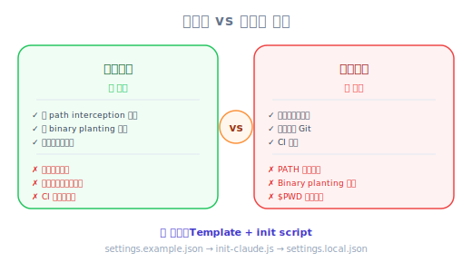
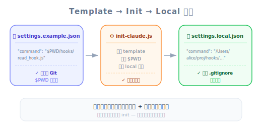

# Hooks 的注意事項 — 工程師深入解析

| 項目 | 細節 |
|------|--------|
| 考試領域 | D3 — Claude Code Configuration & Workflows (20%) |
| Task Statements | 3.2 (custom commands & hooks), 1.5 (Agent SDK hooks for tool call interception) |
| 來源 | claude-code-in-action / 05-hooks / Lesson 17（純文字課） |

---

## 一句話摘要

Hook 腳本應使用**絕對路徑**以確保安全性（防止 path interception 和 binary planting 攻擊），但絕對路徑破壞跨機器的可攜性 — 解法是 `settings.example.json` + init script 模式，用 `$PWD` 佔位符替換為機器特定的絕對路徑。

---

## 背景：安全性與可攜性的取捨

你已經知道如何定義和實作 hook（Lesson 15-16）。這堂課解決一個真實世界的部署問題：安全最佳實踐（絕對路徑）與團隊協作（共享設定檔）之間的緊張關係。

> 💡 **iOS/Swift 類比**
>
> 這就像 certificate pinning 的取捨：硬編碼 hash（安全但憑證輪換時壞掉）vs 從 config 載入（靈活但需要安全的分發機制）。你兩者都需要 — 解法是自動化的 setup 步驟。

---

## 核心問題

### 為什麼要絕對路徑？

Claude Code 的安全建議指出 hook command 應使用**絕對路徑**：

```json
// ❌ 相對路徑（安全風險）
"command": "node ./hooks/read_hook.js"

// ✅ 絕對路徑（安全）
"command": "node /Users/alice/projects/queries/hooks/read_hook.js"
```

絕對路徑緩解兩種攻擊向量：

| 攻擊 | 描述 | 絕對路徑如何幫助 |
|--------|-------------|------------------------|
| **Path interception**（[MITRE T1574.007](https://attack.mitre.org/techniques/T1574/007/)） | 攻擊者在 `$PATH` 中較早出現的目錄放入惡意 `node` 或腳本 | 絕對路徑完全繞過 `$PATH` 解析 |
| **Binary planting**（[OWASP](https://owasp.org/www-community/attacks/Binary_planting)） | 攻擊者在工作目錄放入同名惡意檔案 | 絕對路徑指向確切的檔案，不做相對查找 |

> ⚠️ **安全性不可妥協**
>
> CCA 考試將安全最佳實踐視為正確答案。若題目問 hook command 路徑，絕對路徑永遠是首選。

### 為什麼這破壞可攜性


*圖：安全性與可攜性的取捨 — 絕對路徑安全但綁定機器；Template + init script 可兩全其美。*


問題很簡單：絕對路徑是機器特定的。

```
Alice 的機器: /Users/alice/projects/queries/hooks/read_hook.js
Bob 的機器:   /home/bob/dev/queries/hooks/read_hook.js
CI server:    /workspace/queries/hooks/read_hook.js
```

---

## 解法：模板 + Init Script

課程專案用三檔案模式解決：



*圖：Template → Init → Local 模式 — 提交含 $PWD 佔位符的 template，一次性 init 產生機器專屬設定。*

### 1. `settings.example.json`（commit 到 git）

```json
{
  "hooks": {
    "PreToolUse": [
      {
        "matcher": "Read|Grep",
        "hooks": [
          {
            "type": "command",
            "command": "node $PWD/hooks/read_hook.js"
          }
        ]
      }
    ]
  }
}
```

`$PWD` 佔位符標記絕對路徑應放的位置。

### 2. `scripts/init-claude.js`（commit 到 git）

此腳本：讀取模板 → 替換 `$PWD` → 寫入 `settings.local.json`

### 3. `settings.local.json`（gitignored，自動生成）

帶有機器特定絕對路徑的輸出檔。**永遠不 commit** — 每台機器重新生成。

> 📝 **為何對團隊很重要**
>
> 此模式確保：安全（絕對路徑）+ 可攜（模板適用任何機器）+ 自動化（不需手動編輯路徑）+ 版本控制（模板追蹤；生成檔不追蹤）

---

## 兩個 Settings 檔案解釋

執行 `npm run dev` 後，`.claude` 目錄會有兩個 `.json` 檔：

| 檔案 | 用途 | 在 Git？ |
|------|---------|---------|
| `settings.json` | 團隊共用設定 | 是 |
| `settings.local.json` | 帶機器特定絕對路徑的生成檔 | 否（gitignored） |

---

## 反模式（考試常考）

| ❌ 錯誤做法 | ✅ 正確做法 | 為什麼 |
|-------------------|---------------------|-----|
| Hook command 用相對路徑 | 用絕對路徑 | 相對路徑易受 path interception 和 binary planting 攻擊 |
| Commit 帶絕對路徑的 `settings.local.json` | Commit 帶 `$PWD` 佔位符的 `settings.example.json` | 絕對路徑是機器特定的 — 在其他機器上會壞 |
| 每個開發者手動編輯路徑 | 用 init script 自動生成 | 手動編輯容易出錯且不可擴展 |
| 跳過安全建議 | 永遠用絕對路徑 | CCA 考試期望安全最佳實踐 |

---

## 練習題

### Q1：開發者生產力情境（S4）

你的團隊想在所有開發者之間共享 PreToolUse hook 配置。Hook 腳本在專案的 `hooks/` 目錄。推薦方法是？

- A. Commit 帶相對路徑的 `settings.local.json`
- B. Commit 帶絕對路徑的 `settings.json`
- C. Commit 帶 `$PWD` 佔位符的 `settings.example.json` 和生成 `settings.local.json` 的 init script
- D. 每個開發者手動建立自己的 `settings.local.json`

<details><summary>答案</summary>

**C** — 此模式提供安全性（絕對路徑）和可攜性（模板適用任何機器）。Init script 自動化生成。

- A：相對路徑是安全風險
- B：共享設定中的絕對路徑在其他機器上會壞
- D：手動設定容易出錯且不可擴展
</details>

### Q2：CI/CD 整合情境（S5）

CI pipeline 用 Claude Code 搭配 hook。Pipeline 在不同 CI runner 上運行，檔案系統佈局不同。Hook 配置用相對路徑。安全審計標記為漏洞。正確修正？

- A. 將 hooks 目錄加到 CI runner 的 `$PATH`
- B. 在 CI 加入 setup 步驟，根據 runner 的 workspace 目錄生成帶絕對路徑的 `settings.local.json`
- C. 在 CI 停用 hook，非互動模式不需要
- D. 用 `settings.json` 加寫死的路徑

<details><summary>答案</summary>

**B** — Setup 步驟反映 `init-claude.js` 模式：偵測 workspace 目錄並生成帶絕對路徑的 `settings.local.json`。

- A：修改 `$PATH` 不修復相對腳本路徑漏洞
- C：CI 中可能需要 hook 做合規檢查
- D：CI runner 有不同 workspace 路徑
</details>

### Q3：程式碼生成情境（S2）

新開發者加入團隊並 clone 專案。他們啟動 Claude Code 發現 hook 不工作。他們看到 `settings.example.json` 但沒有 `settings.local.json`。最可能的原因和修正？

- A. Hook 功能預設停用；需在全域設定中啟用
- B. 需要執行專案的 setup script（如 `npm run setup`）從模板生成 `settings.local.json`
- C. 需手動複製 `settings.example.json` 為 `settings.json`
- D. Claude Code 在他們的作業系統上不支援 hook

<details><summary>答案</summary>

**B** — `settings.local.json` 被 gitignore，必須由 init script 生成。執行 setup 命令觸發腳本替換 `$PWD` 佔位符。

- A：Hook 預設可用
- C：直接複製不替換 `$PWD` 會留下壞掉的佔位符路徑
- D：Hook 是跨平台的
</details>
