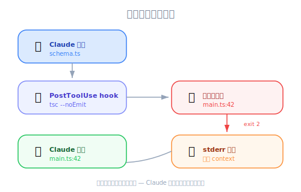
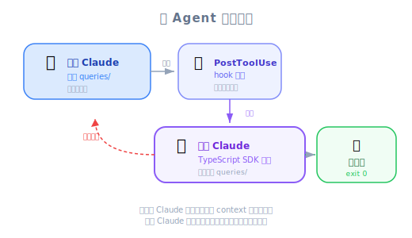

# Useful Hooks — 工程師視角

| 項目 | 內容 |
|------|------|
| 考試對應 | D3 — Claude Code Configuration & Workflows（佔 20%）、D1 — Agentic Architecture（佔 27%） |
| Task Statements | 1.5（Agent SDK hooks：tool call interception & data normalization）、3.2（custom commands & hooks）、1.2（multi-agent coordinator-subagent patterns） |
| 課程來源 | claude-code-in-action / 05-hooks / Lesson 18 |

---

## 一句話理解

PostToolUse hook 可以在每次編輯後跑 compiler/linter 檢查（type-checking hook），也可以啟動另一個 Claude Code instance 來 review 改動是否有重複程式碼（query deduplication hook）——兩者都建立了**不需人工介入的 self-correcting feedback loop**。

---

## 問題：Claude 看不見的地方就會壞掉

當 Claude 修改一個 function signature 時，它會更新定義檔但常常漏掉其他檔案的 call site。就像 iOS 開發者改了一個 protocol method 的 signature，如果沒有 compiler 幫你檢查所有 conformance，壞掉的 call site 就會溜走。

在 TypeScript 專案裡：
1. `schema.ts` 定義了 `createSchema()`
2. `main.ts` 呼叫 `createSchema()`
3. 你請 Claude 在 `createSchema()` 加一個 `verbose: boolean` 參數
4. Claude 更新了 `schema.ts` 但**沒有更新 `main.ts`**
5. 結果：call site 出現 type error，但 Claude 完全沒發現

> 🎬 **影片補充**
>
> 講師現場示範了這個情境——Claude 成功編輯了 function 定義，但留下了壞掉的 `main.ts`。關鍵洞察：Claude 不會自動跑 TypeScript compiler，所以它不知道專案其他地方出了問題。

---


*圖：TypeScript 型別檢查回饋迴路 — PostToolUse 執行 tsc，錯誤回饋給 Claude 自動修正。*


## Hook 1：TypeScript Type-Checking Hook

### 運作方式

一個 PostToolUse hook，在每次檔案編輯後跑 `tsc --noEmit`：

```json
"PostToolUse": [
  {
    "matcher": "Write|Edit|MultiEdit",
    "hooks": [
      {
        "type": "command",
        "command": "node hooks/tsc.js"
      }
    ]
  }
]
```

Hook 腳本：
1. 執行 `tsc --noEmit`（只做 type check，不產生輸出檔）
2. 擷取所有 compiler errors
3. 如果有錯誤，以 exit code 2 結束並輸出錯誤訊息
4. Claude 收到錯誤回饋，在下一輪自動修正

> 💡 **工程類比**
>
> 這跟 Xcode 的 build system 一模一樣——你編輯了一個 `.swift` 檔，compiler 就會 incrementally check 所有相依的檔案。這個 hook 替 Claude Code 複製了這個 compiler feedback loop。

### 擴展到其他語言

| 語言 | Hook 指令 | 檢查內容 |
|------|----------|---------|
| TypeScript | `tsc --noEmit` | 整個專案的 type errors |
| Python | `mypy .` 或 `pyright` | Type annotation 違規 |
| Rust | `cargo check` | Borrow checker + type errors |
| Go | `go vet ./...` | Static analysis 問題 |
| 無型別 JS/Python | `npm test` 或 `pytest` | 用測試當作 type checking 的替代 |

> ⚠️ **效能考量**
>
> TypeScript hook 算輕量——在中型專案上 `tsc --noEmit` 大概 2-5 秒。大型專案可以考慮只檢查有改動的檔案。

---

## 第二個問題：大型專案的程式碼重複

當 Claude 收到複雜的多步驟任務（例如「建一個 Slack 整合，通知 pending 超過時間的訂單」），它可能會失焦而寫出重複的功能，而不是重用既有程式碼。

### 場景

- `src/queries/orderQueries.ts` 已經有 `getPendingOrders()`
- 你請 Claude：「建一個 Slack 整合，通知 pending 超過 3 天的訂單」
- **聚焦任務**：Claude 找到並重用 `getPendingOrders()` — 正確
- **複雜任務**（`/clear` 之後）：Claude 寫了一個全新的 `getOrdersPendingTooLong()` — 重複程式碼

> 🎬 **影片補充**
>
> 講師展示了當任務簡單聚焦（「印出 pending 訂單」），Claude 會重用既有的 query。但當同樣的需求被包在更大的任務裡（Slack 整合），Claude 就建了新的 duplicate。Context window 和任務複雜度直接影響 Claude 發現既有程式碼的能力。

---

## Hook 2：Query Duplication Prevention Hook


*圖：多 Agent 審查模式 — PostToolUse hook 啟動第二個 Claude 實例審查變更。*


### 架構

這個 hook 使用 **multi-agent review pattern** — 一個 Claude instance 審查另一個的工作：

```
Claude（主要）寫入 queries/ 目錄
    ↓
PostToolUse hook 觸發
    ↓
Hook 啟動第二個 Claude Code instance（透過 TypeScript SDK）
    ↓
第二個 instance 對比既有 queries 審查改動
    ↓
發現重複：exit code 2 + 回饋 → 主要 Claude 移除 duplicate
沒有重複：exit code 0 → 主要 Claude 繼續
```

### 設定

```json
"PostToolUse": [
  {
    "matcher": "Write|Edit|MultiEdit",
    "hooks": [
      {
        "type": "command",
        "command": "node hooks/query-hook.js"
      }
    ]
  }
]
```

Hook 腳本邏輯：
1. 檢查改動的檔案是否在 `./queries` 目錄下（不在就 early exit）
2. 建構一段 prompt，請 Claude review 改動是否有 duplicate
3. 透過 **TypeScript SDK**（`@anthropic-ai/claude-code` 套件）啟動獨立的 Claude Code instance
4. 解析回應——如果找到 duplicate，exit code 2 並附帶回饋訊息
5. 主要 Claude 收到回饋後重構，改用既有的 query

> 💡 **這是 hook 裡面的 multi-agent pattern**
>
> Query hook 本質上是 coordinator-subagent pattern（Task Statement 1.2）嵌入 hook 系統（Task Statement 1.5）裡。「reviewer」subagent 的 context 是 scoped 的——它只看 queries 目錄，不是整個專案。這符合考試的核心哲學：**Scoped context > Full history**。

### 權衡

| 好處 | 代價 |
|------|------|
| 更乾淨的 codebase，更少重複 | 每次編輯增加 ~10-30 秒 |
| query 組織更一致 | 額外的 API 使用量（第二個 Claude instance） |
| 抓住 Claude 會遺漏的 duplicate | 只適用於關鍵目錄 |

> ⚠️ **最佳做法：限制監控範圍**
>
> 講師明確建議只監控「少數幾個目錄，像是專案裡真正重要的資料夾，盡量減少額外的工作量。」

---

## Anti-Patterns（考試常考）

| ❌ 錯誤做法 | ✅ 正確做法 | 為什麼 |
|-----------|-----------|--------|
| 在 system prompt 加「永遠跑 type checker」 | PostToolUse hook 跑 `tsc --noEmit` | Prompt 是 probabilistic；hook 是 deterministic |
| 叫 Claude「寫之前先檢查有沒有重複」 | PostToolUse hook 搭配獨立 reviewer instance | 複雜任務中 Claude 會失焦——影片已示範 |
| 用 duplication hook 監控所有目錄 | 只 scope 到關鍵目錄 | 非關鍵目錄的效能代價大於收益 |
| 用 PreToolUse 阻止 duplicate 寫入 | 用 PostToolUse review 並提供回饋 | 要先看到寫了什麼才能判斷是否 duplicate |
| 依賴 Claude 自己找到既有程式碼 | 自動化 review 作為安全網 | Claude 發現既有程式碼的能力會隨任務複雜度下降 |

---

## CCA 考試關聯

> 🎯 **這些概念會出現在哪些考試情境**
>
> - **S2（Code Generation）**：TypeScript type-checking hook = 確保產生的程式碼品質
> - **S4（Developer Productivity）**：兩個 hook 都透過自動抓問題改善開發流程
> - **S5（CI/CD）**：CI pipeline 中的 hook 作為自動化品質關卡
>
> **常見題型**：「Claude 修改了 function 但破壞了其他地方的 call site。最佳做法是什麼？」
> 答案方向：PostToolUse hook 跑 compiler/type checker — Architecture > Prompt。

---

## 模擬考題

### 第一題：Code Generation 情境

你的團隊用 Claude Code 開發一個 200+ 檔案的 TypeScript 專案。工程師回報 Claude 修改 function signature 時，經常破壞其他檔案的 call site。最有效的解決方案是什麼？

- A. 在 CLAUDE.md 加上指示：「修改任何 function signature 後，搜尋並更新所有 call sites」
- B. 設定 PostToolUse hook，在每次編輯後跑 `tsc --noEmit` 並把 type errors 回饋給 Claude
- C. 改用 `--resume` flag 讓 Claude 保留它看過的所有檔案的 context
- D. 用 PreToolUse hook 禁止 Claude 修改 function signatures

<details><summary>答案與解析</summary>

**B** — PostToolUse hook 跑 TypeScript compiler 提供 deterministic 的回饋。Claude 收到 context 裡的 type errors 後會自動修正。

- A 是 prompt-based，有非零失敗率，大型專案尤其嚴重
- C 無法保證 Claude 會記住或重新檢查所有 call sites
- D 阻止了正當工作——目標不是禁止 signature 修改，而是要抓住下游影響

考試哲學：**Architecture > Prompt**、**Deterministic > Probabilistic**
</details>

### 第二題：Developer Productivity 情境

在一個有很多 SQL query 檔案的大型專案中，Claude 有時候會建立 duplicate queries，而不是重用既有的。這在 query 相關任務被包在更大的多步驟任務裡時最常發生。最佳做法是什麼？

- A. 用 few-shot examples 展示 Claude 應該先搜尋既有 queries
- B. 設定 PostToolUse hook，啟動另一個 Claude instance 來 review query 改動是否有 duplicate
- C. 把所有 queries 合併到一個檔案，讓 Claude 一次看到全部
- D. 每次給 Claude 新任務前都先用 `/clear` 避免 context 干擾

<details><summary>答案與解析</summary>

**B** — 獨立的 reviewer instance 提供 independent check（考試哲學：**Independent review > Self-review**）。Hook 抓住主要 instance 因任務複雜度而遺漏的 duplicate。

- A 是 prompt-based，影片已經示範了這個失敗模式——複雜任務中 Claude 會漏掉既有程式碼
- C 建立了一個巨大的檔案，可能超出 Claude 的注意力容量，而且是差勁的程式碼組織
- D 移除了有用的 context，沒有解決根本原因

考試哲學：**Architecture > Prompt**、**Independent review > Self-review**、**Scoped context > Full history**
</details>

### 第三題：Multi-Agent 架構情境

你在設計一個 PostToolUse hook，會啟動另一個 Claude Code instance 來 review 改動。對於 reviewer instance，最重要的考量是什麼？

- A. 給它完整的專案 context，讓它做出全面的判斷
- B. 把它的 context scope 到只看相關目錄和正在 review 的具體改動
- C. 讓它跟主要 Claude instance 在同一個 session 裡跑
- D. 改成 PreToolUse hook，這樣可以在改動發生前就阻止

<details><summary>答案與解析</summary>

**B** — Scoped context 是考試核心原則。Reviewer subagent 只需要看到它需要的東西——相關目錄和改動。完整專案 context（A）浪費 token 且可能稀釋焦點。同一 session（C）不符合 hook 架構的運作方式——hook 啟動的是獨立 process。PreToolUse（D）無法 review 一個還沒發生的改動。

考試哲學：**Scoped context > Full history**
</details>
