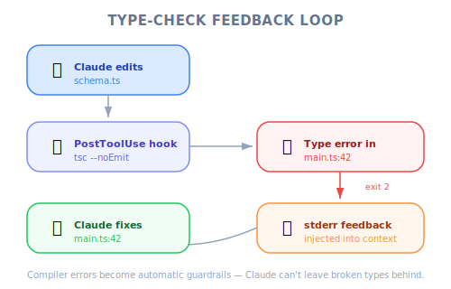
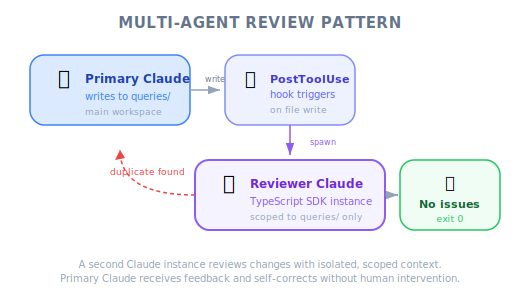

# Useful Hooks — PM Perspective

| Item | Details |
|------|---------|
| Exam Coverage | D3 — Claude Code Configuration & Workflows (20%), D1 — Agentic Architecture (27%) |
| Task Statements | 1.5 (Agent SDK hooks), 3.2 (custom commands & hooks), 1.2 (multi-agent coordinator-subagent patterns) |
| Course Source | claude-code-in-action / 05-hooks / Lesson 18 |

---

## TL;DR

This lesson introduces two practical hooks that solve real-world AI development problems: (1) a **type-checking hook** that catches ripple effects when AI modifies code, and (2) a **duplication prevention hook** that uses a second AI instance to review changes. For PMs, the key insight is: AI tools have predictable blind spots, and **hooks provide guaranteed safeguards** where prompt instructions fall short.

---

## Why PMs Need to Know This

These hooks address two common failure modes in AI-assisted development:

| Failure Mode | Business Impact | Hook Solution |
|-------------|----------------|---------------|
| AI changes a function but breaks other files | Bugs ship to production, developer trust erodes | Type-checking hook catches errors automatically |
| AI creates duplicate code instead of reusing existing | Technical debt accumulates, maintenance costs rise | Duplication review hook flags redundant code |

**PM takeaway**: When writing acceptance criteria for AI-assisted features, you need to specify which quality gates are automated (hooks) vs. which are best-effort (prompts).

---

## Mental Model: Factory Quality Control

### Hook 1: The Inline Inspector

Imagine a factory assembly line where a robot modifies a part. An inline quality inspector immediately checks whether the modification caused problems downstream:

| Factory | AI Development |
|---------|---------------|
| Robot modifies a part | Claude modifies a function signature |
| Inline inspector checks downstream fit | PostToolUse hook runs type checker |
| Part doesn't fit? → Sent back for rework | Type errors found? → Claude fixes them |
| No human needed | No developer intervention needed |

**The key**: The inspector runs **automatically after every modification** — not when someone remembers to check.

### Hook 2: The Independent Auditor

Now imagine the factory has many storage rooms of components. When a worker creates a new component, an independent auditor checks whether a similar component already exists:

| Factory | AI Development |
|---------|---------------|
| Worker creates new component | Claude writes new database query |
| Auditor checks existing inventory | Second Claude instance reviews existing queries |
| Duplicate found? → Use existing part | Duplicate found? → Reuse existing query |
| Extra time for audit, but less waste | Extra API cost, but cleaner codebase |

> 💡 **PM Decision Point**
>
> The duplication hook costs extra time and money per edit. This is a classic **quality vs. speed trade-off** that PMs must evaluate. The instructor recommends: only monitor the most critical directories — don't audit everything.

---

*Figure: TypeScript type-check feedback loop — PostToolUse runs tsc, errors feed back to Claude for automatic fixing.*

## When AI Loses Focus: A PM Must-Know

The video demonstrates a critical insight about AI capability limits:

| Task Type | AI Behavior | Result |
|-----------|------------|--------|
| Simple, focused: "Print pending orders" | Claude finds and reuses existing code | Correct |
| Complex, multi-step: "Build Slack integration with order alerts" | Claude writes brand new duplicate code | Wrong |

**Why this matters to PMs**: When you write complex feature requirements that involve many steps, the AI is **more likely to create redundant code**. This is not a bug — it is a predictable limitation of how context works. Hooks compensate for this limitation.

> 🎯 **Core Exam Philosophy**
>
> **Architecture > Prompt** — Structural safeguards (hooks) are more reliable than instructional ones (prompts).
> **Independent review > Self-review** — A separate reviewer catches what the original worker missed.

---

*Figure: Multi-agent review pattern — a PostToolUse hook spawns a second Claude instance to review changes.*

## Product Scenario Walkthrough

### Scenario: E-Commerce Platform with Multiple Development Teams

You are the PM for an e-commerce platform. Your backend has 50+ SQL query files across multiple domains (orders, inventory, customers, payments). Three development teams use Claude Code daily.

| Problem | Without Hook | With Hook |
|---------|-------------|-----------|
| Team A adds "get pending orders" query | Duplicate of existing query in Team B's code | Second Claude instance catches the duplicate |
| Developer modifies API response type | Call sites in 12 other files break silently | Type checker hook catches all 12 errors immediately |
| Complex feature request spans multiple domains | Claude creates redundant utilities | Scoped review hook flags existing alternatives |

**PRD Implication**: Your acceptance criteria should specify:
- "All TypeScript edits must trigger automated type checking" (= PostToolUse hook)
- "New queries in critical directories must be reviewed for duplicates" (= duplication review hook)
- These are **not optional developer preferences** — they are **required quality gates**

> 💡 **PM Framing for Engineers**
>
> Instead of saying "Claude should check for duplicates" (prompt-based, unreliable), say: "We need a PostToolUse hook that automatically reviews changes to the queries directory for duplication." This gives engineers a clear architectural requirement.

---

## Trade-off Analysis for PMs

| Factor | Type-Checking Hook | Duplication Review Hook |
|--------|-------------------|------------------------|
| Cost per trigger | Low (~2-5 seconds) | High (~10-30 seconds + API cost) |
| Coverage | All TypeScript files | Scoped to critical directories |
| False positive rate | Near zero (compiler is deterministic) | Low but possible (AI judgment) |
| Setup complexity | Simple (one command) | Moderate (TypeScript SDK integration) |
| **Recommendation** | Enable for all projects | Enable for high-value directories only |

---

## Instructor Insights (From the Video)

1. **Task complexity degrades AI code discovery** — When the task is simple, Claude finds existing code. When the task is complex, Claude loses focus and writes duplicates. This is a **predictable pattern**, not a random bug.
2. **Hooks can use the TypeScript SDK** — This means hooks can programmatically launch separate Claude Code instances. This opens up multi-agent review patterns inside the hook system.
3. **"It really comes down to trade-offs"** — The instructor explicitly frames this as a cost-benefit decision, not a universal best practice. PMs should evaluate per-directory.

---

## Anti-Patterns (Exam Favorites)

| ❌ Wrong Approach | ✅ Correct Approach | Why |
|-------------------|---------------------|-----|
| Write in PRD: "AI should always check types" | Require PostToolUse hook for type checking | Prompt-based requirements have non-zero failure rate |
| Assume AI will find existing code | Implement automated duplication review | AI loses focus on complex tasks — demonstrated in video |
| Monitor all directories with review hook | Scope to critical directories only | Cost outweighs benefit for low-value directories |
| Rely on code reviews to catch duplicates | Use hooks as a first line of defense | Human reviewers also miss duplicates; hooks are consistent |

---

## Practice Questions

### Question 1: Developer Productivity Scenario

Your engineering team reports that Claude Code frequently introduces type errors when modifying shared TypeScript utilities. These errors are caught during code review, but by then the developer has moved on to other tasks. As PM, which requirement should you add to the team's development workflow?

- A. Add a team-wide CLAUDE.md instruction: "Always run the type checker after modifying shared utilities"
- B. Require engineers to manually run `tsc --noEmit` after each Claude Code session
- C. Implement a PostToolUse hook that automatically runs the type checker after every file edit
- D. Schedule a daily batch type-check job that emails engineers about accumulated errors

Answer and Explanation

**C** — A PostToolUse hook provides immediate, automatic feedback with zero developer effort. The type errors are caught and fixed in the same Claude Code session, before the developer moves on.

- A is a prompt instruction — Claude may ignore it, especially during complex tasks
- B adds manual overhead that developers will forget
- D delays error detection by hours, increasing the cost to fix

**PM Key Takeaway**: The goal is to catch errors **at the moment they are introduced**, not downstream. Hooks achieve this; prompts and manual processes do not.

### Question 2: E-Commerce Platform Scenario

Your e-commerce platform has a `queries/` directory with 200+ SQL functions. Engineers using Claude Code report duplicate queries appearing regularly. The duplication is most severe when Claude is given multi-step tasks. What approach best balances quality and cost?

- A. Configure a PostToolUse hook that launches a separate Claude instance to review all file changes across the entire project
- B. Configure a PostToolUse hook that launches a separate Claude instance to review changes only in the `queries/` directory
- C. Add few-shot examples to the system prompt showing how to search for existing queries
- D. Consolidate all queries into fewer files to increase the chance Claude sees existing ones

Answer and Explanation

**B** — Scoping the review hook to only the `queries/` directory balances quality (catches duplicates) with cost (doesn't add overhead to every file edit). The instructor explicitly recommends this approach.

- A is too expensive — reviewing every file change project-wide would significantly slow development
- C is prompt-based and the video demonstrates this exact failure mode
- D is poor software architecture and creates maintenance problems

**PM Key Takeaway**: Quality gates should be **targeted to high-risk areas**, not applied uniformly. This is the "proportionate response" principle.

### Question 3: Multi-Agent Architecture Scenario

A product team is debating whether to implement the query duplication hook. The engineering lead says it adds 15-20 seconds per query file edit. As PM, how should you frame this decision?

- A. Reject the hook because it slows down developers
- B. Accept the hook for all directories to maximize code quality
- C. Evaluate the trade-off: implement the hook only for critical directories where duplication has high business impact
- D. Replace the hook with a weekly code duplication audit

Answer and Explanation

**C** — This is a proportionate response. The hook adds cost per edit, so it should be targeted at directories where duplication has the highest impact (e.g., payment queries, order queries). Low-risk directories (e.g., test utilities) may not justify the overhead.

- A ignores a proven quality problem
- B over-applies the solution, creating unnecessary overhead
- D delays detection and increases fix cost

**PM Key Takeaway**: The exam tests proportionate responses. "Always" and "never" answers are usually wrong — context-appropriate solutions are correct.

