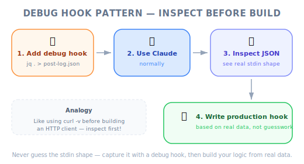

# Another Useful Hook — Engineering Deep Dive

| Item | Detail |
|------|--------|
| Exam Domain | D3 — Claude Code Configuration & Workflows (20%), D1 — Agentic Architecture (27%) |
| Task Statements | 1.5 (Agent SDK hooks for tool call interception), 3.2 (custom commands & hooks), 1.7 (session state & resumption) |
| Source | claude-code-in-action / 05-hooks / Lesson 19 (text-only) |

---

## One-Liner

Beyond PreToolUse and PostToolUse, Claude Code offers 7 additional hook types (`Notification`, `Stop`, `SubagentStop`, `PreCompact`, `UserPromptSubmit`, `SessionStart`, `SessionEnd`) — and the stdin input structure varies by both hook type and tool matcher, making a `jq . > log.json` debug hook essential for development.

---


*Figure: Complete hook taxonomy — all 9 hook types organized by lifecycle stage, blocking capability, and use case.*

## The Complete Hook Taxonomy

Most of this course focused on PreToolUse and PostToolUse. This lesson reveals the full picture:

| Hook Type | When It Fires | Can Block? | Key Use Cases |
|-----------|--------------|------------|---------------|
| `PreToolUse` | Before a tool executes | Yes | Access control, policy enforcement, prerequisite checks |
| `PostToolUse` | After a tool executes | No (feedback only) | Type checking, linting, duplication review |
| `Notification` | When Claude sends a notification (permission needed or 60s idle) | No | Custom alerting, Slack/email notifications |
| `Stop` | When Claude finishes responding | No | Session logging, summary generation, cleanup |
| `SubagentStop` | When a subagent (displayed as "Task" in UI) finishes | No | Subagent output validation, aggregation |
| `PreCompact` | Before a compact operation (manual or automatic) | No | Context preservation, fact extraction before compaction |
| `UserPromptSubmit` | When user submits a prompt, before Claude processes it | Yes | Input validation, prompt preprocessing, logging |
| `SessionStart` | When starting or resuming a session | No | Environment setup, context loading |
| `SessionEnd` | When a session ends | No | Cleanup, session logging, state persistence |

> 💡 **Engineering analogy**
>
> If you think of Claude Code as an iOS app:
> - `PreToolUse`/`PostToolUse` = `URLProtocol` interceptors (per-request middleware)
> - `SessionStart`/`SessionEnd` = `applicationDidFinishLaunching` / `applicationWillTerminate`
> - `Notification` = `UNUserNotificationCenter` delegate
> - `Stop` = completion handler on an `Operation`
> - `PreCompact` = `didReceiveMemoryWarning` (about to trim context)
> - `UserPromptSubmit` = `textFieldShouldReturn` (intercept before processing)

---

## The Confusing Part: Variable stdin Input

Each hook type receives **different stdin JSON structures**. And for `PreToolUse`/`PostToolUse`, the `tool_input` field varies based on which tool was called.

### Example 1: PostToolUse on TodoWrite

```json
{
  "session_id": "9ecf22fa-edf8-4332-ae85-b6d5456eda64",
  "transcript_path": "<path_to_transcript>",
  "hook_event_name": "PostToolUse",
  "tool_name": "TodoWrite",
  "tool_input": {
    "todos": [{ "content": "write a readme", "status": "pending", "priority": "medium", "id": "1" }]
  },
  "tool_response": {
    "oldTodos": [],
    "newTodos": [{ "content": "write a readme", "status": "pending", "priority": "medium", "id": "1" }]
  }
}
```

Key fields for PostToolUse:
- `tool_name` — which tool was used
- `tool_input` — what Claude sent TO the tool (varies per tool)
- `tool_response` — what the tool returned (varies per tool)

### Example 2: Stop Hook

```json
{
  "session_id": "af9f50b6-f042-4773-b3e2-c3a4814765ce",
  "transcript_path": "<path_to_transcript>",
  "hook_event_name": "Stop",
  "stop_hook_active": false
}
```

Notice: No `tool_name`, no `tool_input`, no `tool_response`. Completely different structure.

> ⚠️ **This is the #1 pitfall when writing hooks**
>
> You cannot assume the stdin structure. A hook script that works for PostToolUse on `Write` will crash if it receives PostToolUse on `TodoWrite` because the `tool_input` fields are completely different. Always validate the structure before accessing nested fields.

---



*Figure: Debug hook pattern — inspect stdin with jq before building production logic, like using curl -v before writing an HTTP client.*

## The Debug Hook: Your Best Friend

The lesson's most practical tip is a universal debug hook that logs stdin to a file:

```json
"PostToolUse": [
  {
    "matcher": "*",
    "hooks": [
      {
        "type": "command",
        "command": "jq . > post-log.json"
      }
    ]
  }
]
```

What this does:
1. The `*` matcher catches **all** tool uses
2. `jq .` pretty-prints the JSON stdin
3. Output is written to `post-log.json`
4. You can inspect exactly what data your hook will receive

> 💡 **Development workflow**
>
> 1. Add the debug hook with `matcher: "*"`
> 2. Use Claude Code normally — trigger the tools you want to hook
> 3. Inspect `post-log.json` to see the exact stdin structure
> 4. Write your actual hook script based on the real data
> 5. Replace the debug hook with your production hook
>
> This is the same pattern as using `curl -v` to inspect HTTP responses before writing API client code.

This works for any hook type — just change the key:

```json
"Stop": [
  {
    "matcher": "*",
    "hooks": [
      {
        "type": "command",
        "command": "jq . > stop-log.json"
      }
    ]
  }
]
```

---

## Common stdin Fields by Hook Type

| Field | PreToolUse | PostToolUse | Stop | Notification | SubagentStop |
|-------|-----------|------------|------|-------------|-------------|
| `session_id` | Yes | Yes | Yes | Yes | Yes |
| `transcript_path` | Yes | Yes | Yes | Yes | Yes |
| `hook_event_name` | Yes | Yes | Yes | Yes | Yes |
| `tool_name` | Yes | Yes | No | No | No |
| `tool_input` | Yes | Yes | No | No | No |
| `tool_response` | No | Yes | No | No | No |
| `stop_hook_active` | No | No | Yes | No | No |

> 💡 **Exam tip**
>
> The `transcript_path` field is available in ALL hook types. This means any hook can access the full conversation transcript — useful for logging, auditing, and context extraction.

---

## Practical Applications of Additional Hooks

| Hook | Use Case | Example |
|------|----------|---------|
| `Stop` | Session summary logging | Write a summary of what Claude did to a log file |
| `SubagentStop` | Validate subagent output | Check if research subagent returned structured data |
| `PreCompact` | Preserve critical facts | Extract key decisions before context is trimmed |
| `UserPromptSubmit` | Input preprocessing | Validate prompts against a template before Claude sees them |
| `SessionStart` | Environment bootstrap | Load project-specific context or verify prerequisites |
| `SessionEnd` | Cleanup | Remove temporary files, update session log |
| `Notification` | Custom alerts | Send Slack notification when Claude needs permission |

---

## Anti-Patterns (Exam Favorites)

| ❌ Wrong Approach | ✅ Correct Approach | Why |
|-------------------|---------------------|-----|
| Assume all hooks receive the same stdin structure | Use `jq . > log.json` to discover the structure first | stdin varies by hook type AND by tool matcher |
| Hard-code `tool_input` field access without validation | Check `tool_name` first, then access tool-specific fields | Different tools have different `tool_input` shapes |
| Use `matcher: "*"` in production for heavyweight hooks | Scope matchers to specific tools | `*` catches everything — performance and cost impact |
| Write hook scripts without testing stdin first | Use debug hook → inspect → write production hook | Saves debugging time and prevents runtime errors |
| Ignore `transcript_path` in hooks | Use it for context-aware hook logic | Transcript provides full conversation history for hooks that need it |

---

## CCA Exam Connection

> 🎯 **Exam scenarios where these concepts appear**
>
> - **S2 (Code Generation)**: `Stop` hook for session logging in CI pipelines
> - **S4 (Developer Productivity)**: `SessionStart` for environment setup, `PreCompact` for context preservation
> - **S5 (CI/CD)**: Understanding hook types for pipeline orchestration
>
> **Common exam pattern**: "You need to perform an action when Claude finishes responding. Which hook type should you use?"
> Answer direction: `Stop` hook — it fires when Claude finishes responding, regardless of which tool was last used.

---

## Practice Questions

### Q1: CI/CD Pipeline Scenario

Your CI pipeline uses Claude Code to review PRs. You need to write a summary of Claude's review findings to a log file after Claude finishes responding. Which hook configuration is correct?

- A. PostToolUse hook with matcher `*` that writes to a log file
- B. Stop hook that reads the transcript and writes a summary
- C. PreToolUse hook that captures all tool calls
- D. Notification hook that triggers after 60 seconds of inactivity

<details><summary>Answer</summary>

**B** — The `Stop` hook fires when Claude finishes responding, making it the right place to generate a session summary. It has access to `transcript_path` for reading the full conversation.

- A would fire after every single tool use, not just at the end — creates many partial logs
- C fires before tool execution, not after Claude is done
- D fires on idle or permission request, not on completion

Key: Match the hook type to the lifecycle event you need.
</details>

### Q2: Developer Productivity Scenario

You are writing a PostToolUse hook that should only process file edits but it keeps crashing when Claude uses other tools like `Bash` or `Read`. What is the most likely cause and fix?

- A. The matcher is wrong — change it from `*` to `Write|Edit|MultiEdit`
- B. The hook script assumes `tool_input` always has a `file_path` field, but different tools have different `tool_input` structures
- C. PostToolUse hooks cannot access `tool_input` — use PreToolUse instead
- D. The hook needs to be moved from project settings to global settings

<details><summary>Answer</summary>

**B** — The `tool_input` structure varies by tool. A `Write` tool has `file_path` and `content`, but a `Bash` tool has `command`. If the hook assumes `tool_input.file_path` exists without checking `tool_name` first, it crashes on non-file tools.

- A is a partial fix (scoping the matcher), but the root cause is the script not validating input structure
- C is factually wrong — PostToolUse hooks DO receive `tool_input`
- D is unrelated to the crash

Best practice: Always check `tool_name` before accessing tool-specific `tool_input` fields, OR scope your matcher to specific tools.
</details>

### Q3: Multi-Agent Architecture Scenario

You need to validate that a subagent (displayed as "Task" in the UI) returns properly structured JSON data before the coordinator processes it. Which hook type should you use?

- A. PostToolUse hook on the coordinator's tool calls
- B. SubagentStop hook that inspects the subagent's output
- C. Stop hook that runs when the main session finishes
- D. PreCompact hook that checks data before context trimming

<details><summary>Answer</summary>

**B** — `SubagentStop` fires when a subagent finishes, which is the exact lifecycle event you need. It allows you to validate the subagent's output before the coordinator processes it.

- A would fire on the coordinator's tool calls, not the subagent's completion
- C fires when the entire session ends, which is too late
- D is about context compaction, not subagent output validation

Exam philosophy: Choose the hook type that matches the specific lifecycle event.
</details>
