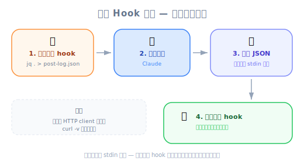

# Another Useful Hook — 工程师视角

| 项目 | 内容 |
|------|------|
| 考试对应 | D3 — Claude Code Configuration & Workflows（占 20%）、D1 — Agentic Architecture（占 27%） |
| Task Statements | 1.5（Agent SDK hooks：tool call interception）、3.2（custom commands & hooks）、1.7（session state & resumption） |
| 课程来源 | claude-code-in-action / 05-hooks / Lesson 19（纯文字课程） |

---

## 一句话理解

除了 PreToolUse 和 PostToolUse，Claude Code 还有 7 种 hook 类型（`Notification`、`Stop`、`SubagentStop`、`PreCompact`、`UserPromptSubmit`、`SessionStart`、`SessionEnd`）——而且 stdin 输入结构会因 hook 类型和 tool matcher 不同而改变，所以用 `jq . > log.json` 的 debug hook 是开发时必备的。

---


*圖：Hook 完整分類 — 全部 9 種 Hook 依生命週期、是否可攔截、用途分類。*

## 完整的 Hook 分类

课程大部分聚焦在 PreToolUse 和 PostToolUse。这节课揭开了完整面貌：

| Hook 类型 | 何时触发 | 能否阻止？ | 主要用途 |
|----------|---------|-----------|---------|
| `PreToolUse` | 工具执行前 | 可以 | 访问控制、政策 enforcement、前置条件检查 |
| `PostToolUse` | 工具执行后 | 不行（只能反馈） | Type checking、linting、duplication review |
| `Notification` | Claude 发送通知时（需要权限或闲置 60 秒） | 不行 | 自定义警报、Slack/email 通知 |
| `Stop` | Claude 完成回应时 | 不行 | Session 日志、摘要生成、清理 |
| `SubagentStop` | Subagent（UI 中显示为「Task」）完成时 | 不行 | Subagent 输出验证、结果聚合 |
| `PreCompact` | Compact 操作前（手动或自动） | 不行 | Context 保存、压缩前 fact extraction |
| `UserPromptSubmit` | 用户提交 prompt，Claude 处理前 | 可以 | 输入验证、prompt 预处理、日志 |
| `SessionStart` | 开始或恢复 session 时 | 不行 | 环境设置、context 加载 |
| `SessionEnd` | Session 结束时 | 不行 | 清理、session 日志、状态持久化 |

> 💡 **工程类比**
>
> 把 Claude Code 想成一个 iOS app：
> - `PreToolUse`/`PostToolUse` = `URLProtocol` 拦截器（per-request middleware）
> - `SessionStart`/`SessionEnd` = `applicationDidFinishLaunching` / `applicationWillTerminate`
> - `Notification` = `UNUserNotificationCenter` delegate
> - `Stop` = `Operation` 上的 completion handler
> - `PreCompact` = `didReceiveMemoryWarning`（即将裁剪 context）
> - `UserPromptSubmit` = `textFieldShouldReturn`（在处理前拦截）

---

## 令人困惑的部分：不同的 stdin 输入结构

每种 hook 类型收到的 **stdin JSON 结构不同**。而且对 `PreToolUse`/`PostToolUse` 来说，`tool_input` 字段会因被调用的工具而异。

### 示例 1：PostToolUse on TodoWrite

```json
{
  "session_id": "9ecf22fa-edf8-4332-ae85-b6d5456eda64",
  "transcript_path": "<path_to_transcript>",
  "hook_event_name": "PostToolUse",
  "tool_name": "TodoWrite",
  "tool_input": {
    "todos": [{ "content": "write a readme", "status": "pending", "priority": "medium", "id": "1" }]
  },
  "tool_response": {
    "oldTodos": [],
    "newTodos": [{ "content": "write a readme", "status": "pending", "priority": "medium", "id": "1" }]
  }
}
```

PostToolUse 的关键字段：
- `tool_name` — 使用了哪个工具
- `tool_input` — Claude 传给工具的输入（每个工具不同）
- `tool_response` — 工具返回的结果（每个工具不同）

### 示例 2：Stop Hook

```json
{
  "session_id": "af9f50b6-f042-4773-b3e2-c3a4814765ce",
  "transcript_path": "<path_to_transcript>",
  "hook_event_name": "Stop",
  "stop_hook_active": false
}
```

注意：没有 `tool_name`、没有 `tool_input`、没有 `tool_response`。结构完全不同。

> ⚠️ **写 hook 最大的陷阱**
>
> 你不能假设 stdin 结构。一个为 PostToolUse on `Write` 写的 hook 脚本，如果收到 PostToolUse on `TodoWrite` 就会 crash，因为 `tool_input` 的字段完全不同。访问嵌套字段前一定要先验证结构。

---

## Debug Hook：你最好的朋友



*圖：除錯 Hook 模式 — 先用 jq 觀察 stdin，再建構正式邏輯，如同寫 HTTP client 前先用 curl -v。*

这节课最实用的技巧是一个通用 debug hook，把 stdin 写到文件：

```json
"PostToolUse": [
  {
    "matcher": "*",
    "hooks": [
      {
        "type": "command",
        "command": "jq . > post-log.json"
      }
    ]
  }
]
```

它做了什么：
1. `*` matcher 捕捉**所有**工具使用
2. `jq .` 把 JSON stdin 格式化
3. 输出写到 `post-log.json`
4. 你可以检查 hook 会收到的确切数据

> 💡 **开发工作流**
>
> 1. 加上 debug hook，`matcher: "*"`
> 2. 正常使用 Claude Code——触发你想要 hook 的工具
> 3. 检查 `post-log.json` 看确切的 stdin 结构
> 4. 根据真实数据撰写你的正式 hook 脚本
> 5. 用正式 hook 替换 debug hook
>
> 这跟用 `curl -v` 检查 HTTP response 后再写 API client 是一样的模式。

任何 hook 类型都适用——只要换 key：

```json
"Stop": [
  {
    "matcher": "*",
    "hooks": [
      {
        "type": "command",
        "command": "jq . > stop-log.json"
      }
    ]
  }
]
```

---

## 各 Hook 类型的常见 stdin 字段

| 字段 | PreToolUse | PostToolUse | Stop | Notification | SubagentStop |
|------|-----------|------------|------|-------------|-------------|
| `session_id` | 有 | 有 | 有 | 有 | 有 |
| `transcript_path` | 有 | 有 | 有 | 有 | 有 |
| `hook_event_name` | 有 | 有 | 有 | 有 | 有 |
| `tool_name` | 有 | 有 | 无 | 无 | 无 |
| `tool_input` | 有 | 有 | 无 | 无 | 无 |
| `tool_response` | 无 | 有 | 无 | 无 | 无 |
| `stop_hook_active` | 无 | 无 | 有 | 无 | 无 |

> 💡 **考试提示**
>
> `transcript_path` 字段在**所有** hook 类型中都有。这代表任何 hook 都可以访问完整的对话记录——对 logging、auditing、context extraction 很有用。

---

## 额外 Hook 的实际应用

| Hook | 用途 | 示例 |
|------|------|------|
| `Stop` | Session 摘要日志 | 把 Claude 做了什么写到 log 文件 |
| `SubagentStop` | 验证 subagent 输出 | 检查 research subagent 是否返回了结构化数据 |
| `PreCompact` | 保存关键 facts | 在 context 被裁剪前 extract 关键决策 |
| `UserPromptSubmit` | 输入预处理 | Claude 收到 prompt 前根据 template 验证 |
| `SessionStart` | 环境启动 | 加载项目特定的 context 或验证前置条件 |
| `SessionEnd` | 清理 | 移除临时文件、更新 session 日志 |
| `Notification` | 自定义警报 | Claude 需要权限时发 Slack 通知 |

---

## Anti-Patterns（考试常考）

| ❌ 错误做法 | ✅ 正确做法 | 为什么 |
|-----------|-----------|--------|
| 假设所有 hook 收到相同的 stdin 结构 | 先用 `jq . > log.json` 发现结构 | stdin 因 hook 类型和 tool matcher 而异 |
| 直接访问 `tool_input` 字段不做验证 | 先检查 `tool_name`，再访问工具特定字段 | 不同工具有不同的 `tool_input` 形状 |
| 在 production 的重量级 hook 用 `matcher: "*"` | 把 matcher scope 到特定工具 | `*` 捕捉所有东西——冲击性能和成本 |
| 没先测试 stdin 就写 hook 脚本 | 用 debug hook → 检查 → 写正式 hook | 节省 debug 时间并防止 runtime errors |
| 忽略 hook 中的 `transcript_path` | 用它做 context-aware 的 hook 逻辑 | Transcript 提供完整对话历史给需要它的 hook |

---

## CCA 考试关联

> 🎯 **这些概念会出现在哪些考试场景**
>
> - **S2（Code Generation）**：`Stop` hook 用于 CI pipeline 的 session logging
> - **S4（Developer Productivity）**：`SessionStart` 做环境设置、`PreCompact` 做 context 保存
> - **S5（CI/CD）**：理解 hook 类型以 orchestrate pipeline
>
> **常见题型**：「你需要在 Claude 完成回应后执行一个动作。应该用哪种 hook？」
> 答案方向：`Stop` hook——它在 Claude 完成回应时触发，不管最后用了哪个工具。

---

## 模拟考题

### 第一题：CI/CD Pipeline 场景

你的 CI pipeline 用 Claude Code 做 PR review。你需要在 Claude 完成回应后把 review 结果写到 log 文件。正确的 hook 配置是哪个？

- A. PostToolUse hook，matcher 设为 `*`，写到 log 文件
- B. Stop hook，读取 transcript 并写出摘要
- C. PreToolUse hook，捕捉所有 tool calls
- D. Notification hook，在闲置 60 秒后触发

<details><summary>答案与解析</summary>

**B** — `Stop` hook 在 Claude 完成回应时触发，是生成 session 摘要的正确时机。它可以通过 `transcript_path` 访问完整对话记录。

- A 在每次 tool use 后都会触发，不只是结束时——会产生很多不完整的 log
- C 在工具执行前触发，不是 Claude 完成后
- D 在闲置或需要权限时触发，不是完成时

关键：把 hook 类型跟你需要的 lifecycle event 配对。
</details>

### 第二题：Developer Productivity 场景

你在写一个 PostToolUse hook，只想处理文件编辑，但它在 Claude 使用 `Bash` 或 `Read` 等其他工具时一直 crash。最可能的原因和修正是什么？

- A. Matcher 设错了——从 `*` 改成 `Write|Edit|MultiEdit`
- B. Hook 脚本假设 `tool_input` 一定有 `file_path` 字段，但不同工具有不同的 `tool_input` 结构
- C. PostToolUse hook 不能访问 `tool_input`——改用 PreToolUse
- D. Hook 需要从项目设置移到全局设置

<details><summary>答案与解析</summary>

**B** — `tool_input` 结构因工具而异。`Write` 工具有 `file_path` 和 `content`，但 `Bash` 工具有 `command`。如果 hook 没有先检查 `tool_name` 就直接假设 `tool_input.file_path` 存在，碰到非文件工具就会 crash。

- A 是部分修正（限缩 matcher），但 root cause 是脚本没有验证输入结构
- C 事实上是错的——PostToolUse hook 确实会收到 `tool_input`
- D 跟 crash 无关

最佳做法：访问工具特定的 `tool_input` 字段前先检查 `tool_name`，或者把 matcher scope 到特定工具。
</details>

### 第三题：Multi-Agent 架构场景

你需要验证一个 subagent（UI 中显示为「Task」）返回的是结构化 JSON 数据，然后 coordinator 才能处理它。应该用哪种 hook？

- A. PostToolUse hook，挂在 coordinator 的 tool calls 上
- B. SubagentStop hook，检查 subagent 的输出
- C. Stop hook，在主 session 结束时执行
- D. PreCompact hook，在 context 裁剪前检查数据

<details><summary>答案与解析</summary>

**B** — `SubagentStop` 在 subagent 完成时触发，这正是你需要的 lifecycle event。它让你在 coordinator 处理之前验证 subagent 的输出。

- A 会在 coordinator 的 tool calls 上触发，不是 subagent 完成时
- C 在整个 session 结束时才触发，太迟了
- D 是关于 context compaction，不是 subagent 输出验证

考试哲学：选择跟特定 lifecycle event 匹配的 hook 类型。
</details>
