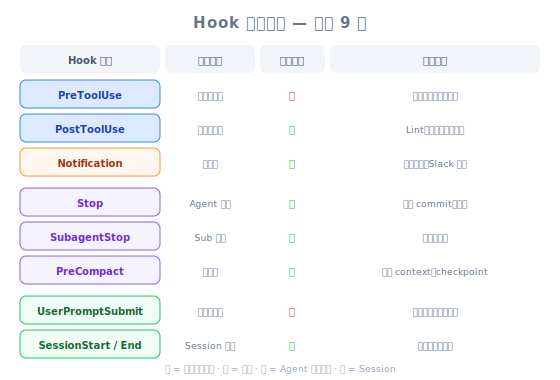

# Another Useful Hook — 工程師視角

| 項目 | 內容 |
|------|------|
| 考試對應 | D3 — Claude Code Configuration & Workflows（佔 20%）、D1 — Agentic Architecture（佔 27%） |
| Task Statements | 1.5（Agent SDK hooks：tool call interception）、3.2（custom commands & hooks）、1.7（session state & resumption） |
| 課程來源 | claude-code-in-action / 05-hooks / Lesson 19（純文字課程） |

---

## 一句話理解



*圖：Hook 完整分類 — 全部 9 種 Hook 依生命週期、是否可攔截、用途分類。*

除了 PreToolUse 和 PostToolUse，Claude Code 還有 7 種 hook 類型（`Notification`、`Stop`、`SubagentStop`、`PreCompact`、`UserPromptSubmit`、`SessionStart`、`SessionEnd`）——而且 stdin 輸入結構會因 hook 類型和 tool matcher 不同而改變，所以用 `jq . > log.json` 的 debug hook 是開發時必備的。

---

## 完整的 Hook 分類

課程大部分聚焦在 PreToolUse 和 PostToolUse。這節課揭開了完整面貌：

| Hook 類型 | 何時觸發 | 能否阻止？ | 主要用途 |
|----------|---------|-----------|---------|
| `PreToolUse` | 工具執行前 | 可以 | 存取控制、政策 enforcement、前置條件檢查 |
| `PostToolUse` | 工具執行後 | 不行（只能回饋） | Type checking、linting、duplication review |
| `Notification` | Claude 發送通知時（需要權限或閒置 60 秒） | 不行 | 自訂警報、Slack/email 通知 |
| `Stop` | Claude 完成回應時 | 不行 | Session 日誌、摘要生成、清理 |
| `SubagentStop` | Subagent（UI 中顯示為「Task」）完成時 | 不行 | Subagent 輸出驗證、結果聚合 |
| `PreCompact` | Compact 操作前（手動或自動） | 不行 | Context 保存、壓縮前 fact extraction |
| `UserPromptSubmit` | 用戶提交 prompt，Claude 處理前 | 可以 | 輸入驗證、prompt 前處理、日誌 |
| `SessionStart` | 開始或恢復 session 時 | 不行 | 環境設定、context 載入 |
| `SessionEnd` | Session 結束時 | 不行 | 清理、session 日誌、狀態持久化 |

> [!TIP]
> **工程類比**
>
> 把 Claude Code 想成一個 iOS app：
> - `PreToolUse`/`PostToolUse` = `URLProtocol` 攔截器（per-request middleware）
> - `SessionStart`/`SessionEnd` = `applicationDidFinishLaunching` / `applicationWillTerminate`
> - `Notification` = `UNUserNotificationCenter` delegate
> - `Stop` = `Operation` 上的 completion handler
> - `PreCompact` = `didReceiveMemoryWarning`（即將裁剪 context）
> - `UserPromptSubmit` = `textFieldShouldReturn`（在處理前攔截）

---

## 令人困惑的部分：不同的 stdin 輸入結構

每種 hook 類型收到的 **stdin JSON 結構不同**。而且對 `PreToolUse`/`PostToolUse` 來說，`tool_input` 欄位會因被呼叫的工具而異。

### 範例 1：PostToolUse on TodoWrite

```json
{
  "session_id": "9ecf22fa-edf8-4332-ae85-b6d5456eda64",
  "transcript_path": "<path_to_transcript>",
  "hook_event_name": "PostToolUse",
  "tool_name": "TodoWrite",
  "tool_input": {
    "todos": [{ "content": "write a readme", "status": "pending", "priority": "medium", "id": "1" }]
  },
  "tool_response": {
    "oldTodos": [],
    "newTodos": [{ "content": "write a readme", "status": "pending", "priority": "medium", "id": "1" }]
  }
}
```

PostToolUse 的關鍵欄位：
- `tool_name` — 使用了哪個工具
- `tool_input` — Claude 傳給工具的輸入（每個工具不同）
- `tool_response` — 工具回傳的結果（每個工具不同）

### 範例 2：Stop Hook

```json
{
  "session_id": "af9f50b6-f042-4773-b3e2-c3a4814765ce",
  "transcript_path": "<path_to_transcript>",
  "hook_event_name": "Stop",
  "stop_hook_active": false
}
```

注意：沒有 `tool_name`、沒有 `tool_input`、沒有 `tool_response`。結構完全不同。

> [!WARNING]
> **寫 hook 最大的陷阱**
>
> 你不能假設 stdin 結構。一個為 PostToolUse on `Write` 寫的 hook 腳本，如果收到 PostToolUse on `TodoWrite` 就會 crash，因為 `tool_input` 的欄位完全不同。存取巢狀欄位前一定要先驗證結構。

---

## Debug Hook：你最好的朋友

這節課最實用的技巧是一個通用 debug hook，把 stdin 寫到檔案：

```json
"PostToolUse": [
  {
    "matcher": "*",
    "hooks": [
      {
        "type": "command",
        "command": "jq . > post-log.json"
      }
    ]
  }
]
```

它做了什麼：
1. `*` matcher 捕捉**所有**工具使用
2. `jq .` 把 JSON stdin 格式化
3. 輸出寫到 `post-log.json`
4. 你可以檢查 hook 會收到的確切資料

> [!TIP]
> **開發工作流**
>
> 1. 加上 debug hook，`matcher: "*"`
> 2. 正常使用 Claude Code——觸發你想要 hook 的工具
> 3. 檢查 `post-log.json` 看確切的 stdin 結構
> 4. 根據真實資料撰寫你的正式 hook 腳本
> 5. 用正式 hook 取代 debug hook
>
> 這跟用 `curl -v` 檢查 HTTP response 後再寫 API client 是一樣的模式。

任何 hook 類型都適用——只要換 key：

```json
"Stop": [
  {
    "matcher": "*",
    "hooks": [
      {
        "type": "command",
        "command": "jq . > stop-log.json"
      }
    ]
  }
]
```

---

## 各 Hook 類型的常見 stdin 欄位

| 欄位 | PreToolUse | PostToolUse | Stop | Notification | SubagentStop |
|------|-----------|------------|------|-------------|-------------|
| `session_id` | 有 | 有 | 有 | 有 | 有 |
| `transcript_path` | 有 | 有 | 有 | 有 | 有 |
| `hook_event_name` | 有 | 有 | 有 | 有 | 有 |
| `tool_name` | 有 | 有 | 無 | 無 | 無 |
| `tool_input` | 有 | 有 | 無 | 無 | 無 |
| `tool_response` | 無 | 有 | 無 | 無 | 無 |
| `stop_hook_active` | 無 | 無 | 有 | 無 | 無 |

> [!TIP]
> **考試提示**
>
> `transcript_path` 欄位在**所有** hook 類型中都有。這代表任何 hook 都可以存取完整的對話紀錄——對 logging、auditing、context extraction 很有用。

---

## 額外 Hook 的實際應用

| Hook | 用途 | 範例 |
|------|------|------|
| `Stop` | Session 摘要日誌 | 把 Claude 做了什麼寫到 log 檔 |
| `SubagentStop` | 驗證 subagent 輸出 | 檢查 research subagent 是否回傳了結構化資料 |
| `PreCompact` | 保存關鍵 facts | 在 context 被裁剪前 extract 關鍵決策 |
| `UserPromptSubmit` | 輸入前處理 | Claude 收到 prompt 前根據 template 驗證 |
| `SessionStart` | 環境啟動 | 載入專案特定的 context 或驗證前置條件 |
| `SessionEnd` | 清理 | 移除暫存檔、更新 session 日誌 |
| `Notification` | 自訂警報 | Claude 需要權限時發 Slack 通知 |

---

## Anti-Patterns（考試常考）

| ❌ 錯誤做法 | ✅ 正確做法 | 為什麼 |
|-----------|-----------|--------|
| 假設所有 hook 收到相同的 stdin 結構 | 先用 `jq . > log.json` 發現結構 | stdin 因 hook 類型和 tool matcher 而異 |
| 直接存取 `tool_input` 欄位不做驗證 | 先檢查 `tool_name`，再存取工具特定欄位 | 不同工具有不同的 `tool_input` 形狀 |
| 在 production 的重量級 hook 用 `matcher: "*"` | 把 matcher scope 到特定工具 | `*` 捕捉所有東西——衝擊效能和成本 |
| 沒先測試 stdin 就寫 hook 腳本 | 用 debug hook → 檢查 → 寫正式 hook | 節省 debug 時間並防止 runtime errors |
| 忽略 hook 中的 `transcript_path` | 用它做 context-aware 的 hook 邏輯 | Transcript 提供完整對話歷史給需要它的 hook |

---

## CCA 考試關聯

> [!IMPORTANT]
> **這些概念會出現在哪些考試情境**
>
> - **S2（Code Generation）**：`Stop` hook 用於 CI pipeline 的 session logging
> - **S4（Developer Productivity）**：`SessionStart` 做環境設定、`PreCompact` 做 context 保存
> - **S5（CI/CD）**：理解 hook 類型以 orchestrate pipeline
>
> **常見題型**：「你需要在 Claude 完成回應後執行一個動作。應該用哪種 hook？」
> 答案方向：`Stop` hook——它在 Claude 完成回應時觸發，不管最後用了哪個工具。

---

## 模擬考題

### 第一題：CI/CD Pipeline 情境

你的 CI pipeline 用 Claude Code 做 PR review。你需要在 Claude 完成回應後把 review 結果寫到 log 檔。正確的 hook 設定是哪個？

- A. PostToolUse hook，matcher 設為 `*`，寫到 log 檔
- B. Stop hook，讀取 transcript 並寫出摘要
- C. PreToolUse hook，捕捉所有 tool calls
- D. Notification hook，在閒置 60 秒後觸發

<details><summary>答案與解析</summary>

**B** — `Stop` hook 在 Claude 完成回應時觸發，是生成 session 摘要的正確時機。它可以透過 `transcript_path` 存取完整對話紀錄。

- A 在每次 tool use 後都會觸發，不只是結束時——會產生很多不完整的 log
- C 在工具執行前觸發，不是 Claude 完成後
- D 在閒置或需要權限時觸發，不是完成時

關鍵：把 hook 類型跟你需要的 lifecycle event 配對。
</details>

### 第二題：Developer Productivity 情境

你在寫一個 PostToolUse hook，只想處理檔案編輯，但它在 Claude 使用 `Bash` 或 `Read` 等其他工具時一直 crash。最可能的原因和修正是什麼？

- A. Matcher 設錯了——從 `*` 改成 `Write|Edit|MultiEdit`
- B. Hook 腳本假設 `tool_input` 一定有 `file_path` 欄位，但不同工具有不同的 `tool_input` 結構
- C. PostToolUse hook 不能存取 `tool_input`——改用 PreToolUse
- D. Hook 需要從專案設定移到全域設定

<details><summary>答案與解析</summary>

**B** — `tool_input` 結構因工具而異。`Write` 工具有 `file_path` 和 `content`，但 `Bash` 工具有 `command`。如果 hook 沒有先檢查 `tool_name` 就直接假設 `tool_input.file_path` 存在，碰到非檔案工具就會 crash。

- A 是部分修正（限縮 matcher），但 root cause 是腳本沒有驗證輸入結構
- C 事實上是錯的——PostToolUse hook 確實會收到 `tool_input`
- D 跟 crash 無關

最佳做法：存取工具特定的 `tool_input` 欄位前先檢查 `tool_name`，或者把 matcher scope 到特定工具。
</details>

### 第三題：Multi-Agent 架構情境

你需要驗證一個 subagent（UI 中顯示為「Task」）回傳的是結構化 JSON 資料，然後 coordinator 才能處理它。應該用哪種 hook？

- A. PostToolUse hook，掛在 coordinator 的 tool calls 上
- B. SubagentStop hook，檢查 subagent 的輸出
- C. Stop hook，在主 session 結束時執行
- D. PreCompact hook，在 context 裁剪前檢查資料

<details><summary>答案與解析</summary>

**B** — `SubagentStop` 在 subagent 完成時觸發，這正是你需要的 lifecycle event。它讓你在 coordinator 處理之前驗證 subagent 的輸出。

- A 會在 coordinator 的 tool calls 上觸發，不是 subagent 完成時
- C 在整個 session 結束時才觸發，太遲了
- D 是關於 context compaction，不是 subagent 輸出驗證

考試哲學：選擇跟特定 lifecycle event 匹配的 hook 類型。
</details>
