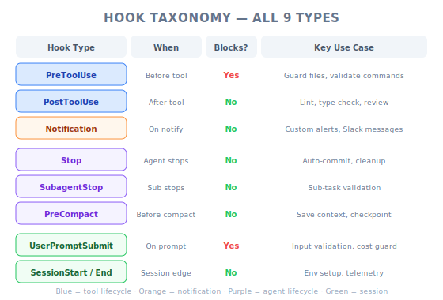

# Another Useful Hook — PM Perspective

| Item | Details |
|------|---------|
| Exam Coverage | D3 — Claude Code Configuration & Workflows (20%), D1 — Agentic Architecture (27%) |
| Task Statements | 1.5 (Agent SDK hooks), 3.2 (custom commands & hooks), 1.7 (session state & resumption) |
| Course Source | claude-code-in-action / 05-hooks / Lesson 19 (text-only) |

---

## TL;DR



*Figure: Complete hook taxonomy — all 9 hook types organized by lifecycle stage, blocking capability, and use case.*

Claude Code has 9 hook types — not just PreToolUse and PostToolUse. The additional hooks (`Stop`, `SubagentStop`, `Notification`, `PreCompact`, `UserPromptSubmit`, `SessionStart`, `SessionEnd`) cover the full AI session lifecycle. For PMs, this means you can specify automation at **every stage** of the AI workflow — from session start to finish, not just during tool execution.

---

## Why PMs Need to Know All Hook Types

Understanding the full hook taxonomy lets you write more precise requirements:

| PM Question | Relevant Hook | Example Requirement |
|-------------|--------------|---------------------|
| "What happens when the AI finishes a task?" | `Stop` | "Generate a summary report after each review session" |
| "How do we set up the environment?" | `SessionStart` | "Load project configuration when Claude starts" |
| "What happens when a sub-task completes?" | `SubagentStop` | "Validate subagent output before coordinator uses it" |
| "How do we preserve context?" | `PreCompact` | "Extract key decisions before auto-compaction" |
| "Can we validate user input?" | `UserPromptSubmit` | "Check prompts against template before processing" |

Without knowing these hook types, PMs default to vague requirements like "the system should log everything" — which engineers cannot implement precisely.

---

## Mental Model: Hotel Guest Lifecycle

Think of an AI session like a hotel guest's stay:

| Hotel Event | Hook Type | What Happens |
|------------|-----------|--------------|
| Guest checks in | `SessionStart` | Room prepared, preferences loaded |
| Guest makes a request (room service) | `PreToolUse` | Verify request is allowed, check credit |
| Request fulfilled | `PostToolUse` | Quality check, update bill |
| Guest asks front desk but nobody's there | `Notification` | Alert manager (permission needed or idle) |
| Concierge finishes a delegated errand | `SubagentStop` | Report back to guest with results |
| Room getting cluttered | `PreCompact` | Housekeeping saves important items before cleaning |
| Guest writes in suggestion box | `UserPromptSubmit` | Front desk reviews before forwarding to management |
| Guest finishes all requests for the day | `Stop` | Daily summary prepared |
| Guest checks out | `SessionEnd` | Final bill, cleanup, loyalty points |

> [!TIP]
> **PM Takeaway**
>
> You don't need to understand the technical implementation of each hook. You need to know **which lifecycle moments can be automated** so you can write requirements that engineers can map to specific hook types.

---

## The Variable Data Problem (Simplified for PMs)

One challenge engineers face: each hook type receives different data. This is important for PMs because it affects what information is available at each stage:

| Hook Type | Available Data | PM Implication |
|-----------|---------------|----------------|
| `PreToolUse` / `PostToolUse` | Which tool, what input, what output | Can make decisions based on specific tool actions |
| `Stop` | Session ID, transcript path | Can generate summaries but doesn't know the last specific action |
| `Notification` | Session ID, notification details | Can alert but has limited context |
| `SubagentStop` | Session ID, subagent output | Can validate sub-task results |

> [!IMPORTANT]
> **Why PMs need to care**
>
> If you write a requirement like "log every database query Claude makes," engineers need to know this means a PostToolUse hook on database tools (which has `tool_input` with the query). If you write "summarize what Claude did after each session," that's a Stop hook (which has `transcript_path` but no individual tool data).

---

## Product Scenario Walkthrough

### Scenario: AI-Powered Code Review Pipeline

You are PM for a CI/CD system that uses Claude Code for automated code reviews. Here's how different hook types apply:

| Pipeline Stage | Hook Type | Automation |
|---------------|-----------|------------|
| Pipeline starts | `SessionStart` | Load repo config, set review scope |
| Claude reviews a file | `PostToolUse` | Run linter after each file read |
| Claude writes review comments | `PostToolUse` | Validate comment format |
| A research subagent investigates a pattern | `SubagentStop` | Verify research results are structured |
| Context getting large | `PreCompact` | Save key findings before trimming |
| Claude finishes review | `Stop` | Generate review summary, write to PR |
| Pipeline ends | `SessionEnd` | Clean up temp files, update metrics |

**PRD Language**:
- Instead of: "The system should automatically generate a review summary"
- Write: "A `Stop` hook generates a structured review summary written to the PR after Claude finishes responding"

This gives engineers an unambiguous implementation target.

---

## The Debug Hook: A PM Should Know It Exists

Engineers use a simple debug technique to discover what data each hook receives:

```json
{
  "matcher": "*",
  "hooks": [{ "type": "command", "command": "jq . > log.json" }]
}
```

**Why PMs should care**: If engineers say "we don't know what data is available at this lifecycle stage," the answer is: use a debug hook to discover it. This prevents requirements from being blocked by "we'd need to investigate."

---

## Hook Type Decision Framework for PMs

When writing requirements, use this decision tree:

1. **Does it need to happen BEFORE an AI action?** → PreToolUse (can block)
2. **Does it need to happen AFTER an AI action?** → PostToolUse (feedback only)
3. **Does it need to happen when Claude is DONE responding?** → Stop
4. **Does it need to happen when a SUB-TASK completes?** → SubagentStop
5. **Does it need to happen at SESSION start/end?** → SessionStart / SessionEnd
6. **Does it need to happen when CONTEXT is about to be trimmed?** → PreCompact
7. **Does it need to happen when the USER submits a prompt?** → UserPromptSubmit
8. **Does it need to happen when Claude NEEDS ATTENTION?** → Notification

> [!TIP]
> **Simple rule**
>
> Match the hook to the **lifecycle moment**, not the action. "After Claude finishes" is a Stop hook, not a PostToolUse hook on every tool.

---

## Anti-Patterns (Exam Favorites)

| ❌ Wrong Approach | ✅ Correct Approach | Why |
|-------------------|---------------------|-----|
| Write "the system should log everything" | Specify which hook type logs what data | Vague requirements lead to over-engineering or under-engineering |
| Assume all hooks provide the same data | Understand that data varies by hook type | Requirements may ask for data not available at that lifecycle stage |
| Use PostToolUse for session-end actions | Use Stop hook for session-end actions | PostToolUse fires per-tool, Stop fires once at the end |
| Ignore SubagentStop in multi-agent designs | Use SubagentStop to validate sub-task outputs | Without validation, coordinator may process malformed subagent data |

---

## Practice Questions

### Question 1: CI/CD Pipeline Scenario

Your team's CI pipeline uses Claude Code for automated PR reviews. After Claude finishes reviewing, you need a summary written to a log file for auditing. Which approach is correct?

- A. PostToolUse hook with `matcher: "*"` that appends to a log after every tool call
- B. Stop hook that reads the transcript and generates a structured summary
- C. SessionEnd hook that writes a raw dump of all data
- D. Notification hook that sends the summary when Claude goes idle

<details><summary>Answer and Explanation</summary>

**B** — The Stop hook fires exactly when Claude finishes responding. It has access to `transcript_path` for generating a meaningful summary. This is the correct lifecycle moment for "after Claude finishes."

- A fires after every tool call, generating many partial entries — not a clean summary
- C fires when the entire session ends, which may be too late or too broad
- D fires on idle or permission requests, not on completion

**PM Key Takeaway**: "After Claude finishes" maps to the `Stop` hook, not PostToolUse. Getting the lifecycle moment right is critical for writing implementable requirements.
</details>

### Question 2: Multi-Agent Research Scenario

A coordinator agent dispatches research tasks to subagents. You need to ensure each subagent returns structured JSON data before the coordinator processes it. What should you specify in the requirements?

- A. Add validation instructions to the coordinator's system prompt
- B. Implement a SubagentStop hook that validates the subagent's output structure
- C. Implement a PostToolUse hook on the coordinator's tool calls
- D. Add a PreCompact hook to check data before context trimming

<details><summary>Answer and Explanation</summary>

**B** — `SubagentStop` fires when a subagent completes, which is the exact point where output validation should occur. It provides deterministic validation before the coordinator processes potentially malformed data.

- A is prompt-based (probabilistic) and puts the burden on the coordinator
- C fires on the coordinator's own tool calls, not when subagents finish
- D is about context management, not output validation

**PM Key Takeaway**: In multi-agent architectures, specify validation at the **boundary between agents** — that's where SubagentStop hooks live.
</details>

### Question 3: Developer Productivity Scenario

Your development team wants to automatically load project-specific context (coding standards, architecture decisions) when starting a Claude Code session. Which hook type is appropriate?

- A. PreToolUse hook that loads context before the first tool call
- B. UserPromptSubmit hook that injects context before the first prompt
- C. SessionStart hook that loads project context when the session begins
- D. Notification hook that loads context when Claude requests permission

<details><summary>Answer and Explanation</summary>

**C** — `SessionStart` fires when a session begins or is resumed, making it the natural place to load environment and project context.

- A only fires when a specific tool is called, which may not be the first action
- B fires on every user prompt, not just session start — would repeatedly load context
- D fires on notifications, which is unrelated to session initialization

**PM Key Takeaway**: Environment setup belongs in `SessionStart`, not in per-action hooks. This ensures context is loaded once and available throughout the session.
</details>
