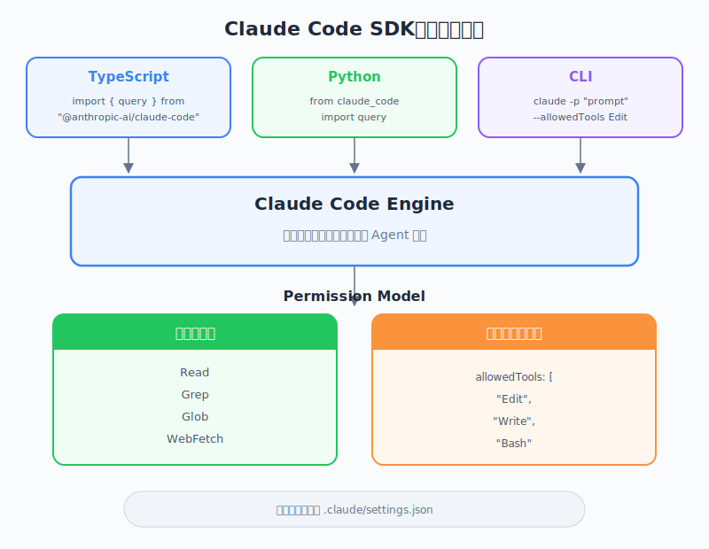

# The Claude Code SDK — 工程師視角

| 項目 | 內容 |
|------|------|
| 考試對應 | D2 — Tool Integration & MCP（佔 20%）、D3 — Claude Code Configuration & Workflows（佔 20%）、D1 — Agentic Architecture（佔 27%） |
| Task Statements | 2.4（MCP integration — SDK 以程式化方式擴展 Claude Code）、3.6（CI/CD integration — SDK 驅動自動化工作流）、1.1（agentic loops — SDK 以程式化方式執行完整 agentic loop） |
| 課程來源 | claude-code-in-action / 06-sdk-and-wrap-up / Lesson 20 |

---

## 一句話理解

Claude Code SDK 讓你從 TypeScript、Python 或 CLI 以程式化方式執行 Claude Code — 繼承所有設定和權限 — 預設為唯讀模式，需要透過 `allowedTools` 明確授權才能寫入，是互動式 Claude Code 與自動化 pipeline 之間的橋樑。

---


*圖：Claude Code SDK 架構 — 三個進入點、同一引擎、權限模型。*


## SDK 是什麼，為什麼存在

終端機裡的 Claude Code 是互動式的 — 人類打字、看回應。SDK 把人從迴圈中移除：你的程式碼送出 prompt 並處理回應。

關鍵點：SDK **不是**獨立產品。它底層跑的是完全相同的 Claude Code，這意味著：

- 它讀取 `CLAUDE.md` 檔案
- 它遵守 `.claude/settings.json` 的權限設定
- 它使用相同的工具（Read、Write、Edit、Bash 等）
- 它遵循相同的 agentic loop 架構

> 💡 **核心洞察**
> SDK 就是沒有終端機 UI 的 Claude Code。相同引擎、相同設定、相同能力 — 不同介面。

---

## 三種存取方式

SDK 透過三種介面提供：

### 1. TypeScript（主要方式）

```typescript
import { query } from "@anthropic-ai/claude-code";

const messages = await query({
  prompt: "這個專案中有哪些重複的 query？",
  options: {
    maxTurns: 10,
  },
});

for await (const message of messages) {
  if (message.type === "text") {
    console.log(message.content);
  }
}
```

### 2. Python

```python
import subprocess
import json

result = subprocess.run(
    ["claude", "--print", "--output-format", "json", "Find duplicate queries"],
    capture_output=True, text=True
)
response = json.loads(result.stdout)
```

### 3. CLI（Pipe 模式）

```bash
echo "Find duplicate queries" | claude --print --output-format json
```

> 🎬 **講師影片重點**
> 講師先示範 TypeScript SDK，因為它提供最豐富的 API，支援 async iteration 逐筆讀取訊息。Python 和 CLI 則是透過 subprocess 呼叫 `claude` CLI binary。

---

## 權限模型：預設唯讀

這是 SDK 中最重要的安全概念：

```typescript
// 預設：Claude 只能讀取檔案，不能修改
const messages = await query({
  prompt: "分析這個 codebase",
});

// 明確授權寫入：必須指定 allowedTools
const messages = await query({
  prompt: "在 package.json 加入一個 test script",
  options: {
    allowedTools: ["Edit", "Write", "Bash"],
  },
});
```

**為什麼預設唯讀？** 程式化執行時沒有人類在迴圈中，沒有人可以批准危險操作。SDK 預設採取最安全的姿態。

| 權限等級 | Claude 可以做什麼 | 使用場景 |
|---------|------------------|---------|
| 預設（無 `allowedTools`） | 讀取檔案、分析程式碼、回答問題 | Code review、分析、文件查詢 |
| `allowedTools: ["Edit"]` | 讀取 + 修改既有檔案 | 自動重構、程式碼修正 |
| `allowedTools: ["Edit", "Write"]` | 讀取 + 修改 + 建立檔案 | 程式碼生成、Scaffolding |
| `allowedTools: ["Edit", "Write", "Bash"]` | 完整存取包含 shell 指令 | CI/CD pipeline、Build 自動化 |

> 🎯 **考試重點**
> 最小權限原則適用：只授予 SDK 呼叫實際需要的工具。Code review pipeline 不應該有 `Bash` 存取權限。

---

## 基本使用模式

核心模式是：**import -> query -> iterate**

```typescript
import { query } from "@anthropic-ai/claude-code";

// 1. 發送 prompt（啟動 agentic loop）
const conversation = await query({
  prompt: "找出 src/ 中所有重複的資料庫 query",
  options: {
    maxTurns: 10,         // 限制 agentic loop 迭代次數
    allowedTools: [],      // 唯讀（預設）
  },
});

// 2. 非同步迭代訊息
for await (const message of conversation) {
  switch (message.type) {
    case "text":
      console.log("Claude 說:", message.content);
      break;
    case "tool_use":
      console.log("Claude 使用工具:", message.name);
      break;
    case "error":
      console.error("錯誤:", message.content);
      break;
  }
}
```

`query()` 函式回傳一個 async iterable — 訊息會隨著 Claude 思考和行動串流進來，就像終端機體驗一樣。

> 💡 **核心洞察**
> `maxTurns` 控制 Claude 可以執行多少次 agentic loop 迭代。每個 turn 可能包含多個 tool call。設太低可能讓 Claude 無法完成複雜任務；設太高可能造成不必要的成本。

---

## 實際使用場景

SDK 的真正威力在 pipeline 整合中展現：

### Git Hooks

```typescript
// pre-commit hook：檢查 secrets
const result = await query({
  prompt: "檢查 staged 檔案中是否有寫死的 secrets 或 API keys",
  options: { maxTurns: 5 },
});
```

### Build Scripts

```typescript
// Post-build：生成 changelog
const result = await query({
  prompt: "比較 HEAD 與上一個 tag，生成一筆 changelog 條目",
  options: { maxTurns: 10 },
});
```

### CI/CD Pipelines

```typescript
// PR review bot
const result = await query({
  prompt: `Review 這個 PR diff 找出問題:\n${prDiff}`,
  options: {
    maxTurns: 15,
    allowedTools: [],  // 唯讀用於 review
  },
});
```

> 🎬 **講師影片重點**
> 講師示範了兩步驟工作流：先用唯讀模式呼叫 SDK 找出重複 query，再用 `allowedTools: ["Edit"]` 修改 `package.json`。這展示了漸進式權限提升模式。

---

## 安全性：設定繼承

SDK 繼承 `.claude/settings.json` 的所有設定：

```json
{
  "permissions": {
    "allow": ["Read", "Glob", "Grep"],
    "deny": ["Bash(rm *)"]
  }
}
```

即使你的 SDK 程式碼傳入 `allowedTools: ["Bash"]`，settings 中的 deny 規則仍然適用。這是縱深防禦：

1. **第一層**：SDK `allowedTools` — 呼叫者授予的權限
2. **第二層**：`.claude/settings.json` — 專案允許的權限
3. **第三層**：Global settings — 使用者系統層級允許的權限

> 🎯 **考試重點**
> SDK 權限是呼叫者授予（`allowedTools`）和設定允許的**交集**。如果 settings deny `Bash(rm *)`，即使有 `allowedTools: ["Bash"]`，SDK 也無法執行 `rm`。

---

## 總結表格

| 概念 | 重點 | 考試相關性 |
|------|------|-----------|
| SDK 用途 | 以程式化方式執行 Claude Code，無需終端機 UI | D1 1.1 — 自動化中的 agentic loop |
| 三種介面 | TypeScript（主要）、Python、CLI | D2 2.4 — 程式化工具整合 |
| 預設唯讀 | 無寫入權限，除非 `allowedTools` 明確授權 | D3 3.6 — 安全的 CI/CD 整合 |
| 設定繼承 | SDK 遵守 `.claude/settings.json` 和 `CLAUDE.md` | D3 3.6 — 設定傳播 |
| Async Iteration | `for await (const msg of conversation)` 模式 | D1 1.1 — 串流 agentic 回應 |
| maxTurns | 控制 agentic loop 深度 | D1 1.1 — 迴圈終止控制 |
| Pipeline 整合 | Git hooks、CI/CD、build scripts、自動化 | D3 3.6 — CI/CD 整合 |

---

## 記憶卡

| # | 正面 | 背面 | 記憶錨點 |
|---|------|------|---------|
| 1 | Claude Code SDK 的預設權限等級是什麼？ | 唯讀。寫入需要透過 `allowedTools` 明確授權。 | 「沒有鑰匙就不能進」— SDK 預設門是鎖的 |
| 2 | 存取 Claude Code SDK 的三種方式？ | TypeScript（`@anthropic-ai/claude-code`）、Python（subprocess）、CLI（pipe 模式） | 三扇門通往同一個房間 |
| 3 | SDK 中 `maxTurns` 控制什麼？ | Claude 每次 query 可以執行的 agentic loop 迭代次數 | 就像賽車設定圈數上限 |
| 4 | SDK 會遵守 `.claude/settings.json` 嗎？ | 會 — 它繼承所有設定，包含 allow/deny 規則 | 相同引擎、相同規則手冊 |
| 5 | 如何在 TypeScript SDK 中授予寫入權限？ | 在 options 中傳入 `allowedTools: ["Edit", "Write"]` | 明確的鑰匙開明確的門 |
| 6 | CI/CD code review pipeline 推薦的權限模型？ | 唯讀（不設 `allowedTools`）— review 不需要寫入權限 | 稽核員，不是編輯者 |
| 7 | TypeScript SDK 的核心使用模式？ | Import `query` -> 帶 prompt 和 options 呼叫 -> async iterate 訊息 | Import、query、iterate |
| 8 | SDK 為什麼預設唯讀？ | 沒有人類在迴圈中批准危險操作 — 最小權限原則 | 沒有主管就不給剪刀 |

---

## 練習題

### Q1：CI/CD 整合場景

團隊想在 CI pipeline 中用 Claude Code SDK 加入自動化 code review 步驟。Review 只分析 PR，絕不修改程式碼。哪個設定正確？

- A. `allowedTools: ["Read", "Grep", "Glob"]`
- B. `allowedTools: []`（或完全省略這個欄位）
- C. `allowedTools: ["Edit"]` 搭配 settings 中的 deny 規則
- D. `allowedTools: ["Bash"]` 來執行分析指令

<details><summary>答案</summary>

**B** — SDK 預設就是唯讀模式。對於只需分析（不需修改）的 code review pipeline，傳空的 `allowedTools` 陣列或省略即可。Claude 仍然可以讀取檔案、搜尋程式碼、產生分析。

- A 不正確，因為 Read/Grep/Glob 預設就可用 — 不需列出
- C 授予不必要的寫入權限再試圖限制 — 違反最小權限原則
- D 授予遠超 review 所需的 shell 存取權限

關鍵：SDK 的預設唯讀姿態就是分析類任務的正確選擇。
</details>

### Q2：Agentic Loop 場景

你用 SDK 自動化 dependency 更新。Claude 需要讀取 `package.json`、檢查過期的 dependency 並更新它們。執行後你發現 Claude 在分析後停下，沒有進行修改。最可能的原因是什麼？

- A. `maxTurns` 設太低
- B. SDK 處於唯讀模式（沒有 `allowedTools` 授權 Edit）
- C. `.claude/settings.json` deny 了 Write 權限
- D. TypeScript SDK 不支援檔案修改

<details><summary>答案</summary>

**B** — SDK 預設唯讀。沒有 `allowedTools: ["Edit"]`，Claude 可以分析 `package.json` 但無法修改它。Claude 會報告發現結果但跳過編輯步驟。

- A 可能導致過早停止，但描述的症狀（分析後在編輯前停止）指向權限問題，不是 turn 限制
- C 有可能但不太可能是首要原因 — SDK 自身的唯讀預設會先觸發
- D 事實錯誤 — TypeScript SDK 在授權後完全支援檔案修改

關鍵：當 SDK 只分析不修改時，先檢查 `allowedTools`。
</details>

