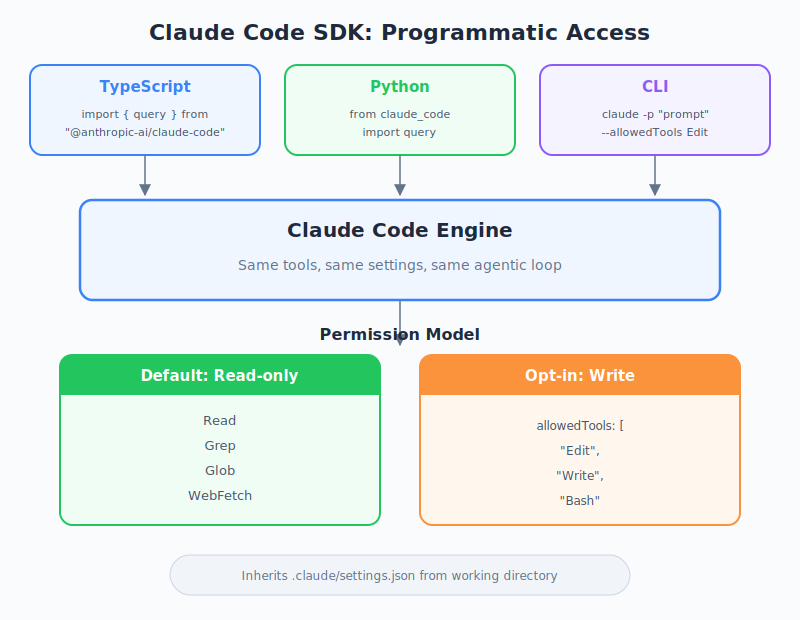

# The Claude Code SDK — PM Perspective

| Item | Details |
|------|---------|
| Exam Coverage | D2 — Tool Integration & MCP (20%), D3 — Claude Code Configuration & Workflows (20%), D1 — Agentic Architecture (27%) |
| Task Statements | 2.4 (MCP integration — SDK extends Claude Code programmatically), 3.6 (CI/CD integration — SDK enables automated workflows), 1.1 (agentic loops — SDK runs full agentic loops programmatically) |
| Course Source | claude-code-in-action / 06-sdk-and-wrap-up / Lesson 20 |

---

## TL;DR

The Claude Code SDK lets other programs use Claude Code without a human at the keyboard. It is the same Claude Code — same rules, same capabilities — but controlled by scripts and pipelines instead of a person. By default it can only read, not write, which is a deliberate safety choice. PMs need to understand this because it determines what automated workflows are possible and how to specify them in requirements.

---

*Figure: Claude Code SDK architecture — three entry points, same engine, permission model.*

## Why PMs Need to Know About the SDK

The SDK transforms Claude Code from a developer tool into an **automation component**. This matters for product because:

| Without SDK | With SDK |
|-------------|----------|
| Claude Code helps one developer at a time | Claude Code runs inside CI/CD for every PR |
| Human must type every prompt | Scripts trigger Claude Code on events (git push, build, schedule) |
| Permissions approved by the developer in real-time | Permissions must be pre-configured — no human in the loop |

> 💡 **PM Takeaway**
> The SDK is how Claude Code scales from "one developer's assistant" to "team-wide automation." Any requirement involving automated AI code review, generation, or analysis likely needs the SDK.

---

## Mental Model: Hiring a Contractor

Think of Claude Code in the terminal as having a contractor work beside you — you tell them what to do, watch them work, and approve each step.

The SDK is like giving that contractor **written work orders**:

| Aspect | Terminal (In-person) | SDK (Written work orders) |
|--------|---------------------|--------------------------|
| Communication | Real-time conversation | Pre-written instructions |
| Oversight | You watch every step | You review results after |
| Permissions | "Sure, go ahead" in the moment | Must be specified in the work order upfront |
| Safety | You can stop them mid-task | Safety rules must be pre-configured |
| Scale | One project at a time | Many projects simultaneously |

The key difference: **when there is no human watching, you need stricter rules upfront.**

---

## Three Ways to Use the SDK

The SDK comes in three flavors. PMs do not need to know the syntax, but should understand the trade-offs:

| Interface | Best For | Team Profile |
|-----------|----------|-------------|
| TypeScript | Rich integrations, real-time message processing | Teams with Node.js/TypeScript expertise |
| Python | Data pipelines, ML workflows, scripting | Teams with Python-heavy stacks |
| CLI (pipe mode) | Shell scripts, quick automations, bash-based CI | DevOps teams, simple integrations |

> 💡 **PM Takeaway**
> When scoping an SDK integration, ask your engineering team which interface fits their stack. The capabilities are identical — only the programming language differs.

---

## The Read-Only Default: A Product Decision

The SDK defaults to **read-only** mode. Claude can analyze code, find issues, and report findings — but cannot modify anything unless explicitly granted permission.

This is not a limitation — it is a deliberate product safety decision.

### Scenario Analysis: Why Read-Only Matters

Imagine a nightly CI job that uses Claude Code to review all open PRs:

| Scenario | Permission Level | What Happens |
|----------|-----------------|--------------|
| PR analysis + comment | Read-only (default) | Claude reads code, generates review comments. Safe. |
| Auto-fix formatting | Read + Edit | Claude reads code AND modifies files. Requires trust in the edit logic. |
| Auto-fix + commit + push | Read + Edit + Bash | Claude can run arbitrary shell commands. High risk without guardrails. |

Each step up the permission ladder adds capability AND risk. The SDK forces you to make this trade-off explicit.

> 🎯 **Exam Note**
> The principle of least privilege: grant only the permissions needed for the specific task. A code review bot should be read-only. A code formatting bot needs Edit. A deployment bot needs Bash. Never grant more than required.

---

## How the SDK Fits Into Pipelines

The SDK is most useful as a **component** in larger automated workflows:

### Scenario 1: Git Pre-Commit Hook

**Business need**: Prevent accidental secret commits

**Flow**: Developer commits code -> SDK analyzes staged files (read-only) -> blocks commit if secrets found

**Permission**: Read-only (default) — analysis only, no modifications needed

### Scenario 2: CI/CD Code Review

**Business need**: Every PR gets an automated first-pass review

**Flow**: PR opened -> CI triggers SDK -> SDK reads diff and generates review -> posts comments to PR

**Permission**: Read-only — review generates text output, does not modify code

### Scenario 3: Automated Dependency Updates

**Business need**: Keep dependencies current without manual work

**Flow**: Weekly schedule -> SDK checks for outdated packages -> SDK updates config files -> creates PR

**Permission**: Read + Edit — must modify configuration files

> 🎬 **Instructor insight from the video**
> The instructor shows a two-step demo: first using read-only mode to find duplicate queries in the codebase, then granting Edit permission to update package.json. This progressive permission pattern is the recommended approach — analyze first, then modify only what is needed.

---

## Security: Settings Inheritance

The SDK inherits all security settings from the project configuration. This means:

1. **Project-level rules** (`.claude/settings.json`) apply to SDK calls
2. **Deny rules cannot be overridden** by the SDK caller
3. **Defense in depth**: even if the SDK grants a permission, project settings can still block it

### Scenario Analysis: Multi-Layer Security

A company has these rules in `.claude/settings.json`:
- Allow: Read, Grep, Glob
- Deny: Bash commands that delete files

An engineer writes an SDK script that grants `allowedTools: ["Bash"]`.

**Result**: Claude can run Bash commands EXCEPT deletion commands. The settings deny rule acts as a guardrail that the SDK cannot bypass.

> 💡 **PM Takeaway**
> When writing requirements for SDK-based automations, specify BOTH the SDK permissions AND the project settings. They work together as layers — the SDK grants capability, and settings define boundaries.

---

## PM Requirements Checklist for SDK Features

When specifying an SDK-based feature, include:

| Requirement Area | What to Specify | Example |
|-----------------|-----------------|---------|
| Task scope | What should the AI analyze or modify | "Review all Python files in the PR diff" |
| Permission level | Read-only, Edit, Write, Bash, or combination | "Read-only for analysis; Edit for auto-fix mode" |
| Trigger | What event starts the SDK call | "On PR creation" or "Nightly at 2 AM" |
| Output | Where results go | "Post as PR comment" or "Write to audit log" |
| Guardrails | What the AI must NOT do | "Must not modify test files" or "Max 10 agentic turns" |
| Failure handling | What happens when the SDK call fails | "Log error and notify team channel" |

---

## Anti-Patterns (Exam Favorites)

| Wrong Approach | Correct Approach | Why |
|----------------|------------------|-----|
| Grant full permissions "to be safe" | Grant minimum permissions needed | More permissions = more risk. "Safe" means fewer permissions, not more. |
| Treat SDK as a different product from Claude Code | Understand SDK is the same engine with a programmatic interface | Same settings, same tools, same capabilities |
| Skip specifying permission levels in requirements | Explicitly state read-only vs. write for each automation | Engineers cannot guess the intended safety posture |
| Assume SDK automations need no human oversight | Design review checkpoints for high-risk SDK actions | No human in the loop means pre-configured rules must be thorough |

---

## Summary Table

| Concept | Key Point | Exam Relevance |
|---------|-----------|----------------|
| SDK Purpose | Run Claude Code programmatically as part of pipelines | D1 1.1 — agentic loops in automation |
| Three Interfaces | TypeScript, Python, CLI — same capabilities | D2 2.4 — programmatic tool integration |
| Read-Only Default | Safety-first: no writes unless explicitly granted | D3 3.6 — secure CI/CD integration |
| Settings Inheritance | Project settings act as guardrails SDK cannot bypass | D3 3.6 — defense in depth |
| Pipeline Integration | Git hooks, CI/CD, build scripts, scheduled jobs | D3 3.6 — workflow automation |
| Permission Escalation | Analyze first (read-only), then modify (with grants) | D3 3.6 — progressive permission model |

---

## Flashcards

| # | Front | Back | Memory Anchor |
|---|-------|------|---------------|
| 1 | What is the Claude Code SDK's default permission level? | Read-only. Write access requires explicit permission grants. | Contractor with a "look but don't touch" work order |
| 2 | What three interfaces does the SDK offer? | TypeScript, Python, and CLI (pipe mode) — all with identical capabilities | Three phone lines to the same office |
| 3 | Why does the SDK default to read-only? | No human in the loop to approve risky actions — principle of least privilege | Unsupervised contractor gets stricter rules |
| 4 | Does the SDK respect project settings? | Yes — deny rules in settings cannot be overridden by SDK permission grants | Building security overrides your visitor badge |
| 5 | What is the recommended approach for SDK automations that need to modify code? | Analyze first in read-only mode, then modify with explicit permission grants | Inspect the house before renovating |
| 6 | Name three practical SDK use cases | Git pre-commit hooks (secret detection), CI/CD code review, automated dependency updates | Security guard, quality inspector, maintenance crew |
| 7 | What should PM requirements specify for SDK features? | Task scope, permission level, trigger, output destination, guardrails, failure handling | The complete work order checklist |
| 8 | How do SDK permissions and project settings interact? | They intersect — SDK grants capability, settings define boundaries. Deny rules always win. | Two locks on the same door |

---

## Practice Questions

### Question 1: CI/CD Pipeline Scenario

Your team wants Claude Code to automatically review every PR and post comments. The review should analyze code quality but never modify any files. As PM, which permission specification is correct in the requirements?

- A. "Grant full access so Claude can thoroughly review the code"
- B. "Use read-only mode — Claude analyzes and generates review text without file modifications"
- C. "Grant Edit permission so Claude can fix issues it finds during review"
- D. "Grant Bash permission so Claude can run test suites as part of the review"

Answer and Explanation

**B** — A code review that posts comments only needs to read code and generate text. Read-only mode provides exactly this capability with maximum safety.

- A violates least privilege — review does not need write access
- C conflates review with auto-fix — these should be separate features with separate permissions
- D adds unnecessary risk — running tests is a separate concern from code review

**PM Key Takeaway**: Separate "analysis" features (read-only) from "modification" features (write access). Never bundle them under one permission level.

### Question 2: Automation Safety Scenario

An engineer proposes an SDK automation that updates dependencies weekly. The script grants `allowedTools: ["Edit", "Write", "Bash"]`. The project settings deny `Bash(rm *)`. Can the automation accidentally delete files?

- A. Yes — `allowedTools` overrides project settings
- B. No — project settings deny rules always take precedence over SDK grants
- C. Yes — but only if Claude decides deletion is necessary
- D. No — `Bash` is completely disabled when any deny rule exists

Answer and Explanation

**B** — Project settings act as guardrails that SDK grants cannot bypass. The deny rule for `Bash(rm *)` prevents file deletion regardless of what `allowedTools` specifies.

- A is wrong — SDK grants never override settings deny rules
- C is wrong — Claude cannot bypass deny rules through reasoning
- D is wrong — only the specific pattern is blocked, not all Bash usage

**PM Key Takeaway**: Project settings are your safety net. When writing requirements, specify both SDK permissions AND project settings deny rules for defense in depth.

### Question 3: Product Scoping Scenario

You are scoping a new feature: "AI-powered code generation that creates boilerplate files from templates." Which SDK permission level is the minimum required?

- A. Read-only (default)
- B. Edit only
- C. Edit + Write
- D. Edit + Write + Bash

Answer and Explanation

**C** — Code generation that creates new files needs Write permission (to create new files). Edit is needed if the generation also modifies existing files (e.g., updating an index). Bash is not needed for file creation.

- A is insufficient — cannot create files in read-only mode
- B is insufficient — Edit modifies existing files but cannot create new ones
- D grants unnecessary Bash access — file creation does not need shell commands

**PM Key Takeaway**: Map each feature action to the minimum tool it requires. "Create new files" = Write. "Modify existing files" = Edit. "Run shell commands" = Bash. Grant only what is needed.

