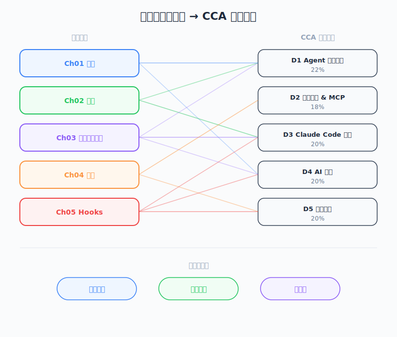

# Summary and Next Steps — 工程师视角

*圖：課程章節對應 CCA 考試領域。*

| 项目 | 内容 |
|------|------|
| 考试对应 | 全部 5 个 Domain（D1-D5） |
| Task Statements | 复习：1.1、2.1、2.4、3.1、3.2、3.6 |
| 课程来源 | claude-code-in-action / 06-sdk-and-wrap-up / Lesson 22 |

---

## 一句话理解

课程最后给出三个行动建议 — 持续关注更新、勇于实验定制化、善用 GitHub 集成自动化 — 同时作为整门课涵盖的五大 CCA 考试 domain 的总复习。

---

## 讲师的三个建议

| # | 建议 | 具体含义 | 对应考试 Domain |
|---|------|---------|----------------|
| 1 | **Stay Updated（保持更新）** | Claude Code 持续活跃开发中，新功能、工具和技巧频繁推出。追踪 Claude Code 首页和 changelog。 | D1 — Agentic Architecture（理解不断演进的能力） |
| 2 | **Experiment（实验）** | 编写 custom commands、丰富 `CLAUDE.md`、尝试课程之外的 MCP servers。通过动手实验建立肌肉记忆。 | D2 — Tool Use & MCP、D3 — Configuration |
| 3 | **Automate（自动化）** | 用 GitHub integration 将重复性任务交给 Claude。思考哪些触发条件（PR 创建、Issue 开启、`@claude` mention）可以驱动自动化。 | D3 — CI/CD、D5 — Developer Productivity |

---

## 课程章节 vs 考试 Domain 对照表

这是考前复习最重要的对照表。每个章节对应到特定的 CCA domain：

| 章节 | 课程 | 主要 Domain | 次要 Domain | 核心概念 |
|------|------|------------|------------|---------|
| 01 — Intro | 02-04 | D1 — Agentic Architecture（27%） | D5 — Developer Productivity（18%） | Agentic loops、plan-execute-observe 循环、coding assistant vs autocomplete |
| 02 — Getting Started | 05-08 | D3 — Configuration（20%） | D1 — Agentic Architecture（27%） | `CLAUDE.md`、project setup、context window、permission model、iterative changes |
| 03 — Context & Commands | 10-11 | D3 — Configuration（20%） | D2 — Tool Use & MCP（20%） | Context 管理、`@file` 引用、custom slash commands、`.claude/commands/` |
| 04 — Integrations | 12-13 | D2 — Tool Use & MCP（20%） | D3 — Configuration（20%） | MCP 架构（host/client/server）、`settings.json`、GitHub Actions、`-p` flag、`allowed_tools` |
| 05 — Hooks | 14-19 | D3 — Configuration（20%） | D1 — Agentic Architecture（27%） | Hook 生命周期（9 种）、PreToolUse/PostToolUse、blocking vs non-blocking、stdin/stdout 协议 |
| 06 — SDK & Wrap Up | 20-22 | D1 — Agentic Architecture（27%） | D4 — Security（15%） | SDK programmatic access、`claudeClient.sendMessage()`、conversation turns array、总复习 |

---

## 核心概念复习表

| 概念 | 章节 | Domain | 一句话定义 |
|------|------|--------|-----------|
| Agentic loop | 01 | D1 | Claude 自主地计划、执行工具、观察结果、迭代，直到任务完成。 |
| `CLAUDE.md` | 02 | D3 | 项目级别的指令文件，Claude 会自动读取以理解项目惯例和约束。 |
| Permission model | 02 | D4 | 三层架构 — project（`settings.json`）、user（`settings.local.json`）、enterprise（`settings.enterprise.json`）— 使用 allowlist 和 denylist。 |
| Context window | 03 | D1 | 有限的 token 预算；通过 `@file` 引用、`.claudeignore` 和 compaction 管理。 |
| Custom commands | 03 | D3 | 放在 `.claude/commands/` 的 Markdown 文件，定义可重复使用的 slash command，支持 `$ARGUMENTS` 插值。 |
| MCP architecture | 04 | D2 | Host（Claude Code）通过 stdio/SSE 连接 MCP servers；servers 提供 tools、resources 和 prompts。 |
| CI 中的 `allowed_tools` | 04 | D3/D4 | 在 non-interactive 模式（`-p` flag）下，每个 tool 必须逐一列出 — 不能用 blanket server 权限。 |
| Hooks | 05 | D3 | 在特定生命周期节点执行的脚本；9 种类型，2 种可 blocking（PreToolUse、UserPromptSubmit）。 |
| Hook stdin/stdout 协议 | 05 | D3 | Hooks 通过 stdin 接收 JSON，通过 stdout 返回 JSON。结构依 hook 类型和 tool matcher 而异。 |
| SDK（`@anthropic-ai/claude-code`） | 06 | D1 | Node.js 包，提供 programmatic 访问；调用 `claudeClient.sendMessage()` 返回 conversation turns array，支持 streaming。 |

---

## CCA 考试备考清单

用这份清单确认你已涵盖课程中的每个主要主题：

### D1 — Agentic Architecture（27%）
- [ ] 能解释 agentic loop（plan、execute、observe、iterate）
- [ ] 理解 Claude 如何决定使用哪些 tools
- [ ] 知道 agentic coding 和 autocomplete 的差异
- [ ] 能描述 SDK 的 programmatic 接口（`sendMessage`、conversation turns）
- [ ] 理解 subagent 架构（Task tool）

### D2 — Tool Use & MCP（20%）
- [ ] 能描述 MCP 架构：host、client、server
- [ ] 知道三个 MCP primitives：tools、resources、prompts
- [ ] 理解传输机制：stdio 和 SSE
- [ ] 能在 `settings.json` 中配置 MCP servers
- [ ] 知道 local 和 CI 环境下 MCP 权限的差异

### D3 — Configuration & Workflows（20%）
- [ ] 能创建和组织 `CLAUDE.md` 文件（root、nested、`~/.claude/CLAUDE.md`）
- [ ] 知道如何在 `.claude/commands/` 中创建 custom commands
- [ ] 理解 hook 系统：9 种类型、blocking vs non-blocking
- [ ] 能配置 Claude Code 的 GitHub Actions workflows
- [ ] 知道 `custom_instructions`、`mcp_config`、`allowed_tools` 配置层级

### D4 — Security & Trust（15%）
- [ ] 理解三层 permission model（project/user/enterprise）
- [ ] 知道 allowlist vs denylist 行为
- [ ] 能解释为什么 CI 需要逐一列出 tool 权限
- [ ] 理解 hook 的安全意义（PreToolUse 作为访问控制）

### D5 — Developer Productivity（18%）
- [ ] 能判断何时使用 Claude Code vs 传统工具
- [ ] 知道如何组织 prompt 以达到有效的 agentic 执行
- [ ] 理解自动化（GitHub integration）如何减少手动工作
- [ ] 能评估合适的定制化层级（CLAUDE.md、commands、hooks、SDK）

---

## Flashcards

### Card 1
**Q:** MCP servers 的传输机制有哪些？
**A:** stdio（本机 process）和 SSE（HTTP streaming）。课程主要涵盖 stdio 用于本机 MCP servers 和 GitHub Actions 环境。

### Card 2
**Q:** `-p` flag 是什么？何时使用？
**A:** `-p`（print/pipe）flag 让 Claude Code 以 non-interactive 模式运行。用于 CI/CD（GitHub Actions）。因为没有人类可以批准，需要 `allowed_tools` 逐一列出每个允许的 tool。

### Card 3
**Q:** 列出两种 blocking hook 类型。
**A:** `PreToolUse` 和 `UserPromptSubmit`。这两种可以通过返回 `{ "decision": "block" }` 阻止 Claude 继续。

### Card 4
**Q:** `CLAUDE.md` 配置的三个层级是什么？
**A:** (1) 项目根目录 `CLAUDE.md`，(2) 嵌套目录 `CLAUDE.md` 文件（作用范围限于子目录），(3) 用户全局 `~/.claude/CLAUDE.md`。

### Card 5
**Q:** SDK 和 CLI 的差异是什么？
**A:** SDK（`@anthropic-ai/claude-code`）通过 Node.js 提供 programmatic 访问。调用 `claudeClient.sendMessage()` 返回 conversation turns array。CLI 是交互式终端使用。

### Card 6
**Q:** Custom commands 使用什么文件结构？
**A:** `.claude/commands/`（project scope）或 `~/.claude/commands/`（user scope）中的 Markdown 文件。用 `/command-name` 调用。支持 `$ARGUMENTS` placeholder 做参数化。

### Card 7
**Q:** 在 GitHub Actions 中，为什么不能用 `mcp__playwright` 作为 blanket 权限？
**A:** 在 non-interactive 模式（`-p` flag）中，没有人类可以批准 tool 使用。每个 tool 必须在 `allowed_tools` 中逐一列出。Blanket server-level 权限只在交互（本机）模式下有效。

### Card 8
**Q:** Hook 的 stdin/stdout 协议是什么？
**A:** Hooks 通过 stdin 接收带有事件 context 的 JSON。通过 stdout 返回 JSON。对 PreToolUse：返回 `{ "decision": "allow" }` 或 `{ "decision": "block", "reason": "..." }`。结构依 hook 类型而异。

### Card 9
**Q:** 讲师给了哪三个持续学习的建议？
**A:** (1) Stay updated — Claude Code 持续演进中。(2) Experiment — 尝试 custom commands、CLAUDE.md 定制化、新的 MCP servers。(3) Automate — 用 GitHub integration 处理由事件触发的重复性任务。

### Card 10
**Q:** 哪个考试 domain 权重最高？
**A:** D1 — Agentic Architecture，占 27%。涵盖 agentic loops、tool selection、SDK，以及核心的 plan-execute-observe 循环。
