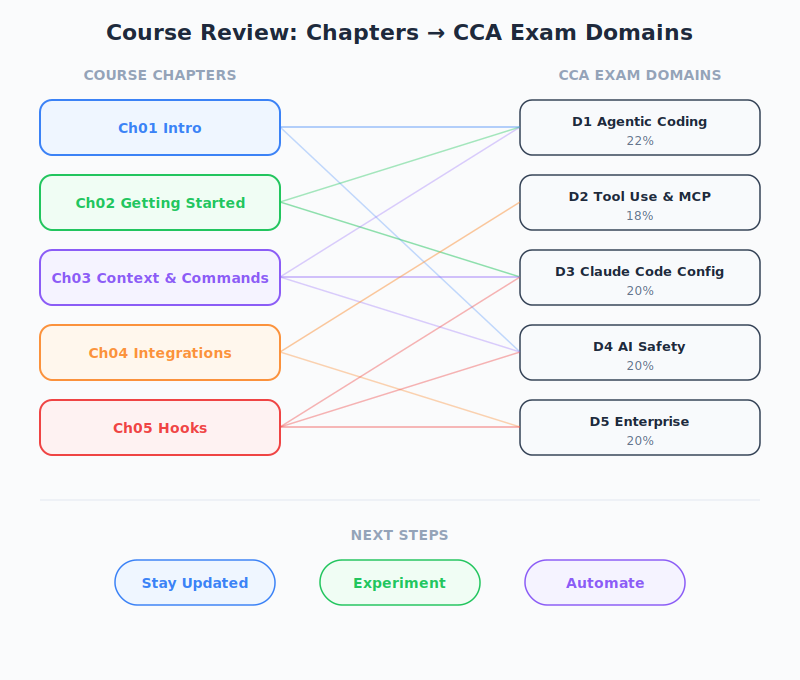

# Summary and Next Steps — PM Perspective

| Item | Details |
|------|---------|
| Exam Coverage | All 5 Domains (D1-D5) |
| Task Statements | Review: 1.1, 2.1, 2.4, 3.1, 3.2, 3.6 |
| Course Source | claude-code-in-action / 06-sdk-and-wrap-up / Lesson 22 |

---

## TL;DR

The course wraps up with three recommendations: stay updated, experiment, and automate. For PMs, this is the synthesis moment — understanding what Claude Code can do across the entire stack (agentic execution, tool integration, configuration, CI/CD automation) and translating that into product decisions, team workflows, and automation strategy.

---

*Figure: Course chapters mapped to CCA exam domains.*

## What We Learned: Chapter-by-Chapter PM Takeaways

| Chapter | What We Learned | PM Action Item |
|---------|----------------|---------------|
| 01 — Intro | Claude Code is an agentic coding assistant that plans, executes, and iterates autonomously. It is fundamentally different from autocomplete. | **Write positioning docs** that distinguish agentic AI from autocomplete tools when evaluating build-vs-buy. |
| 02 — Getting Started | Project setup via `CLAUDE.md` defines how Claude understands your codebase. Context window is finite and must be managed. | **Define project standards** for `CLAUDE.md` — what conventions, constraints, and context should every team project include? |
| 03 — Context & Commands | Custom commands create reusable workflows. Context can be precisely controlled with `@file` references. | **Identify repetitive team workflows** (code review, bug triage, release notes) that could become custom commands. |
| 04 — Integrations | MCP servers extend Claude's capabilities. GitHub integration automates PR reviews and issue responses. | **Evaluate MCP servers** relevant to your stack. **Set up automated PR review** as a quality gate. |
| 05 — Hooks | Hooks enforce policies at the tool-execution level. 9 hook types cover the entire lifecycle. | **Define governance policies** (e.g., "no direct production DB access") that should be enforced via hooks. |
| 06 — SDK & Wrap Up | The SDK enables programmatic integration. The course ends with three forward-looking recommendations. | **Plan integration roadmap** — where does Claude Code fit programmatically in your CI/CD pipeline? |

---

## The Three Recommendations Through a PM Lens

### 1. Stay Updated — Track the Platform Roadmap

Claude Code is actively evolving. New capabilities change what is possible.

**PM Actions:**
- Subscribe to Claude Code changelog and release notes
- Maintain a capability inventory — what Claude Code can do today vs what it could not do 3 months ago
- Revisit "not feasible" decisions quarterly as capabilities evolve

### 2. Experiment — Build Team Muscle Memory

Customization (CLAUDE.md, commands, MCP servers) is where Claude Code becomes a team-specific tool rather than a generic assistant.

**PM Actions:**
- Allocate sprint time for Claude Code experimentation (custom commands, MCP server trials)
- Create a shared `CLAUDE.md` template for your organization's projects
- Document which MCP servers your team uses and why

### 3. Automate — Design Event-Driven Workflows

GitHub integration turns Claude Code from a developer tool into a team automation layer.

**PM Actions:**
- Map your team's repetitive tasks to potential automation triggers (PR created, issue opened, `@claude` mention)
- Define SLAs for automated responses (e.g., "PR review within 5 minutes of creation")
- Create a governance framework for what Claude can and cannot do autonomously

---

## Course-to-Exam Domain Mapping (PM View)

| Domain | Weight | What PMs Should Know | Course Chapters |
|--------|--------|---------------------|----------------|
| D1 — Agentic Architecture | 27% | How Claude plans and executes autonomously. Why it sometimes fails (context limits, tool selection). | 01, 02, 06 |
| D2 — Tool Use & MCP | 20% | MCP as an extensibility model. How to evaluate and integrate third-party tools. | 04 |
| D3 — Configuration | 20% | `CLAUDE.md` as team standards. Commands as reusable workflows. Hooks as policy enforcement. CI/CD as automation. | 02, 03, 04, 05 |
| D4 — Security & Trust | 15% | Permission model (3 tiers). Why CI requires explicit permissions. Hook-based access control. | 02, 04, 05 |
| D5 — Developer Productivity | 18% | When to use Claude Code. How automation reduces toil. Measuring productivity gains. | 01, 04, 06 |

---

## PM Decision Framework: Where to Invest

Based on the full course, here is a prioritized investment framework:

| Priority | Investment | Effort | Impact | Rationale |
|----------|-----------|--------|--------|-----------|
| 1 | `CLAUDE.md` standards | Low | High | Every interaction benefits from clear project context. Zero ongoing cost. |
| 2 | Automated PR review (GitHub integration) | Medium | High | 100% review coverage. Catches structural issues. Reduces developer context switching. |
| 3 | Custom commands for team workflows | Low | Medium | Standardizes how the team interacts with Claude. Reusable across projects. |
| 4 | MCP server evaluation | Medium | Medium | Extends Claude's capabilities to match your tech stack. |
| 5 | Hook-based governance | High | Medium | Policy enforcement at the tool level. Important for security-sensitive teams. |
| 6 | SDK integration | High | Variable | Programmatic access for custom tooling. ROI depends on use case. |

---

## Business Impact Summary

| Metric | Before Claude Code | After Full Adoption |
|--------|-------------------|-------------------|
| PR review coverage | Inconsistent (depends on availability) | 100% automated first-pass |
| Bug triage time | Hours (developer investigates) | Minutes (`@claude` mention in issues) |
| Onboarding friction | High (learn project conventions manually) | Lower (`CLAUDE.md` encodes conventions) |
| Policy compliance | Manual review | Automated (hooks enforce at tool level) |
| Repetitive task cost | Developer time per occurrence | One-time command/automation setup |

---

## Practice Questions

### Question 1: Strategy Scenario

Your team has completed the Claude Code in Action course. The CTO asks you to propose a phased rollout plan. Which order makes the most sense?

- A. SDK integration, then hooks, then CLAUDE.md, then GitHub integration
- B. CLAUDE.md standards, then GitHub integration (PR review), then custom commands, then hooks
- C. Custom commands, then MCP servers, then CLAUDE.md, then SDK
- D. Hooks first (security), then everything else in any order

Answer and Explanation

**B** — Start with the lowest-effort, highest-impact items. `CLAUDE.md` is foundational (every interaction benefits). GitHub PR review provides immediate automation value. Custom commands standardize team workflows. Hooks come later as governance needs mature.

- A starts with the highest-effort item (SDK) — poor prioritization
- C skips the foundational layer (CLAUDE.md)
- D is security-first but ignores that you need basic adoption before governance

**PM Key Takeaway**: Foundation first (CLAUDE.md), automation second (GitHub), customization third (commands), governance fourth (hooks), programmatic access last (SDK).

### Question 2: Productivity Scenario

A developer on your team says "Claude Code is just a fancy autocomplete." Based on the course, what is the key distinction you should explain?

- A. Claude Code uses a larger language model
- B. Claude Code operates in an agentic loop — it plans, executes tools, observes results, and iterates autonomously, unlike autocomplete which predicts the next token
- C. Claude Code has access to MCP servers
- D. Claude Code can read CLAUDE.md files

Answer and Explanation

**B** — The fundamental distinction is the agentic loop. Autocomplete predicts inline completions. Claude Code autonomously plans multi-step approaches, executes tools (file reads, writes, terminal commands), observes results, and iterates. This is the core concept from Chapter 01 (D1 — Agentic Architecture).

- A is a technical detail, not the architectural distinction
- C and D are features within the agentic architecture, not the core difference

**PM Key Takeaway**: The agentic loop is the defining capability. Everything else (MCP, hooks, SDK) builds on top of this autonomous plan-execute-observe cycle.

### Question 3: Automation Scenario

Your team wants to automate three tasks: (1) PR code review, (2) enforce "no console.log in production code" policy, (3) generate release notes from PR descriptions. Which Claude Code features map to each?

- A. (1) GitHub PR Review Action, (2) PreToolUse hook, (3) Custom command
- B. (1) Custom command, (2) CLAUDE.md instruction, (3) GitHub mention
- C. (1) MCP server, (2) PostToolUse hook, (3) SDK integration
- D. (1) GitHub PR Review Action, (2) PostToolUse hook, (3) Custom command

Answer and Explanation

**A** — (1) The GitHub PR Review Action is purpose-built for automated code review. (2) A PreToolUse hook can intercept file writes and block if `console.log` is detected — this is a blocking policy enforcement. (3) A custom command can template the release notes generation workflow.

- B uses CLAUDE.md for policy enforcement — this is guidance, not enforcement (Claude can still proceed)
- C uses PostToolUse for policy — PostToolUse cannot block, only provide feedback after the fact
- D uses PostToolUse — same issue as C, it cannot prevent the violation

**PM Key Takeaway**: Blocking enforcement requires PreToolUse (the only tool-level hook that can prevent execution). PostToolUse is for observation and feedback, not enforcement.

