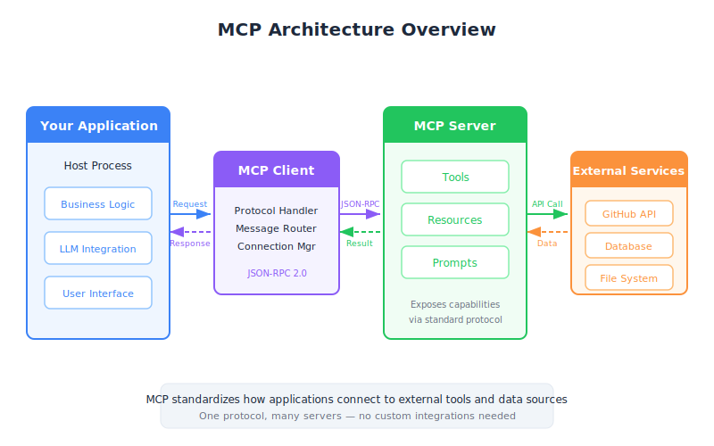

# Introducing MCP — PM Strategic Overview

| Item | Detail |
|------|--------|
| Exam Domain | D2 — Tool Design & MCP Integration (18%) |
| Task Statements | T2.1 Design and implement tool schemas; T2.3 Configure MCP server connections |
| Source | introduction-to-model-context-protocol / 01-mcp-basics / Lesson 03 |

---

## One-Liner

MCP is a universal adapter standard that lets AI assistants plug into any external service without requiring custom integration work for each one.

---

## The Business Problem: Integration Sprawl

Imagine you are managing a product team building a customer-facing AI assistant. The assistant needs to access GitHub for engineering data, Salesforce for customer data, and Slack for internal communications. Without a standard protocol, your engineering team must build and maintain a separate integration for each service — like building a custom power adapter for every appliance in your office.

This creates three compounding problems:

1. **Development cost** — Every new service requires weeks of custom integration work
2. **Maintenance burden** — When any service updates its API, your team must update the integration
3. **Quality risk** — Each hand-built integration is another surface for bugs and security issues

This is exactly what happened before USB existed in the hardware world. Every printer, keyboard, and mouse had its own proprietary connector. USB standardized the interface and transformed the entire industry.

> **PM Takeaway**
> When evaluating whether to adopt MCP for your product, the key question is not "can we build integrations ourselves?" but "should we be spending engineering cycles on integration plumbing instead of product features?"

---

## How MCP Changes the Game

MCP introduces a standard "plug" that all services can implement. Instead of your team building custom integrations, they connect to pre-built MCP servers that already know how to talk to each service.

Think of it as the difference between:

- **Before MCP**: Hiring a translator who speaks English-to-Spanish, another who speaks English-to-French, and another who speaks English-to-Japanese — each one custom-trained for your specific needs
- **After MCP**: Using a universal translation service where translators follow a standard protocol, and you can swap them in and out without retraining anyone

The MCP architecture has two key roles:

**MCP Client** — Your product (the thing users interact with). It knows how to ask for tools and use them, but does not need to know how each external service works internally.

**MCP Server** — A specialized connector for a specific service (GitHub, Salesforce, etc.). It handles all the service-specific complexity and presents a clean, standardized interface.

> **PM Takeaway**
> MCP is a "buy vs. build" accelerator. For every MCP server that exists in the ecosystem, your team avoids weeks of integration work. The ROI scales with the number of services your AI product needs to access.

---

## The MCP Ecosystem: Who Builds What

One of MCP's most important characteristics is its open ecosystem. MCP servers can be built by:

- **Service providers** (first-party): Companies like AWS or Stripe release official MCP servers for their platforms
- **Community developers** (third-party): Open-source contributors build and maintain servers for popular services
- **Your own team** (internal): For proprietary internal tools and databases that no public MCP server covers

This mirrors the app store model. Apple builds the platform (MCP protocol), some apps come from major companies (official MCP servers), and anyone can publish their own (custom servers).

---

## MCP vs. Tool Use: A Common Confusion

Stakeholders and even some engineers confuse these two concepts. Here is the clear distinction:

**Tool use** is the capability — Claude can call functions, retrieve data, and take actions. This exists with or without MCP.

**MCP** is the delivery mechanism — it provides the tool definitions and execution infrastructure so your team does not have to build them from scratch.

An analogy: tool use is like the ability to make phone calls. MCP is like a phone directory and switchboard service. You could make calls without a directory (manually dialing numbers you looked up yourself), but the directory makes it dramatically faster and more reliable.

> **PM Takeaway**
> In product discussions, frame MCP as the "how" of tool integration, not the "what." The "what" is Claude's ability to use tools. MCP just makes tool integration dramatically cheaper and faster to ship.

---

## Strategic Implications for Product Decisions

When planning your product roadmap, MCP affects several key decisions:

**Time-to-market**: Adding a new integration drops from weeks to days (or hours) when an MCP server already exists.

**Build vs. buy**: For standard services, using existing MCP servers is almost always the right call. Custom MCP servers make sense only for proprietary internal systems.

**Vendor lock-in**: MCP is an open protocol, not proprietary to Anthropic. This reduces dependency on any single AI provider.

**Scalability**: Your product can support dozens of integrations without proportional engineering headcount growth.

---

## CCA Exam Relevance

This lesson maps to **Domain 2 (18%)** — expect questions about:

- The business case for MCP over custom integrations
- Correctly distinguishing MCP from tool use (a frequent exam trap)
- Understanding the open ecosystem model (anyone can author servers)
- Identifying the Client-Server architecture roles

---

## Flashcards

| Front | Back |
|-------|------|
| What business problem does MCP solve? | It eliminates the need for teams to build and maintain custom integrations for every external service their AI product needs to access. |
| What real-world analogy best describes MCP? | USB for AI integrations — one standard protocol that any service can implement, replacing custom connectors for each service. |
| What is the difference between MCP and tool use? | Tool use is Claude's ability to call functions. MCP is the protocol that provides tool definitions and execution, so teams do not have to build them manually. |
| Who can build MCP servers? | Service providers (official), community developers (open-source), or your own team (for internal tools). |
| How does MCP affect time-to-market? | Adding a new service integration drops from weeks to days or hours when a pre-built MCP server exists. |
| What are the two roles in MCP architecture? | MCP Client (your product, which discovers and uses tools) and MCP Server (the connector that wraps an external service). |
| Why does MCP reduce vendor lock-in risk? | MCP is an open protocol, not proprietary to Anthropic, so switching AI providers does not require rebuilding all integrations. |
| What three types of capabilities does an MCP server expose? | Tools (actions), prompts (reusable templates), and resources (data access). |
