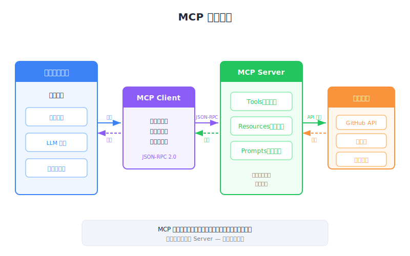

# Introducing MCP — PM 策略概覽

| Item | Detail |
|------|--------|
| Exam Domain | D2 — Tool Design & MCP Integration (18%) |
| Task Statements | T2.1 設計與實作 tool schemas; T2.3 設定 MCP server 連線 |
| Source | introduction-to-model-context-protocol / 01-mcp-basics / Lesson 03 |

---

## 一句話摘要

MCP 是一個通用轉接標準，讓 AI 助手能即插即用地連接任何外部服務，無需為每個服務做客製化整合。

---

## 商業問題：整合蔓延

想像你在管理一個產品團隊，正在打造面向客戶的 AI 助手。助手需要存取 GitHub 取得工程數據、Salesforce 取得客戶資料、Slack 用於內部溝通。沒有標準協定的話，你的工程團隊必須為每個服務建置和維護獨立的整合——就像為辦公室裡的每個電器打造專用電源轉接器。

這造成三個不斷累積的問題：

1. **開發成本** — 每個新服務都需要數週的客製化整合工作
2. **維護負擔** — 任何服務更新 API 時，你的團隊就得更新整合
3. **品質風險** — 每個手工打造的整合都是另一個 bug 和安全漏洞的攻擊面

這正是硬體世界在 USB 出現之前的狀況。每台印表機、鍵盤、滑鼠都有自己的專有連接器。USB 標準化了介面，改變了整個產業。

> **PM Takeaway**
> 評估是否為產品採用 MCP 時，關鍵問題不是「我們能自己建整合嗎？」而是「我們該把工程人力花在整合管線上，還是產品功能上？」

---

## MCP 如何改變遊戲規則

MCP 引入了一個所有服務都能實作的標準「插頭」。你的團隊不用建客製化整合，而是連接到已經知道如何與各服務溝通的預建 MCP server。

想像一下兩者的差異：

- **MCP 之前**：聘請一位英翻西語的翻譯、一位英翻法語的翻譯、一位英翻日語的翻譯——每位都為你的特定需求客製化培訓
- **MCP 之後**：使用通用翻譯服務，翻譯人員遵循標準協定，你可以隨時替換，不需重新培訓任何人

MCP 架構有兩個關鍵角色：

**MCP Client** — 你的產品（使用者互動的對象）。它知道如何請求 tools 並使用它們，但不需要知道每個外部服務內部如何運作。

**MCP Server** — 針對特定服務（GitHub、Salesforce 等）的專用連接器。它處理所有服務特定的複雜性，呈現乾淨、標準化的介面。

> **PM Takeaway**
> MCP 是「買 vs 建」的加速器。生態系中每存在一個 MCP server，你的團隊就省下數週的整合工作。ROI 隨你的 AI 產品需要存取的服務數量而擴大。

---

## MCP 生態系：誰建什麼

MCP 最重要的特徵之一是其開放生態系。MCP server 可由以下人員建置：

- **服務提供者**（第一方）：像 AWS 或 Stripe 這樣的公司為其平台發布官方 MCP server
- **社群開發者**（第三方）：開源貢獻者為熱門服務建置和維護 server
- **你自己的團隊**（內部）：針對沒有公開 MCP server 涵蓋的專有內部工具和資料庫

這映射了 App Store 模式。Apple 建平台（MCP 協定），部分 app 來自大公司（官方 MCP server），任何人都能發布自己的（自訂 server）。

---

## MCP vs. Tool Use：常見混淆

利害關係人甚至部分工程師會混淆這兩個概念。以下是清楚的區分：

**Tool use** 是能力——Claude 可以呼叫函式、擷取資料、執行動作。這無論有沒有 MCP 都存在。

**MCP** 是遞送機制——它提供 tool 定義和執行基礎設施，讓你的團隊不需從零開始建置。

打個比方：tool use 就像打電話的能力。MCP 就像電話簿和總機服務。你可以不用電話簿打電話（自己查號碼手動撥號），但電話簿讓整個過程快得多、可靠得多。

> **PM Takeaway**
> 在產品討論中，把 MCP 定位為工具整合的「how」，而非「what」。「what」是 Claude 使用 tools 的能力。MCP 只是讓工具整合在交付上大幅更便宜、更快速。

---

## 對產品決策的策略影響

規劃產品路線圖時，MCP 影響幾個關鍵決策：

**上市時間**：當 MCP server 已存在時，新增整合從數週降到數天（或數小時）。

**買 vs 建**：對標準服務，使用現有 MCP server 幾乎永遠是正確選擇。自訂 MCP server 只對專有內部系統有意義。

**廠商鎖定**：MCP 是開放協定，非 Anthropic 專有。這降低對單一 AI 供應商的依賴。

**可擴展性**：你的產品可以支援數十個整合，而不需要等比例增加工程人員。

---

## CCA 考試關聯性

本課對應 **Domain 2 (18%)** — 預期考題涵蓋：

- MCP 相對於客製化整合的商業案例
- 正確區分 MCP 和 tool use（常見考試陷阱）
- 理解開放生態系模式（任何人都可以撰寫 server）
- 辨認 Client-Server 架構角色

---

## Flashcards

| Front | Back |
|-------|------|
| MCP 解決什麼商業問題？ | 消除團隊為 AI 產品需要存取的每個外部服務建置和維護客製化整合的需求。 |
| 最能描述 MCP 的真實世界類比是什麼？ | AI 整合的 USB——一個任何服務都能實作的標準協定，取代每個服務的專用連接器。 |
| MCP 和 tool use 的區別是什麼？ | Tool use 是 Claude 呼叫函式的能力。MCP 是提供 tool 定義和執行的協定，讓團隊不需手動建置。 |
| 誰可以建 MCP server？ | 服務提供者（官方）、社群開發者（開源）、或你自己的團隊（內部工具）。 |
| MCP 如何影響上市時間？ | 當預建 MCP server 存在時，新增服務整合從數週降到數天或數小時。 |
| MCP 架構中的兩個角色是什麼？ | MCP Client（你的產品，探索並使用 tools）和 MCP Server（封裝外部服務的連接器）。 |
| 為什麼 MCP 降低廠商鎖定風險？ | MCP 是開放協定，非 Anthropic 專有，因此切換 AI 供應商不需重建所有整合。 |
| MCP server 提供哪三種能力？ | Tools（動作）、prompts（可重用範本）和 resources（資料存取）。 |
