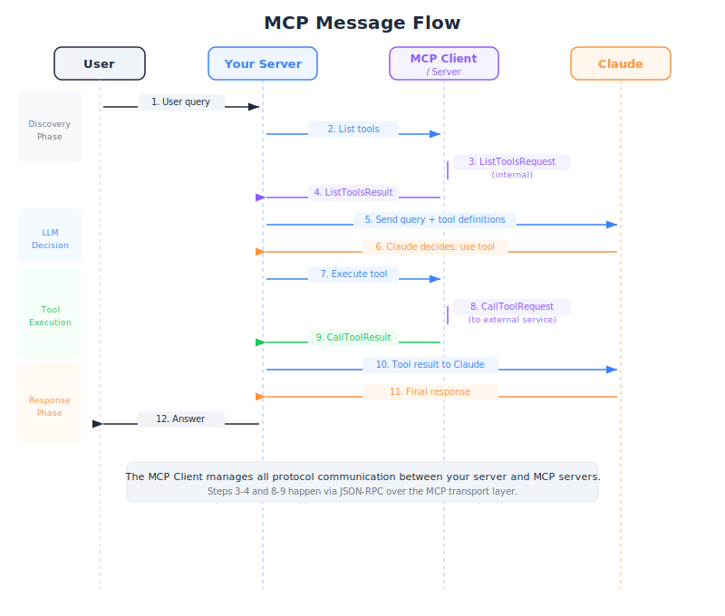

# MCP Clients — Engineering Deep Dive

| Item | Detail |
|------|--------|
| Exam Domain | D2 — Tool Design & MCP Integration (18%) |
| Task Statements | T2.2 Implement MCP client-server communication; T2.4 Handle tool discovery and execution flows |
| Source | introduction-to-model-context-protocol / 01-mcp-basics / Lesson 04 |

---

## One-Liner

The MCP client is the communication bridge between your application server and MCP servers, handling tool discovery and execution through a transport-agnostic message protocol.

---




## What Is an MCP Client?

The MCP client lives inside your application and serves as the intermediary between Claude and MCP servers. It does not implement tools — it discovers them and routes execution requests.

```
User  →  Your Server (contains MCP Client)  →  MCP Server  →  External Service
                    ↕
                  Claude
```

The client is **transport agnostic**, meaning it can communicate with MCP servers over multiple protocols:

- **stdio** — Standard input/output (local processes)
- **HTTP** — Remote servers via HTTP requests
- **WebSockets** — Persistent bidirectional connections

This transport agnosticism is critical: the same client code works regardless of whether the MCP server is a local process or a remote service.

> **Key Insight**
> The MCP client is not your entire application. It is a specific component within your server that handles the MCP protocol. Your server orchestrates everything — receiving user queries, talking to Claude, and using the MCP client to interact with MCP servers.

---

## Key Message Types

MCP communication is built on a request/result pattern. There are two essential message pairs:

### Tool Discovery

```
ListToolsRequest  →  MCP Server
ListToolsResult   ←  MCP Server
```

The `ListToolsResult` contains an array of tool definitions, each with a name, description, and input schema. This is how Claude learns what tools are available.

### Tool Execution

```
CallToolRequest   →  MCP Server  (includes tool_name + tool_input)
CallToolResult    ←  MCP Server  (includes execution output)
```

The `CallToolRequest` carries the tool name and input arguments. The `CallToolResult` returns the execution output, which gets fed back to Claude.

> **Key Insight**
> These four message types (two request/result pairs) are the core of MCP communication. Everything else is built on top of these primitives. If you understand these, you understand MCP's communication model.

---

## The Complete 12-Step Flow

This is the end-to-end sequence from user query to final response. Understanding this flow is essential for debugging and for the CCA exam.

```
 1. User sends a question to your server
 2. Your server connects to MCP server(s)
 3. MCP client sends ListToolsRequest
 4. MCP server returns ListToolsResult (available tools)
 5. Your server sends user query + tool definitions to Claude
 6. Claude analyzes the query and decides which tools to use
 7. Claude returns a tool_use response (tool name + input)
 8. Your server extracts the tool call from Claude's response
 9. MCP client sends CallToolRequest to the appropriate MCP server
10. MCP server executes the tool and returns CallToolResult
11. Your server sends the tool result back to Claude
12. Claude generates a final natural language response
```

Notice the two distinct phases:

- **Discovery phase** (steps 2-5): The client learns what tools exist and tells Claude about them
- **Execution phase** (steps 6-12): Claude decides to use a tool, the client executes it, and Claude interprets the result

```python
# Simplified pseudocode of the flow
async def handle_user_query(query: str):
    # Discovery phase
    tools = await mcp_client.list_tools()          # Steps 3-4
    tool_schemas = format_for_claude(tools)

    # First Claude call
    response = await claude.messages.create(        # Steps 5-7
        messages=[{"role": "user", "content": query}],
        tools=tool_schemas
    )

    # Execution phase
    if response.has_tool_use:
        tool_call = response.tool_use_block
        result = await mcp_client.call_tool(        # Steps 9-10
            tool_call.name, tool_call.input
        )

        # Second Claude call
        final = await claude.messages.create(       # Steps 11-12
            messages=[...previous + tool_result],
            tools=tool_schemas
        )
        return final.text

    return response.text
```

> **Key Insight**
> The flow involves TWO calls to Claude: one where Claude decides to use a tool, and a second where Claude interprets the tool's output. This double-call pattern is fundamental to agentic AI architectures.

---

## Transport Layer Details

### stdio Transport

The MCP server runs as a child process. Communication happens over stdin/stdout pipes.

```python
# Client spawns MCP server as a subprocess
server_process = subprocess.Popen(
    ["python", "mcp_server.py"],
    stdin=subprocess.PIPE,
    stdout=subprocess.PIPE
)
```

Best for: local development, single-machine deployments, testing.

### HTTP/SSE Transport

The MCP server runs as a web server. Communication uses HTTP requests and Server-Sent Events for streaming.

Best for: remote servers, microservice architectures, production deployments.

### WebSocket Transport

Persistent bidirectional connection between client and server.

Best for: high-frequency tool calls, real-time applications.

---

## CCA Exam Relevance

This lesson is core to **Domain 2 (18%)**. Exam focus areas:

- **The 12-step flow**: Be able to trace a request from user query through tool discovery, Claude decision, tool execution, and final response
- **Message types**: Know the four key messages (ListToolsRequest/Result, CallToolRequest/Result)
- **Transport agnosticism**: Understand that MCP clients work across stdio, HTTP, and WebSocket transports
- **Double Claude call**: Recognize that the agentic flow requires two separate API calls to Claude

---

## Flashcards

| Front | Back |
|-------|------|
| What is the role of the MCP client? | It is the communication bridge within your server that discovers tools from MCP servers and routes tool execution requests on behalf of Claude. |
| What are the two essential MCP message pairs? | ListToolsRequest/ListToolsResult (tool discovery) and CallToolRequest/CallToolResult (tool execution). |
| What three transport protocols can MCP clients use? | stdio (local processes), HTTP (remote servers), and WebSockets (persistent connections). |
| How many calls to Claude are needed in a typical MCP tool-use flow? | Two: first to send the query and tool definitions so Claude can decide which tool to use, then a second to send the tool result so Claude can generate a final response. |
| What happens during the "discovery phase" of MCP? | The client sends a ListToolsRequest to the MCP server, receives available tool definitions, and includes them in the request to Claude. |
| What information does a CallToolRequest contain? | The tool name and the tool input arguments (as determined by Claude's tool_use response). |
| Why is MCP described as "transport agnostic"? | The same client code works regardless of whether communication happens over stdio, HTTP, or WebSockets. The protocol is independent of the transport layer. |
| In the 12-step MCP flow, what triggers the execution phase? | Claude's response containing a tool_use block, indicating it has decided to call a specific tool with specific inputs. |
