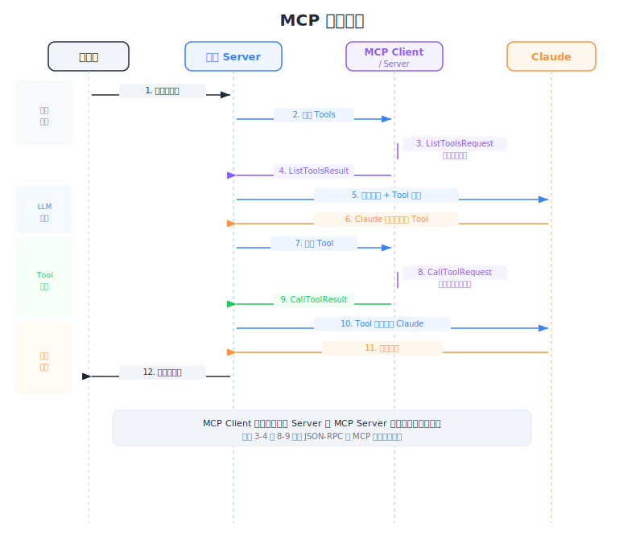

# MCP Clients — 工程深度解析




| Item | Detail |
|------|--------|
| Exam Domain | D2 — Tool Design & MCP Integration (18%) |
| Task Statements | T2.2 实现 MCP client-server 通信; T2.4 处理 tool discovery 和执行流程 |
| Source | introduction-to-model-context-protocol / 01-mcp-basics / Lesson 04 |

---

## 一句话摘要

MCP client 是你的应用程序 server 与 MCP server 之间的通信桥梁，通过传输层无关的消息协议处理 tool discovery 和执行。

---

## 什么是 MCP Client？

MCP client 存在于你的应用程序内部，担任 Claude 与 MCP server 之间的中介。它不实现 tools——它发现 tools 并路由执行请求。

```
用户  →  你的 Server（包含 MCP Client）  →  MCP Server  →  外部服务
                    ↕
                  Claude
```

Client 是**传输层无关**的，意味着它可以通过多种协议与 MCP server 通信：

- **stdio** — 标准输入/输出（本地进程）
- **HTTP** — 通过 HTTP 请求访问远程 server
- **WebSockets** — 持久双向连接

这个传输层无关性至关重要：无论 MCP server 是本地进程还是远程服务，相同的 client 代码都能运作。

> **Key Insight**
> MCP client 不是你的整个应用程序。它是你 server 内处理 MCP 协议的特定组件。你的 server 协调一切——接收用户查询、与 Claude 对话、使用 MCP client 与 MCP server 交互。

---

## 关键消息类型

MCP 通信建立在 request/result 模式上。有两个核心消息对：

### Tool Discovery

```
ListToolsRequest  →  MCP Server
ListToolsResult   ←  MCP Server
```

`ListToolsResult` 包含 tool 定义数组，每个定义有名称、描述和输入 schema。这就是 Claude 得知有哪些 tools 可用的方式。

### Tool Execution

```
CallToolRequest   →  MCP Server（包含 tool_name + tool_input）
CallToolResult    ←  MCP Server（包含执行输出）
```

`CallToolRequest` 携带 tool 名称和输入参数。`CallToolResult` 返回执行输出，然后传回给 Claude。

> **Key Insight**
> 这四种消息类型（两对 request/result）是 MCP 通信的核心。所有其他东西都建立在这些原语之上。理解了这些，你就理解了 MCP 的通信模型。

---

## 完整的 12 步流程

这是从用户查询到最终响应的端到端序列。理解这个流程对于调试和 CCA 考试都至关重要。

```
 1. 用户发送问题到你的 server
 2. 你的 server 连接到 MCP server(s)
 3. MCP client 发送 ListToolsRequest
 4. MCP server 返回 ListToolsResult（可用 tools）
 5. 你的 server 把用户查询 + tool 定义发送给 Claude
 6. Claude 分析查询并决定使用哪些 tools
 7. Claude 返回 tool_use 响应（tool 名称 + 输入）
 8. 你的 server 从 Claude 响应中提取 tool call
 9. MCP client 发送 CallToolRequest 到对应的 MCP server
10. MCP server 执行 tool 并返回 CallToolResult
11. 你的 server 把 tool 结果送回 Claude
12. Claude 生成最终自然语言响应
```

注意两个不同阶段：

- **Discovery 阶段**（步骤 2-5）：client 了解有哪些 tools 并告诉 Claude
- **Execution 阶段**（步骤 6-12）：Claude 决定使用 tool，client 执行它，Claude 解读结果

```python
# 简化的伪代码
async def handle_user_query(query: str):
    # Discovery 阶段
    tools = await mcp_client.list_tools()          # 步骤 3-4
    tool_schemas = format_for_claude(tools)

    # 第一次 Claude 调用
    response = await claude.messages.create(        # 步骤 5-7
        messages=[{"role": "user", "content": query}],
        tools=tool_schemas
    )

    # Execution 阶段
    if response.has_tool_use:
        tool_call = response.tool_use_block
        result = await mcp_client.call_tool(        # 步骤 9-10
            tool_call.name, tool_call.input
        )

        # 第二次 Claude 调用
        final = await claude.messages.create(       # 步骤 11-12
            messages=[...previous + tool_result],
            tools=tool_schemas
        )
        return final.text

    return response.text
```

> **Key Insight**
> 这个流程涉及两次 Claude 调用：一次让 Claude 决定使用哪个 tool，第二次让 Claude 解读 tool 的输出。这个双调用模式是 agentic AI 架构的基础。

---

## 传输层细节

### stdio Transport

MCP server 作为子进程执行。通信通过 stdin/stdout 管道。

最适合：本地开发、单机部署、测试。

### HTTP/SSE Transport

MCP server 作为网络服务执行。通信使用 HTTP 请求和 Server-Sent Events 进行流式传输。

最适合：远程 server、微服务架构、生产环境部署。

### WebSocket Transport

Client 和 server 之间的持久双向连接。

最适合：高频率 tool 调用、实时应用程序。

---

## CCA 考试关联性

本课是 **Domain 2 (18%)** 的核心。考试重点：

- **12 步流程**：能够追踪从用户查询经过 tool discovery、Claude 决策、tool 执行到最终响应的完整请求
- **消息类型**：知道四个关键消息（ListToolsRequest/Result、CallToolRequest/Result）
- **传输层无关性**：理解 MCP client 能跨 stdio、HTTP 和 WebSocket 传输运作
- **双重 Claude 调用**：识别 agentic 流程需要两次独立的 Claude API 调用

---

## Flashcards

| Front | Back |
|-------|------|
| MCP client 的角色是什么？ | 它是你 server 内的通信桥梁，代表 Claude 从 MCP server 发现 tools 并路由 tool 执行请求。 |
| MCP 的两个核心消息对是什么？ | ListToolsRequest/ListToolsResult（tool discovery）和 CallToolRequest/CallToolResult（tool execution）。 |
| MCP client 可以使用哪三种传输协议？ | stdio（本地进程）、HTTP（远程 server）和 WebSockets（持久连接）。 |
| 典型 MCP tool-use 流程需要几次 Claude 调用？ | 两次：第一次发送查询和 tool 定义让 Claude 决定用哪个 tool，第二次发送 tool 结果让 Claude 生成最终响应。 |
| MCP 的"discovery 阶段"发生什么？ | Client 发送 ListToolsRequest 到 MCP server，收到可用 tool 定义，并将它们包含在发给 Claude 的请求中。 |
| CallToolRequest 包含什么信息？ | Tool 名称和 tool 输入参数（由 Claude 的 tool_use 响应决定）。 |
| 为什么 MCP 被描述为"传输层无关"？ | 相同的 client 代码无论通信通过 stdio、HTTP 或 WebSockets 都能运作。协议独立于传输层。 |
| 在 12 步 MCP 流程中，什么触发 execution 阶段？ | Claude 的响应包含 tool_use 块，表示它已决定用特定输入调用特定 tool。 |
