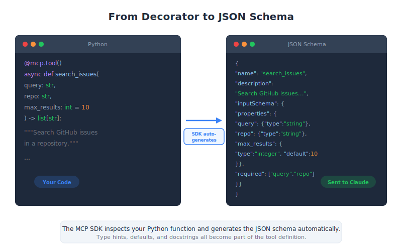

# Defining Tools with MCP — Engineering Deep Dive

| Item | Detail |
|------|--------|
| Exam Domain | D2 — Tool Design & MCP Integration (18%) |
| Task Statements | T2.1 Design and implement tool schemas; T2.5 Use MCP SDK to define tools with type safety |
| Source | introduction-to-model-context-protocol / 02-tools-and-inspector / Lesson 06 |

---

## One-Liner

The Python MCP SDK (FastMCP) lets you define tools as decorated Python functions with type hints, automatically generating JSON schemas and handling validation without manual schema writing.

---




## FastMCP: The Python SDK

FastMCP is the official Python SDK for building MCP servers. It eliminates the tedious process of manually writing JSON tool schemas by leveraging Python's type system.

```python
from mcp.server.fastmcp import FastMCP

# Create an MCP server instance
mcp = FastMCP("document-tools")
```

The `FastMCP` constructor takes a server name string. This name identifies your MCP server to clients during the connection handshake.

> **Key Insight**
> The server name is not just a label — it appears in client logs and debugging output. Choose a descriptive name that reflects the server's purpose (e.g., "github-tools", "document-tools", "database-query").

---

## Defining Tools with @mcp.tool()

Tools are defined as regular Python functions decorated with `@mcp.tool()`. FastMCP inspects the function signature to auto-generate the tool's JSON schema.

```python
@mcp.tool()
def read_doc_contents(file_path: str) -> str:
    """Read and return the contents of a document.

    Args:
        file_path: The path to the document to read.
    """
    with open(file_path, "r") as f:
        return f.read()
```

What happens behind the scenes:

1. **Function name** becomes the tool name: `read_doc_contents`
2. **Docstring** becomes the tool description (what Claude sees when deciding to use the tool)
3. **Type hints** become the JSON schema types: `file_path: str` → `{"type": "string"}`
4. **Return type** defines the output format

The auto-generated JSON schema looks like:

```json
{
    "name": "read_doc_contents",
    "description": "Read and return the contents of a document.",
    "inputSchema": {
        "type": "object",
        "properties": {
            "file_path": {
                "type": "string",
                "description": "The path to the document to read."
            }
        },
        "required": ["file_path"]
    }
}
```

> **Key Insight**
> The docstring is critical for Claude's tool selection accuracy. A vague docstring means Claude may choose the wrong tool or miss it entirely. Write docstrings that clearly state what the tool does, when to use it, and what it returns.

---

## Field Descriptions with Annotated Types

For more precise parameter descriptions, use `Field` from Pydantic:

```python
from pydantic import Field
from typing import Annotated

@mcp.tool()
def edit_document(
    file_path: Annotated[str, Field(description="Path to the document to edit")],
    new_content: Annotated[str, Field(description="The new content to write to the document")],
    create_backup: Annotated[bool, Field(description="Whether to create a .bak backup first")] = True
) -> str:
    """Edit a document by replacing its contents.

    Overwrites the file at file_path with new_content.
    Optionally creates a backup of the original file.
    """
    if create_backup:
        import shutil
        shutil.copy2(file_path, f"{file_path}.bak")

    with open(file_path, "w") as f:
        f.write(new_content)

    return f"Document {file_path} updated successfully"
```

Key patterns:

- **`Annotated[type, Field(...)]`** — Adds rich descriptions to individual parameters
- **Default values** — Parameters with defaults become optional in the schema
- **Boolean flags** — Use `Field(description=...)` to explain what the flag controls

---

## Error Handling

MCP tools handle errors using standard Python exceptions. FastMCP catches exceptions and returns them as error responses to the client.

```python
@mcp.tool()
def read_doc_contents(file_path: str) -> str:
    """Read and return the contents of a document."""
    try:
        with open(file_path, "r") as f:
            return f.read()
    except FileNotFoundError:
        raise ValueError(f"Document not found: {file_path}")
    except PermissionError:
        raise ValueError(f"Permission denied: {file_path}")
```

Best practices for MCP tool errors:

- **Raise `ValueError`** for user-facing errors (invalid input, not found, etc.)
- **Let unexpected exceptions propagate** — FastMCP wraps them as internal errors
- **Include context in error messages** — Claude uses error messages to decide next steps

> **Key Insight**
> Good error messages are part of tool design. When Claude receives an error like "Document not found: /path/to/file", it can explain the issue to the user or try an alternative approach. A generic "Error occurred" gives Claude nothing to work with.

---

## Benefits Over Manual Schema Writing

| Manual Approach | FastMCP Approach |
|----------------|-----------------|
| Write JSON schema by hand | Auto-generated from type hints |
| Manually validate inputs | Pydantic auto-validation |
| Separate schema and implementation | Schema lives with the code |
| Easy to have schema/code drift | Always in sync |
| Verbose boilerplate | Clean, Pythonic functions |

The auto-validation is particularly powerful. If Claude sends `file_path: 42` instead of a string, FastMCP catches the type error before your function runs.

---

## Running the Server

```python
if __name__ == "__main__":
    mcp.run()
```

The `mcp.run()` method starts the MCP server, defaulting to stdio transport. For HTTP transport:

```python
if __name__ == "__main__":
    mcp.run(transport="sse")  # Server-Sent Events over HTTP
```

---

## CCA Exam Relevance

This lesson is central to **Domain 2 (18%)**. Key exam areas:

- **`@mcp.tool()` decorator**: Know that it auto-generates JSON schemas from function signatures
- **Docstrings matter**: They become tool descriptions that Claude uses for tool selection
- **Type hints to schemas**: Understand the mapping (str→string, int→integer, bool→boolean, etc.)
- **Field descriptions**: Know how `Annotated[type, Field(...)]` adds parameter-level descriptions
- **Error handling pattern**: Understand that Python exceptions become MCP error responses

---

## Flashcards

| Front | Back |
|-------|------|
| What does `@mcp.tool()` do? | It decorates a Python function to register it as an MCP tool, auto-generating the JSON schema from the function's name, docstring, type hints, and parameter descriptions. |
| How does FastMCP generate tool descriptions? | From the function's docstring. The first line typically becomes the short description, and the full docstring provides detailed context for Claude's tool selection. |
| How are parameter descriptions added in FastMCP? | Using `Annotated[type, Field(description="...")]` from Pydantic, or from the Args section of the docstring. |
| What happens when a tool raises a ValueError? | FastMCP catches it and returns it as an error response to the MCP client. Claude then sees the error message and can decide how to respond. |
| How does FastMCP handle input validation? | It uses Pydantic auto-validation based on type hints. If Claude sends the wrong type for a parameter, the error is caught before the function executes. |
| What does `FastMCP("name")` create? | An MCP server instance with the given name. The name identifies the server to clients during connection and appears in logs. |
| What is the advantage of FastMCP over manual JSON schema writing? | Schema auto-generation from type hints, automatic input validation, schema always in sync with code, and much less boilerplate. |
| How do you make a tool parameter optional in FastMCP? | Give it a default value in the function signature. Parameters with defaults become optional in the generated JSON schema. |
