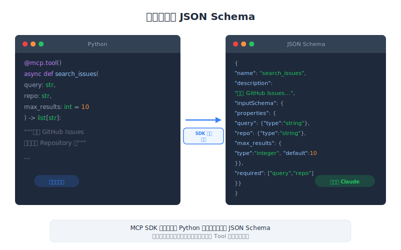

# Defining Tools with MCP — 工程深度解析

| Item | Detail |
|------|--------|
| Exam Domain | D2 — Tool Design & MCP Integration (18%) |
| Task Statements | T2.1 設計與實作 tool schemas; T2.5 使用 MCP SDK 定義型別安全的 tools |
| Source | introduction-to-model-context-protocol / 02-tools-and-inspector / Lesson 06 |

---

## 一句話摘要

Python MCP SDK（FastMCP）讓你用裝飾器和 type hints 定義 tools，自動產生 JSON schema 並處理驗證，無需手寫 schema。

---




## FastMCP：Python SDK

FastMCP 是建置 MCP server 的官方 Python SDK。它利用 Python 的型別系統，消除了手動撰寫 JSON tool schema 的繁瑣過程。

```python
from mcp.server.fastmcp import FastMCP

# 建立 MCP server 實例
mcp = FastMCP("document-tools")
```

`FastMCP` 建構子接受 server 名稱字串。此名稱在連線握手時向 client 識別你的 MCP server。

> **Key Insight**
> Server 名稱不只是標籤——它會出現在 client 的 log 和除錯輸出中。選擇能反映 server 用途的描述性名稱（例如 "github-tools"、"document-tools"、"database-query"）。

---

## 用 @mcp.tool() 定義 Tools

Tools 定義為標準 Python 函式，加上 `@mcp.tool()` 裝飾器。FastMCP 檢查函式簽章來自動產生 tool 的 JSON schema。

```python
@mcp.tool()
def read_doc_contents(file_path: str) -> str:
    """讀取並回傳文件內容。

    Args:
        file_path: 要讀取的文件路徑。
    """
    with open(file_path, "r") as f:
        return f.read()
```

幕後發生的事：

1. **函式名稱**變成 tool 名稱：`read_doc_contents`
2. **Docstring** 變成 tool 描述（Claude 決定是否使用此 tool 時看到的內容）
3. **Type hints** 變成 JSON schema 型別：`file_path: str` → `{"type": "string"}`
4. **回傳型別**定義輸出格式

自動產生的 JSON schema 看起來像：

```json
{
    "name": "read_doc_contents",
    "description": "讀取並回傳文件內容。",
    "inputSchema": {
        "type": "object",
        "properties": {
            "file_path": {
                "type": "string",
                "description": "要讀取的文件路徑。"
            }
        },
        "required": ["file_path"]
    }
}
```

> **Key Insight**
> Docstring 對 Claude 的 tool 選擇準確度至關重要。模糊的 docstring 意味著 Claude 可能選錯 tool 或完全忽略它。寫清楚說明 tool 做什麼、何時使用、回傳什麼的 docstring。

---

## 用 Annotated Types 添加欄位描述

要更精確的參數描述，使用 Pydantic 的 `Field`：

```python
from pydantic import Field
from typing import Annotated

@mcp.tool()
def edit_document(
    file_path: Annotated[str, Field(description="要編輯的文件路徑")],
    new_content: Annotated[str, Field(description="要寫入文件的新內容")],
    create_backup: Annotated[bool, Field(description="是否先建立 .bak 備份")] = True
) -> str:
    """透過替換內容來編輯文件。

    用 new_content 覆寫 file_path 的檔案。
    可選擇建立原始檔案的備份。
    """
    if create_backup:
        import shutil
        shutil.copy2(file_path, f"{file_path}.bak")

    with open(file_path, "w") as f:
        f.write(new_content)

    return f"文件 {file_path} 更新成功"
```

關鍵模式：

- **`Annotated[type, Field(...)]`** — 為個別參數添加豐富描述
- **預設值** — 有預設值的參數在 schema 中變成選填
- **布林旗標** — 用 `Field(description=...)` 解釋旗標控制什麼

---

## 錯誤處理

MCP tools 使用標準 Python 例外處理錯誤。FastMCP 捕獲例外並作為錯誤回應回傳給 client。

```python
@mcp.tool()
def read_doc_contents(file_path: str) -> str:
    """讀取並回傳文件內容。"""
    try:
        with open(file_path, "r") as f:
            return f.read()
    except FileNotFoundError:
        raise ValueError(f"找不到文件：{file_path}")
    except PermissionError:
        raise ValueError(f"權限被拒：{file_path}")
```

MCP tool 錯誤處理最佳實踐：

- **拋出 `ValueError`** 用於面向使用者的錯誤（無效輸入、找不到等）
- **讓非預期例外傳播** — FastMCP 會將它們包裝為內部錯誤
- **在錯誤訊息中包含上下文** — Claude 使用錯誤訊息來決定下一步

> **Key Insight**
> 好的錯誤訊息是 tool 設計的一部分。當 Claude 收到像「找不到文件：/path/to/file」的錯誤時，它能向使用者解釋問題或嘗試替代方案。通用的「發生錯誤」讓 Claude 無從著手。

---

## 相較於手動 Schema 撰寫的優勢

| 手動方式 | FastMCP 方式 |
|---------|-------------|
| 手寫 JSON schema | 從 type hints 自動產生 |
| 手動驗證輸入 | Pydantic 自動驗證 |
| Schema 和實作分離 | Schema 與程式碼同在 |
| 容易 schema/程式碼不同步 | 永遠同步 |
| 冗長的樣板程式碼 | 乾淨的 Pythonic 函式 |

自動驗證特別強大。如果 Claude 發送 `file_path: 42` 而不是字串，FastMCP 在你的函式執行前就捕獲型別錯誤。

---

## 執行 Server

```python
if __name__ == "__main__":
    mcp.run()
```

`mcp.run()` 啟動 MCP server，預設使用 stdio transport。使用 HTTP transport：

```python
if __name__ == "__main__":
    mcp.run(transport="sse")  # HTTP 上的 Server-Sent Events
```

---

## CCA 考試關聯性

本課是 **Domain 2 (18%)** 的核心。重點考試領域：

- **`@mcp.tool()` 裝飾器**：知道它從函式簽章自動產生 JSON schema
- **Docstring 很重要**：它們變成 Claude 用於 tool 選擇的 tool 描述
- **Type hints 到 schema**：理解映射關係（str→string、int→integer、bool→boolean 等）
- **Field 描述**：知道 `Annotated[type, Field(...)]` 如何添加參數級別的描述
- **錯誤處理模式**：理解 Python 例外變成 MCP 錯誤回應

---

## Flashcards

| Front | Back |
|-------|------|
| `@mcp.tool()` 做什麼？ | 裝飾 Python 函式將其註冊為 MCP tool，從函式的名稱、docstring、type hints 和參數描述自動產生 JSON schema。 |
| FastMCP 如何產生 tool 描述？ | 從函式的 docstring。第一行通常成為簡短描述，完整 docstring 為 Claude 的 tool 選擇提供詳細上下文。 |
| 在 FastMCP 中如何添加參數描述？ | 使用 Pydantic 的 `Annotated[type, Field(description="...")]`，或從 docstring 的 Args 部分。 |
| Tool 拋出 ValueError 時會發生什麼？ | FastMCP 捕獲它並作為錯誤回應回傳給 MCP client。Claude 然後看到錯誤訊息並決定如何回應。 |
| FastMCP 如何處理輸入驗證？ | 基於 type hints 使用 Pydantic 自動驗證。如果 Claude 發送錯誤型別的參數，錯誤在函式執行前被捕獲。 |
| `FastMCP("name")` 建立什麼？ | 一個帶有指定名稱的 MCP server 實例。名稱在連線時向 client 識別 server，並出現在 log 中。 |
| FastMCP 相對於手動 JSON schema 撰寫的優勢是什麼？ | 從 type hints 自動產生 schema、自動輸入驗證、schema 永遠與程式碼同步、大幅減少樣板程式碼。 |
| 在 FastMCP 中如何讓 tool 參數變選填？ | 在函式簽章中給它預設值。有預設值的參數在產生的 JSON schema 中變成選填。 |
