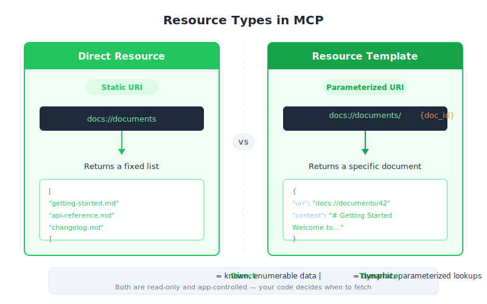

# Defining Resources — Engineering Deep Dive

| Item | Detail |
|------|--------|
| Exam Domain | D2 — Tool Design & MCP Integration (18%) |
| Task Statements | 2.3 (MCP server primitives), 2.4 (resource URI design), 2.5 (MIME type handling) |
| Source | introduction-to-model-context-protocol / 03-resources-and-prompts / Lesson 10 |

---

## One-Liner

Resources are MCP server primitives that expose read-only data to clients via URI-based request-response, analogous to GET handlers in an HTTP server.

---




## Resources vs. Tools: When to Use Which

The first design decision in MCP server development is choosing between resources and tools:

| Dimension | Resource | Tool |
|-----------|----------|------|
| Purpose | Expose data (read-only) | Perform actions (side effects OK) |
| Who controls | Application code (app-controlled) | Claude (model-controlled) |
| Invocation | Client code calls `read_resource()` | Claude decides autonomously |
| Analogy | HTTP GET endpoint | HTTP POST/PUT/DELETE endpoint |
| Context injection | Content goes directly into prompt | Result processed by Claude internally |

Resources shine when you need to populate UI (autocomplete lists) or inject context into prompts (document mentions with `@`).

---

## Two Resource Types

### 1. Direct Resources — Static URIs

Direct resources have fixed URIs with no parameters. They return the same "shape" of data every time.

```python
@mcp.resource(
    "docs://documents",
    mime_type="application/json"
)
def list_docs() -> list[str]:
    return list(docs.keys())
```

The URI `docs://documents` is static — no variable parts. This is ideal for listing all available items, returning server metadata, or providing configuration values.

### 2. Templated Resources — Parameterized URIs

Templated resources use `{param}` placeholders in their URI. The Python SDK automatically extracts these values and passes them as keyword arguments.

```python
@mcp.resource(
    "docs://documents/{doc_id}",
    mime_type="text/plain"
)
def fetch_doc(doc_id: str) -> str:
    if doc_id not in docs:
        raise ValueError(f"Doc with id {doc_id} not found")
    return docs[doc_id]
```

When a client requests `docs://documents/plan.md`, the SDK parses `plan.md` as `doc_id` and passes it to `fetch_doc(doc_id="plan.md")`.

---

## The `mime_type` Parameter

MIME types tell clients how to interpret the returned data:

| MIME Type | Use Case | Client Behavior |
|-----------|----------|-----------------|
| `application/json` | Structured data (lists, objects) | Client calls `json.loads()` |
| `text/plain` | Documents, logs, text | Client uses raw string |
| `application/pdf` | Binary files | Client handles as binary |

The SDK handles serialization automatically — return a Python list or dict, and it becomes valid JSON without manual `json.dumps()`.

---

## Request-Response Flow

```
Client Code --> MCP Client --> MCP Server --> Resource Function
                                                    |
Client Code <-- MCP Client <-- ReadResourceResult <-+
```

1. Your code calls `session.read_resource(AnyUrl(uri))`
2. The MCP client sends a `ReadResourceRequest` to the server
3. The server matches the URI to the correct resource function
4. The function executes and returns data
5. The SDK wraps it in a `ReadResourceResult` with MIME type metadata

---

## Testing with MCP Inspector

Launch the inspector:

```bash
uv run mcp dev mcp_server.py
```

The inspector UI shows two tabs:
- **Resources** — lists direct/static resources (click to read)
- **Resource Templates** — lists templated resources (provide parameter values to test)

The inspector displays the exact response structure including MIME type and serialized content, making it essential for verifying your resource implementations before client integration.

---

## Common Mistakes

1. **Forgetting `mime_type`** — clients may misparse the response if no MIME type is provided
2. **Using resources for actions** — if your function has side effects (write, delete), use a tool instead
3. **Manual serialization** — calling `json.dumps()` yourself when the SDK already handles it, leading to double-serialized strings
4. **Confusing direct vs. templated** — if the URI has no `{}` parameter, it is always a direct resource

> **Key Insight**
>
> Resources are **app-controlled** — your application code decides when to fetch them. This is fundamentally different from tools, where Claude decides when to invoke them. Understanding this control boundary is critical for MCP architecture decisions on the CCA exam.

---

## CCA Exam Relevance

- **D2 (Tool Design & MCP Integration)**: Expect questions on when to use resources vs. tools. The key differentiator is the control model — app-controlled vs. model-controlled.
- **D1 (Agentic Architecture)**: Resources feed context into the prompt without tool calls, reducing latency and token usage.
- Look for scenario questions where data needs to be displayed in UI or used as context — these point to resources, not tools.

---

## Flashcards

| Front | Back |
|-------|------|
| What are the two types of MCP resources? | Direct resources (static URI, no parameters) and Templated resources (parameterized URI with `{param}` placeholders) |
| What does the `mime_type` parameter do in a resource decorator? | Tells the client how to interpret the returned data (e.g., `application/json` for structured data, `text/plain` for raw text) |
| Who controls when MCP resources are accessed? | The application code (app-controlled), not Claude and not the user |
| How does the Python SDK handle templated resource parameters? | It automatically parses `{param}` from the URI and passes matched values as keyword arguments to the function |
| What command launches the MCP Inspector for testing? | `uv run mcp dev mcp_server.py` |
| What is the HTTP analogy for MCP resources? | GET request handlers — they expose read-only data without side effects |
| Do you need to call `json.dumps()` when returning a dict from a resource? | No — the SDK handles serialization automatically |
| Where do resource contents end up when a user mentions `@document`? | Directly injected into the prompt sent to Claude, without requiring a tool call |
