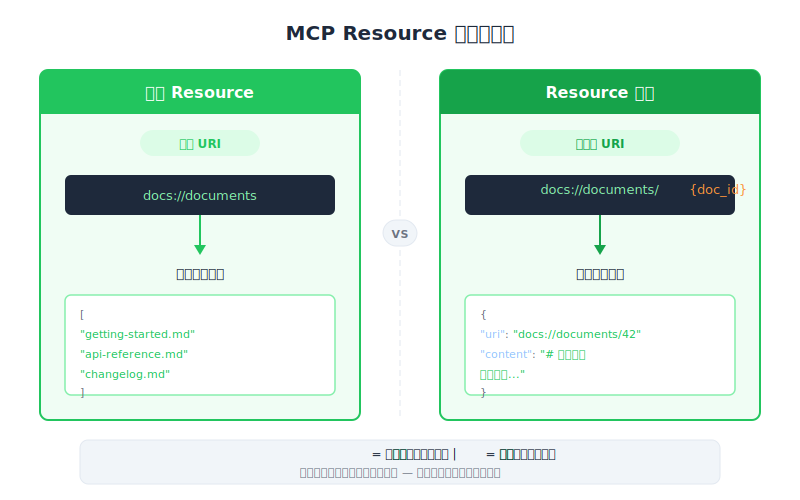

# 定义 Resources — PM 视角

| 项目 | 细节 |
|------|--------|
| 考试范畴 | D2 — Tool Design & MCP Integration (18%) |
| Task Statements | 2.3 (MCP server primitives), 2.4 (resource URI design), 2.5 (MIME type handling) |
| 来源 | introduction-to-model-context-protocol / 03-resources-and-prompts / Lesson 10 |

---

## 一句话摘要

Resources 是 MCP server 的「参考资料库」— 让你的应用程序拉取数据用于显示或提供 context，就像图书管理员根据书名帮你取书。

---

## 为什么 PM 需要理解 Resources

作为 PM，你的产品需求决定了功能该用 resource、tool 还是 prompt。判断错误会导致：

1. **浪费工程资源** — 本来用 resource 就能解决的需求，却做成了 tool
2. **糟糕的用户体验** — 让用户等 Claude「查资料」，但其实数据可以预先加载
3. **错误的验收标准** — 在 PRD 中指定了错误的交互模式

---

## 心智模型：办公室档案系统

把 MCP server 想象成一栋办公大楼，里面有三个部门：

| 部门 | MCP Primitive | 谁决定使用 | 办公室类比 |
|------------|---------------|----------------------|----------------|
| 档案柜 | **Resource** | 前台人员（你的 app） | 前台人员拿出档案给访客 |
| 执行桌 | **Tool** | 主管（Claude） | 主管决定打电话给会计处理退款 |
| 工作手册 | **Prompt** | 员工（用户） | 员工按照标准作业流程执行 |

Resources 就是档案柜。你的应用代码打开抽屉、取出档案，然后显示在 UI 上或交给 Claude 作为 context。Claude 自己不会去开档案柜 — 这个区别非常关键。

---

## 两种 Resource 类型

### 1. Direct Resources — 「给我整本目录」

就像问图书管理员：「给我看所有可用的书。」请求永远相同，URI 是固定的。

- **产品示例**：自动补全下拉菜单，显示所有可用文档
- **URI 模式**：`docs://documents`（无变量）

### 2. Templated Resources — 「给我这本特定的书」

就像问：「给我看 ID 是 plan.md 的书。」请求包含一个参数。

- **产品示例**：用户输入 `@plan.md` 时，系统获取该特定文档
- **URI 模式**：`docs://documents/{doc_id}`（大括号中有变量）

---

## 文档引用功能 — 产品场景演练

想象你正在设计一个聊天界面，用户可以引用文档：

1. **用户输入 `@`** — 你的 app 调用「列出所有文档」resource 来填充自动补全菜单
2. **用户选择 `plan.md`** — 你的 app 调用「获取特定文档」resource，带入 `doc_id=plan.md`
3. **文档内容注入 prompt** — Claude 立即看到文档内容，不需额外步骤
4. **Claude 回复** — 带着完整文档 context，即时回复

这比另一种方案（Claude 调用 tool 去取文档）更快更流畅，因为数据在 Claude 开始思考前就已经在 prompt 里了。

---

## 产品决策框架

撰写 AI 功能的 PRD 时，问自己：

| 问题 | 如果是... | 如果否... |
|----------|-----------|----------|
| 数据需要出现在 UI 中（下拉菜单、侧边栏）？ | **Resource** | 可能是 tool |
| 数据需要在 Claude 回复前就预载为 context？ | **Resource** | 如果 Claude 需要自己决定就用 tool |
| 获取这笔数据是否有副作用（写入、删除、扣款）？ | **Tool**（绝不是 resource） | Resource 是安全的 |
| Claude 是否需要自主决定何时获取这笔数据？ | **Tool** | Resource |

---

## 数据格式提示（MIME Types）

Resources 包含「格式提示」告诉 client 如何显示数据：

| 格式提示 | 含义 | 产品意义 |
|-------------|---------------|---------------------|
| `application/json` | 结构化数据（列表、表格） | 可渲染为丰富的 UI 组件 |
| `text/plain` | 纯文本 | 直接显示或注入聊天 |
| `application/pdf` | 二进制文件 | 可能需要特殊查看器 |

这对 UI 规格很重要 — 知道数据格式有助于设计正确的显示组件。

---

## PM 常见错误

1. **该用 resource 的地方指定成 tool** — 如果数据是只读且需要显示在 UI，resource 更简单也更快
2. **以为 Claude 会去取 resource** — resources 是 app-controlled；你的 app 去取，不是 Claude
3. **忽略自动补全模式** — resources 天然支持用户觉得直觉的 `@mention` UX 模式
4. **没有考虑数据新鲜度** — resources 在请求时返回数据；如需实时更新，需与工程讨论缓存策略

> **Key Insight**
>
> PM 最需要记住的一点：resources 是 **app-controlled**。你的应用代码决定何时获取数据。这意味着你可以保证在 Claude 开始推理前数据已经就绪，带来更快的响应时间和更好的 UX。

---

## CCA 考试关联

- **D2 (Tool Design & MCP Integration)**：场景题会描述一个功能，问该用哪个 primitive。如果场景涉及在 UI 中显示数据或将 context 注入 prompt，答案就是 resources。
- **控制模型是关键区分**：Tools = model-controlled、Resources = app-controlled、Prompts = user-controlled。这个三分法经常出现。
- 小心陷阱答案：建议用 tool「为 UI 获取数据」— 这种场景正确的 primitive 是 resource。

---

## Flashcards

| 正面 | 背面 |
|-------|------|
| 谁控制 MCP resources 的访问时机 — Claude、app 还是用户？ | 应用代码（app-controlled） |
| MCP 中两种 resource 类型是什么？ | Direct resources（固定 URI、无参数）和 Templated resources（URI 含变量占位符） |
| Resources 天然支持什么产品 UX 模式？ | `@mention` 自动补全模式 — 输入 `@`、看到可用项目、选择一个、内容注入 prompt |
| PM 何时该在 PRD 中指定 resource 而非 tool？ | 数据是只读、需要显示在 UI 中、或需要在 Claude 回复前预载为 context 时 |
| MIME type 提示对 resources 有什么作用？ | 告诉 client 应用如何解读和显示返回的数据 |
| 为什么 resources 提供 context 比 tools 更快？ | Resource 数据在 Claude 开始推理前就直接注入 prompt，避免额外的往返 |
| Resource 可以有副作用（写入、删除、扣款）吗？ | 不可以 — resources 是只读的。如需副作用，请用 tool |
| 在办公室类比中，resource 是什么？ | 档案柜 — 前台人员（app）从中取出档案给访客或添加到会议简报中 |
