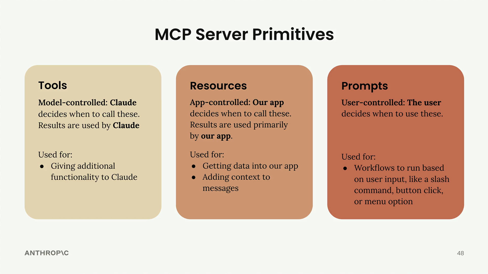

# MCP review

> Source: https://anthropic.skilljar.com/introduction-to-model-context-protocol/296691

#### Summary

                            
                                

Now that we've built our MCP server, let's review the three core server primitives and understand when to use each one. The key insight is that each primitive is controlled by a different part of your application stack.

## Tools: Model-Controlled

Tools are controlled entirely by Claude. The AI model decides when to call these functions, and the results are used directly by Claude to accomplish tasks.

Tools are perfect for giving Claude additional capabilities it can use autonomously. When you ask Claude to "calculate the square root of 3 using JavaScript," it's Claude that decides to use a JavaScript execution tool to run the calculation.

## Resources: App-Controlled

Resources are controlled by your application code. Your app decides when to fetch resource data and how to use it - typically for UI elements or to add context to conversations.

In our project, we used resources in two ways:

- Fetching data to populate autocomplete options in the UI

- Retrieving content to augment prompts with additional context

Think of the "Add from Google Drive" feature in Claude's interface - the application code determines which documents to show and handles injecting their content into the chat context.

## Prompts: User-Controlled

Prompts are triggered by user actions. Users decide when to run these predefined workflows through UI interactions like button clicks, menu selections, or slash commands.

Prompts are ideal for implementing workflows that users can trigger on demand. In Claude's interface, those workflow buttons below the chat input are examples of prompts - predefined, optimized workflows that users can start with a single click.

## Choosing the Right Primitive

Here's a quick decision guide:

- **Need to give Claude new capabilities?** Use tools

- **Need to get data into your app for UI or context?** Use resources

- **Want to create predefined workflows for users?** Use prompts

You can see all three primitives in action in Claude's official interface. The workflow buttons demonstrate prompts, the Google Drive integration shows resources in action, and when Claude executes code or performs calculations, it's using tools behind the scenes.

These are high-level guidelines to help you choose the right primitive for your specific use case. Each serves a different part of your application stack - tools serve the model, resources serve your app, and prompts serve your users.