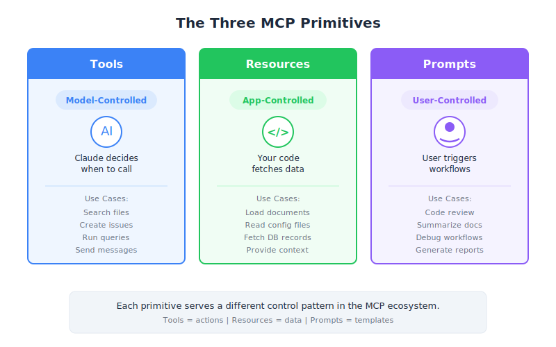

# MCP Review — Engineering Deep Dive

| Item | Detail |
|------|--------|
| Exam Domain | D2 — Tool Design & MCP Integration (18%) |
| Task Statements | 2.3 (MCP server primitives), 2.4-2.6 (resource/tool/prompt design), 1.1 (agentic architecture) |
| Source | introduction-to-model-context-protocol / 04-assessment / Lesson 15 |

---

## One-Liner

MCP has three core server primitives — Tools (model-controlled), Resources (app-controlled), and Prompts (user-controlled) — and choosing the right one depends on who should control the interaction.

---




## The Three Primitives: Complete Reference

### 1. Tools — Model-Controlled

Claude decides when and how to call tools during its reasoning process.

```python
@mcp.tool()
def calculate_sqrt(number: float) -> float:
    """Calculate the square root of a number."""
    return math.sqrt(number)
```

**When to use**: Give Claude capabilities it does not have natively — database queries, API calls, file operations, calculations, code execution.

**Key characteristics**:
- Claude autonomously decides invocation timing
- Results feed back into Claude's reasoning
- Can have side effects (write, delete, send)
- The model sees the tool schema and decides when the tool is relevant

**Real-world example in Claude's interface**: When Claude executes JavaScript code or performs calculations behind the scenes.

---

### 2. Resources — App-Controlled

Your application code decides when to fetch resource data.

```python
@mcp.resource("docs://documents/{doc_id}", mime_type="text/plain")
def fetch_doc(doc_id: str) -> str:
    return docs[doc_id]
```

**When to use**: Fetch data for UI display or inject context into prompts — autocomplete lists, document mentions, sidebar panels.

**Key characteristics**:
- Application code calls `read_resource()`, not Claude
- Content injected directly into prompt (no tool call overhead)
- Read-only — no side effects
- Two types: direct (static URI) and templated (parameterized URI)

**Real-world example in Claude's interface**: "Add from Google Drive" — the app fetches document content and injects it as context.

---

### 3. Prompts — User-Controlled

Users explicitly trigger predefined workflows through UI interactions.

```python
@mcp.prompt(name="format", description="Rewrite document in Markdown")
def format_document(doc_id: str = Field(...)) -> list[base.Message]:
    return [base.UserMessage(f"Reformat document {doc_id} to markdown...")]
```

**When to use**: Predefined, repeatable workflows that users trigger on demand — slash commands, workflow buttons, guided procedures.

**Key characteristics**:
- User triggers via `/command`, button click, or menu selection
- Returns `list[base.Message]` sent to Claude
- Often orchestrates tools (prompts provide instructions, tools provide capabilities)
- Parameterized with `args: dict[str, str]`

**Real-world example in Claude's interface**: Workflow buttons below the chat input.

---

## The Decision Guide

This is the most important decision framework for the CCA exam:

```
Need to give Claude new capabilities?
  → TOOLS (model-controlled)

Need data for UI display or prompt context?
  → RESOURCES (app-controlled)

Want predefined workflows users can trigger?
  → PROMPTS (user-controlled)
```

### Extended Decision Matrix

| Scenario | Primitive | Why |
|----------|-----------|-----|
| Claude calculates a value | Tool | Claude decides when to calculate |
| Autocomplete dropdown shows documents | Resource | App fetches list for UI |
| User types `@plan.md` to inject context | Resource | App fetches and injects content |
| User types `/format` to reformat a doc | Prompt | User explicitly triggers workflow |
| Claude queries a database mid-conversation | Tool | Claude decides when to query |
| Sidebar shows relevant documents | Resource | App decides what to display |
| User clicks "Summarize" button | Prompt | User triggers predefined workflow |
| Claude sends an email | Tool | Claude decides when action is needed |

---

## Control Model Summary Table

| Dimension | Tools | Resources | Prompts |
|-----------|-------|-----------|---------|
| Controller | Claude (model) | App code | User |
| Trigger | Claude's reasoning | `read_resource()` call | `/` command or button |
| Side effects | Yes (write, send, delete) | No (read-only) | No (just messages) |
| Return type | Tool result | Content with MIME type | `list[base.Message]` |
| Decorator | `@mcp.tool()` | `@mcp.resource()` | `@mcp.prompt()` |
| Client method | `call_tool()` | `read_resource()` | `get_prompt()` |
| Discovery | `list_tools()` | `list_resources()` | `list_prompts()` |
| UX pattern | Invisible to user | `@mention` autocomplete | `/` slash commands |

---

## How They Work Together

In a real application, all three primitives collaborate:

1. **Resources** populate the UI with available documents (autocomplete)
2. **Prompts** let users trigger workflows (`/format plan.md`)
3. The prompt tells Claude to reformat the document
4. Claude uses **Tools** to read and edit the document
5. The result appears in the chat

This is the full MCP stack: Resources feed data → Prompts orchestrate workflows → Tools execute actions.

---

## Common Mistakes

1. **Using tools when resources would suffice** — if data is read-only and needed for UI/context, use a resource (faster, no tool call overhead)
2. **Using tools when prompts are appropriate** — if the user explicitly triggers a workflow, use a prompt (better UX, more consistent)
3. **Confusing the control model** — the single most important distinction is WHO controls: model, app, or user
4. **Forgetting that prompts orchestrate tools** — prompts and tools are complementary, not competing
5. **Making resources that have side effects** — resources must be read-only; side effects belong in tools

> **Key Insight**
>
> The three-way control model (Tools = model-controlled, Resources = app-controlled, Prompts = user-controlled) is the foundational concept of MCP architecture. Every exam question about "which primitive to use" can be answered by asking: "Who should control this interaction?" This single question resolves the vast majority of D2 scenario questions on the CCA exam.

---

## CCA Exam Relevance

- **D2 (Tool Design & MCP Integration)**: This lesson is the capstone. Every concept from Lessons 5-13 feeds into the "which primitive?" decision.
- **D1 (Agentic Architecture)**: The control model maps to agent architecture layers — model layer (tools), application layer (resources), user layer (prompts).
- **Exam strategy**: When a scenario question asks "which approach is best," first identify the controller (model/app/user), then select the corresponding primitive.

---

## Flashcards

| Front | Back |
|-------|------|
| What are the three MCP server primitives? | Tools (model-controlled), Resources (app-controlled), Prompts (user-controlled) |
| Who controls Tools in MCP? | Claude (model-controlled) — Claude decides when and how to call tools during reasoning |
| Who controls Resources in MCP? | Application code (app-controlled) — your code calls `read_resource()` to fetch data |
| Who controls Prompts in MCP? | The user (user-controlled) — triggered via slash commands, buttons, or menu selections |
| When should you use a Tool vs. a Resource? | Tool: Claude needs capabilities (actions, side effects). Resource: app needs read-only data for UI or context |
| When should you use a Prompt vs. a Tool? | Prompt: user explicitly triggers a predefined workflow. Tool: Claude autonomously decides to act |
| What is the decision question for choosing an MCP primitive? | "Who should control this interaction?" — Model = Tool, App = Resource, User = Prompt |
| How do the three primitives work together? | Resources feed data to UI, Prompts orchestrate workflows for users, Tools execute actions for Claude |
