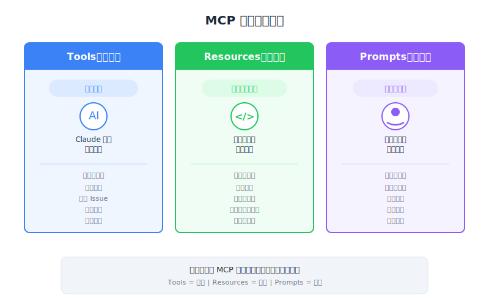

# MCP 复习 — 工程深入解析




| 项目 | 细节 |
|------|--------|
| 考试范畴 | D2 — Tool Design & MCP Integration (18%) |
| Task Statements | 2.3 (MCP server primitives), 2.4-2.6 (resource/tool/prompt design), 1.1 (agentic architecture) |
| 来源 | introduction-to-model-context-protocol / 04-assessment / Lesson 15 |

---

## 一句话摘要

MCP 有三个核心 server primitives — Tools（model-controlled）、Resources（app-controlled）和 Prompts（user-controlled）— 选择正确的那个取决于谁应该控制交互。

---

## 三大 Primitives：完整参考

### 1. Tools — Model-Controlled

Claude 在推理过程中决定何时、如何调用 tools。

```python
@mcp.tool()
def calculate_sqrt(number: float) -> float:
    """Calculate the square root of a number."""
    return math.sqrt(number)
```

**何时使用**：给 Claude 原生没有的能力 — 数据库查询、API 调用、文件操作、计算、代码执行。

**关键特性**：
- Claude 自主决定调用时机
- 结果回馈到 Claude 的推理中
- 可以有副作用（写入、删除、发送）

### 2. Resources — App-Controlled

你的应用代码决定何时获取 resource 数据。

```python
@mcp.resource("docs://documents/{doc_id}", mime_type="text/plain")
def fetch_doc(doc_id: str) -> str:
    return docs[doc_id]
```

**何时使用**：为 UI 显示获取数据或将 context 注入 prompt — 自动补全列表、文档引用、侧边栏面板。

**关键特性**：
- 应用代码调用 `read_resource()`，不是 Claude
- 内容直接注入 prompt（无 tool call 开销）
- 只读 — 无副作用

### 3. Prompts — User-Controlled

用户通过 UI 交互明确触发预定义工作流程。

```python
@mcp.prompt(name="format", description="Rewrite document in Markdown")
def format_document(doc_id: str = Field(...)) -> list[base.Message]:
    return [base.UserMessage(f"Reformat document {doc_id} to markdown...")]
```

**何时使用**：用户按需触发的预定义、可重复工作流程 — slash commands、工作流程按钮。

**关键特性**：
- 用户通过 `/command`、按钮点击或菜单选择触发
- 返回 `list[base.Message]` 发送给 Claude
- 常编排 tools（prompts 提供指令，tools 提供能力）

---

## 决策指南

这是 CCA 考试最重要的决策框架：

```
需要给 Claude 新能力？
  → TOOLS（model-controlled）

需要为 UI 显示或 prompt context 获取数据？
  → RESOURCES（app-controlled）

想要用户可触发的预定义工作流程？
  → PROMPTS（user-controlled）
```

### 扩展决策矩阵

| 场景 | Primitive | 原因 |
|----------|-----------|-----|
| Claude 计算一个值 | Tool | Claude 决定何时计算 |
| 自动补全下拉显示文档 | Resource | App 为 UI 获取列表 |
| 用户输入 `@plan.md` 注入 context | Resource | App 获取并注入内容 |
| 用户输入 `/format` 重新格式化文档 | Prompt | 用户明确触发工作流程 |
| Claude 在对话中查询数据库 | Tool | Claude 决定何时查询 |
| 用户点击「摘要」按钮 | Prompt | 用户触发预定义工作流程 |

---

## 控制模型总结表

| 维度 | Tools | Resources | Prompts |
|-----------|-------|-----------|---------|
| 控制者 | Claude（model） | App 代码 | 用户 |
| 触发 | Claude 的推理 | `read_resource()` 调用 | `/` 命令或按钮 |
| 副作用 | 有（写入、发送、删除） | 无（只读） | 无（只有消息） |
| 返回类型 | Tool result | 含 MIME type 的内容 | `list[base.Message]` |
| Decorator | `@mcp.tool()` | `@mcp.resource()` | `@mcp.prompt()` |
| Client 方法 | `call_tool()` | `read_resource()` | `get_prompt()` |
| 发现 | `list_tools()` | `list_resources()` | `list_prompts()` |
| UX 模式 | 对用户不可见 | `@mention` 自动补全 | `/` slash commands |

---

## 它们如何协作

在真实应用中，三个 primitives 协作：

1. **Resources** 用可用文档填充 UI（自动补全）
2. **Prompts** 让用户触发工作流程（`/format plan.md`）
3. Prompt 告诉 Claude 重新格式化文档
4. Claude 使用 **Tools** 读取和编辑文档
5. 结果出现在聊天中

这是完整的 MCP 堆栈：Resources 供给数据 → Prompts 编排工作流程 → Tools 执行动作。

---

## 常见错误

1. **该用 resource 的场景用了 tool** — 只读数据用于 UI/context 时，resource 更快（无 tool call 开销）
2. **该用 prompt 的场景用了 tool** — 用户明确触发的工作流程，用 prompt（更好的 UX、更一致）
3. **混淆控制模型** — 最重要的区分是「谁」控制：model、app 还是 user
4. **忘记 prompts 编排 tools** — prompts 和 tools 是互补的，不是竞争的
5. **创建有副作用的 resources** — resources 必须只读；副作用属于 tools

> **Key Insight**
>
> 三方控制模型（Tools = model-controlled、Resources = app-controlled、Prompts = user-controlled）是 MCP 架构的基础概念。每个「该用哪个 primitive？」的考题都可以用一个问题回答：「谁应该控制这个交互？」这个问题解决了 CCA 考试中绝大多数 D2 场景题。

---

## CCA 考试关联

- **D2 (Tool Design & MCP Integration)**：本课是总结。Lessons 5-13 的每个概念都汇入「哪个 primitive？」的决策。
- **D1 (Agentic Architecture)**：控制模型对应 agent 架构层 — 模型层（tools）、应用层（resources）、用户层（prompts）。
- **考试策略**：看到场景题时，先辨识控制者（model/app/user），然后选对应的 primitive。

---

## Flashcards

| 正面 | 背面 |
|-------|------|
| MCP 的三个 server primitives 是什么？ | Tools（model-controlled）、Resources（app-controlled）、Prompts（user-controlled） |
| 谁控制 MCP 中的 Tools？ | Claude（model-controlled）— Claude 在推理时决定何时、如何调用 tools |
| 谁控制 MCP 中的 Resources？ | 应用代码（app-controlled）— 你的代码调用 `read_resource()` 获取数据 |
| 谁控制 MCP 中的 Prompts？ | 用户（user-controlled）— 通过 slash commands、按钮或菜单触发 |
| 何时该用 Tool 而非 Resource？ | Tool：Claude 需要能力（动作、副作用）。Resource：app 需要只读数据用于 UI 或 context |
| 何时该用 Prompt 而非 Tool？ | Prompt：用户明确触发预定义工作流程。Tool：Claude 自主决定行动 |
| 选择 MCP primitive 的决策问题是什么？ | 「谁应该控制这个交互？」— Model = Tool、App = Resource、User = Prompt |
| 三个 primitives 如何协作？ | Resources 供给数据到 UI、Prompts 为用户编排工作流程、Tools 为 Claude 执行动作 |
