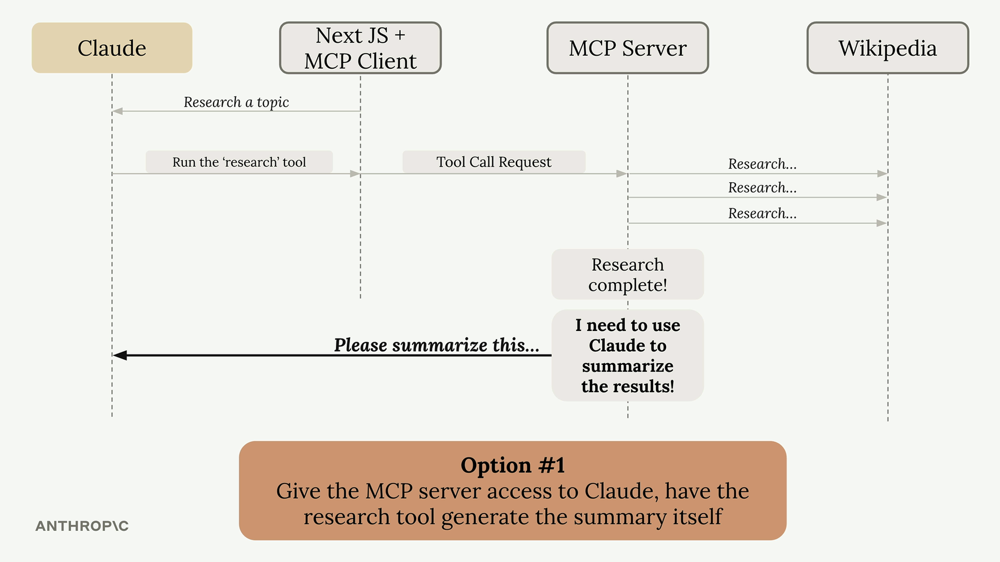
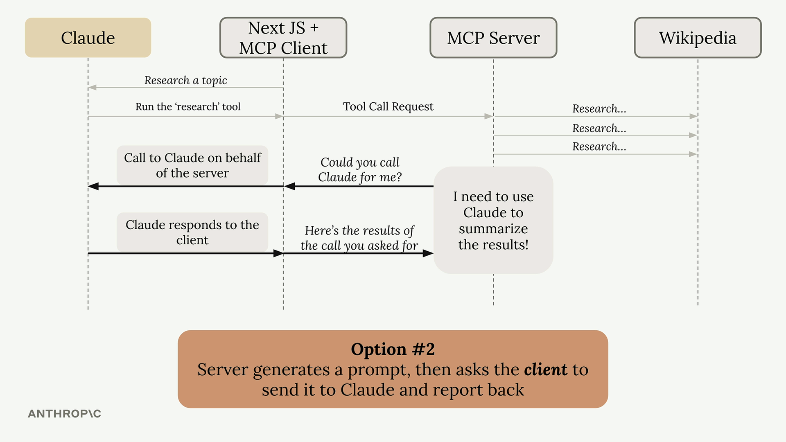

# Sampling

> Source: https://anthropic.skilljar.com/model-context-protocol-advanced-topics/296288

#### Summary


                            
                                

Sampling allows a server to access a language model like Claude through a connected MCP client. Instead of the server directly calling Claude, it asks the client to make the call on its behalf. This shifts the responsibility and cost of text generation from the server to the client.


## The Problem Sampling Solves


Imagine you have an MCP server with a research tool that fetches information from Wikipedia. After gathering all that data, you need to summarize it into a coherent report. You have two options:





**Option 1:** Give the MCP server direct access to Claude. The server would need its own API key, handle authentication, manage costs, and implement all the Claude integration code. This works but adds significant complexity.





**Option 2:** Use sampling. The server generates a prompt and asks the client "Could you call Claude for me?" The client, which already has a connection to Claude, makes the call and returns the results.


## How Sampling Works


The flow is straightforward:


- Server completes its work (like fetching Wikipedia articles)

- Server creates a prompt asking for text generation

- Server sends a sampling request to the client

- Client calls Claude with the provided prompt

- Client returns the generated text to the server

- Server uses the generated text in its response


## Benefits of Sampling


- **Reduces server complexity:** The server doesn't need to integrate with language models directly

- **Shifts cost burden:** The client pays for token usage, not the server

- **No API keys needed:** The server doesn't need credentials for Claude

- **Perfect for public servers:** You don't want a public server racking up AI costs for every user


## Implementation


Setting up sampling requires code on both sides:


### Server Side


In your tool function, use the `create_message` function to request text generation:


```
@mcp.tool()
async def summarize(text_to_summarize: str, ctx: Context):
    prompt = f"""
    Please summarize the following text:
    {text_to_summarize}
    """
    
    result = await ctx.session.create_message(
        messages=[
            SamplingMessage(
                role="user",
                content=TextContent(
                    type="text",
                    text=prompt
                )
            )
        ],
        max_tokens=4000,
        system_prompt="You are a helpful research assistant",
    )
    
    if result.content.type == "text":
        return result.content.text
    else:
        raise ValueError("Sampling failed")
```


### Client Side


Create a sampling callback that handles the server's requests:


```
async def sampling_callback(
    context: RequestContext, params: CreateMessageRequestParams
):
    # Call Claude using the Anthropic SDK
    text = await chat(params.messages)
    
    return CreateMessageResult(
        role="assistant",
        model=model,
        content=TextContent(type="text", text=text),
    )
```


Then pass this callback when initializing your client session:


```
async with ClientSession(
    read,
    write,
    sampling_callback=sampling_callback
) as session:
    await session.initialize()
```


## When to Use Sampling


Sampling is most valuable when building publicly accessible MCP servers. You don't want random users generating unlimited text at your expense. By using sampling, each client pays for their own AI usage while still benefiting from your server's functionality.


The technique essentially moves the AI integration complexity from your server to the client, which often already has the necessary connections and credentials in place.