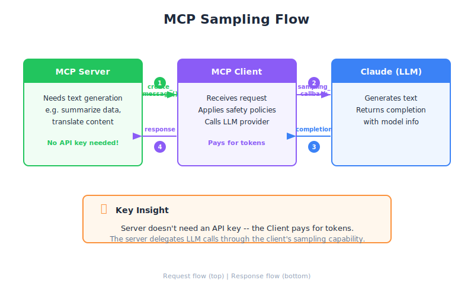

# Sampling — Engineering Deep Dive

| Item | Detail |
|------|--------|
| Exam Domain | D2 — Tool Design & MCP Integration (18%) |
| Task Statements | 2.3 (MCP server capabilities), 2.4 (client-server communication patterns) |
| Source | model-context-protocol-advanced-topics / 01-sampling-and-notifications / Lesson 03 |

---

## One-Liner

Sampling lets an MCP server invoke Claude through the connected client, reversing the typical request flow so the server can leverage AI without managing its own API keys or LLM infrastructure.

---




## How Sampling Works

The standard MCP flow is **Client -> Server** (client asks server to execute a tool). Sampling flips this:

```
Server                    Client                   Claude
  |                         |                        |
  |-- create_message() ---->|                        |
  |                         |-- API call ----------->|
  |                         |<-- response -----------|
  |<-- SamplingResult ------|                        |
```

The server never talks to Claude directly. It asks the **client** to make the call on its behalf.

---

## Server-Side Implementation

On the server, you use the context object's `session.create_message()` method:

```python
@mcp.tool()
async def summarize_research(ctx: Context, topic: str) -> str:
    # Gather data (server's own logic)
    results = await fetch_research_data(topic)

    # Ask the client to call Claude for summarization
    response = await ctx.session.create_message(
        messages=[
            SamplingMessage(
                role="user",
                content=TextContent(
                    type="text",
                    text=f"Summarize these research results:\n{results}"
                )
            )
        ],
        max_tokens=1024
    )

    return response.content.text
```

Key points:
- `SamplingMessage` wraps the prompt sent to the client
- The server specifies `max_tokens` but the client controls model selection
- The server **does not need an API key** — the client handles authentication

---

## Client-Side Implementation

The client must provide a `sampling_callback` when creating the `ClientSession`:

```python
async def handle_sampling(message: CreateMessageRequest) -> CreateMessageResult:
    # Client decides which model to use and makes the API call
    response = await anthropic_client.messages.create(
        model="claude-sonnet-4-20250514",
        max_tokens=message.params.max_tokens,
        messages=[
            {"role": m.role, "content": m.content.text}
            for m in message.params.messages
        ]
    )
    return CreateMessageResult(
        role="assistant",
        content=TextContent(type="text", text=response.content[0].text),
        model="claude-sonnet-4-20250514"
    )

# Pass callback during session initialization
async with ClientSession(read, write, sampling_callback=handle_sampling) as session:
    await session.initialize()
```

The client has full control:
- Which model to call (can upgrade/downgrade)
- Rate limiting and cost management
- Request filtering (can reject sampling requests)

---

## Architecture Benefits

| Benefit | Explanation |
|---------|-------------|
| **No API keys on server** | Server never touches Claude's API directly |
| **Cost shifts to client** | The entity running the client pays for AI usage |
| **Reduced server complexity** | Server focuses on domain logic, not LLM orchestration |
| **Perfect for public servers** | Anyone can connect; each client uses their own credentials |
| **Client-controlled model** | Client picks the model, not the server |

---

## When to Use Sampling

Sampling is ideal when:
- You are building a **public MCP server** (e.g., a research tool) and don't want to pay for every user's AI calls
- The server needs AI capabilities but should remain **stateless and keyless**
- You want the **client to retain control** over model selection and spending

Sampling is NOT ideal when:
- The server needs guaranteed model behavior (client might swap models)
- Low-latency is critical (extra hop adds latency)
- The server needs to chain many LLM calls internally (use direct API instead)

> **Key Insight**
> Sampling inverts the economic model of MCP: instead of the server paying for AI, the client absorbs the cost. This makes it viable to build open-source MCP servers that anyone can connect to without the author bearing API costs.

---

## CCA Exam Relevance

- **D2 Task 2.3**: Understanding MCP server capabilities — sampling is an advanced capability that servers can declare
- **D2 Task 2.4**: Client-server communication patterns — sampling is the primary example of server-initiated communication
- Expect scenario questions about when to use sampling vs. direct API calls
- Key trade-off: convenience and cost-shifting vs. loss of model control on the server side

---

## Flashcards

| Front | Back |
|-------|------|
| What does MCP sampling allow a server to do? | Request the connected client to make an LLM call on its behalf, without needing its own API key |
| Which method does the server call to initiate sampling? | `ctx.session.create_message()` with `SamplingMessage` objects |
| Who pays for the AI usage in a sampling request? | The client, since it makes the actual API call |
| What callback must the client provide to support sampling? | `sampling_callback` passed to `ClientSession` during initialization |
| Can the client reject a sampling request from the server? | Yes — the client has full control and can filter or deny requests |
| Why is sampling ideal for public MCP servers? | Each connecting client uses their own API credentials and pays for their own usage |
| What is the main latency trade-off of sampling? | Extra network hop: Server -> Client -> Claude -> Client -> Server instead of Server -> Claude directly |
| What data structure wraps the prompt in a sampling request? | `SamplingMessage` with `role` and `content` (typically `TextContent`) |
