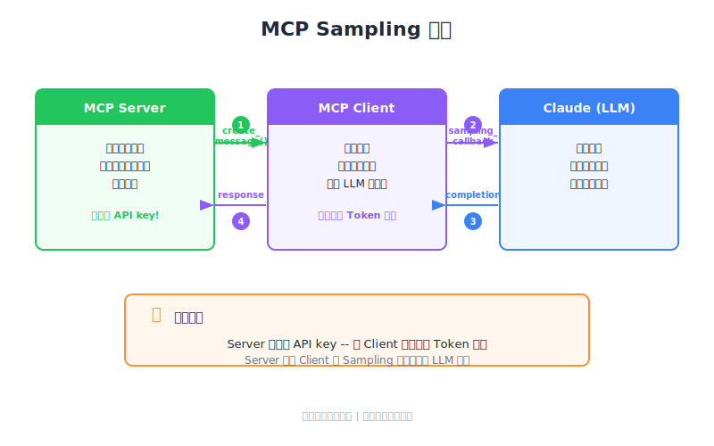

# Sampling — PM Perspective

| Item | Detail |
|------|--------|
| Exam Domain | D2 — Tool Design & MCP Integration (18%) |
| Task Statements | 2.3 (MCP server capabilities), 2.4 (client-server communication patterns) |
| Source | model-context-protocol-advanced-topics / 01-sampling-and-notifications / Lesson 03 |

---

## One-Liner

Sampling 让 MCP server 借用 client 的 AI 大脑而非自备，将成本与复杂度转移给连接方。

---

## 心智模型：翻译员类比

想象你在东京经营一个旅游服务台（MCP server）。一位法国游客（用户）带着自己的随行翻译（MCP client + Claude）前来。你不需要自己雇法语翻译，只要对游客的翻译员说话，请他们转达就好。

| 角色 | 类比 | MCP 对应 |
|------|------|----------|
| 旅游服务台 | 提供本地知识 | MCP server（domain logic） |
| 游客的翻译员 | 转达与翻译 | MCP client（调用 Claude） |
| 游客 | 想要答案 | 终端用户 |

服务台不需要学法语，游客的翻译员搞定一切。这就是 sampling。

---

## PM 为什么要懂 Sampling

Sampling 从根本上改变了 MCP server 的 **商业模式**：

### 没有 Sampling（传统模式）
- Server 方为每次 AI 调用付费
- 必须管理 API key、账单、rate limit
- 扩展成本随用户线性增长
- 开源的障碍：谁来付 API 账单？

### 有 Sampling
- 每个 client 为自己的 AI 使用付费
- Server 零 AI 基础设施成本
- Server 纯粹专注于领域专业
- 对开源友好：无持续成本

> **Key Insight**
> Sampling 就是 AI 工具的「BYOB（Bring Your Own Brain）」模式。它移除了构建和分享 MCP server 最大的障碍：LLM API 调用的成本。

---

## 产品情境演练

### 情境：研究聚合工具

你的团队正在构建一个搜索学术论文并摘要结论的 public MCP server。比较两种方式：

| 维度 | 直接 API（Server 付费） | Sampling（Client 付费） |
|------|------------------------|----------------------|
| 每用户成本 | Server 承担所有 AI 费用 | Server 零成本 |
| API key 管理 | Server 需要 key、轮替、安全措施 | 不需要 — client 处理 |
| Model 控制 | Server 选择 model | Client 选择 model |
| 扩展考量 | 每增加一个用户就增加 server 账单 | Server 成本固定（只有计算） |
| 用户信任 | 用户信任 server 处理数据 | 用户自己的 client 处理数据 |

**PM 决策**：对于面向公众的研究工具，sampling 明显更优 — 它解决了「越多用户 = 越多成本」的单位经济问题。

---

## 取舍矩阵

| 维度 | Sampling 胜出 | 直接 API 胜出 |
|------|--------------|--------------|
| 成本归属 | Server 零 AI 成本 | Server 控制品质 |
| Model 一致性 | — | 保证 model 版本 |
| 设置复杂度 | Server 端更低 | Client 端更低 |
| 公开发布 | 理想选择 | 大规模不可行 |
| 延迟 | — | 更少网络跳转 |
| 合规 | Client 控制数据流 | Server 控制数据流 |

---

## 流程说明（无代码）

1. 用户请 client 使用 server tool（如「摘要这份研究」）
2. Server 收集领域数据（搜索论文、汇整结果）
3. Server 请 client：「请让 Claude 帮我摘要这些」
4. Client 使用自己的 API key 调用 Claude
5. Client 将 Claude 的响应传回 server
6. Server 将最终结果交付给用户

Server 从不直接碰 AI。它是 **请求者**，不是 **调用者**。

---

## 治理考量

作为 PM，需要与团队讨论以下事项：

- **Client 可以拒绝**：Client 没有义务满足 sampling 请求。Server 必须优雅处理拒绝情况。
- **Client 选择 model**：如果产品依赖特定 model 的能力，sampling 无法保证。
- **数据流经 client**：Client 会看到所有 sampling 内容。对于敏感数据，需评估是否可接受。
- **Server 无法记录 AI 调用**：因为 client 发出调用，server 无法直接记录或审计 AI 交互。

---

## CCA Exam Relevance

- **D2 Task 2.3**：Sampling 作为高级 MCP capability — 知道何时建议使用
- **D2 Task 2.4**：Server-initiated communication pattern — sampling 是典型范例
- 预期情境题会比较不同商业场景下 sampling vs. 直接 API
- 考试核心哲学：**Architecture > Prompt** — 选择正确的通信模式是架构决策

---

## Flashcards

| Front | Back |
|-------|------|
| MCP sampling 解决什么商业问题？ | 将 LLM 调用成本转移给 client，消除 server 运营者的 AI API 费用 |
| Sampling 中谁持有 API key？ | Client — server 完全不需要 |
| 为什么 sampling 适合开源 MCP server？ | 每个用户的 client 支付自己的 AI 费用，server 作者无持续 API 成本 |
| Sampling 对产品品质的主要风险？ | Client 控制 model 选择 — server 无法保证使用哪个 model |
| 谁发起 sampling 请求？ | Server 发起，请 client 代为调用 Claude |
| Client 可以拒绝 sampling 请求吗？ | 可以 — client 有完全自主权决定接受、修改或拒绝 |
| Sampling 的「BYOB」类比是什么？ | 「Bring Your Own Brain」— 每个 client 自带 AI 能力到 server |
| PM 何时应建议不使用 sampling？ | 产品需要保证 model 行为、特定 model 版本、或 server 端 AI 调用审计记录时 |
