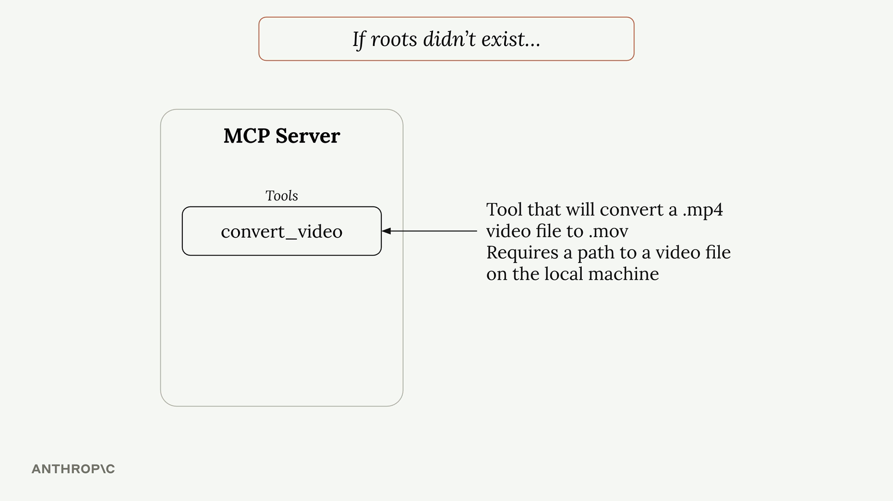
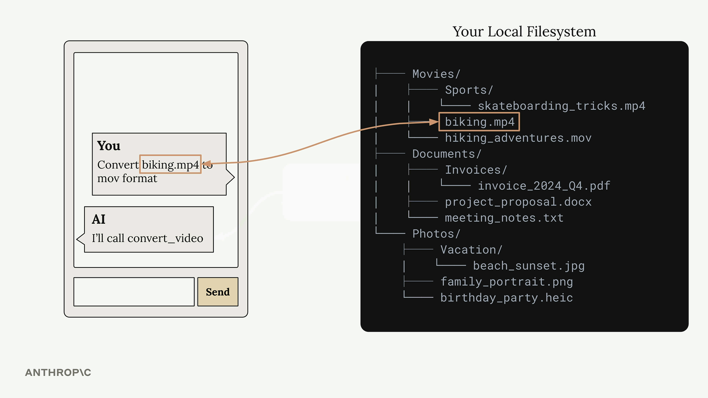

# Roots

> Source: https://anthropic.skilljar.com/model-context-protocol-advanced-topics/296289

#### Summary

                            
                                

Roots are a way to grant MCP servers access to specific files and folders on your local machine. Think of them as a permission system that says "Hey, MCP server, you can access these files" - but they do much more than just grant permission.

## The Problem Roots Solve

Without roots, you'd run into a common issue. Imagine you have an MCP server with a video conversion tool that takes a file path and converts an MP4 to MOV format.

When a user asks Claude to "convert biking.mp4 to mov format", Claude would call the tool with just the filename. But here's the problem - Claude has no way to search through your entire file system to find where that file actually lives.

Your file system might be complex with files scattered across different directories. The user knows the biking.mp4 file is in their Movies folder, but Claude doesn't have that context.

You could solve this by requiring users to always provide full paths, but that's not very user-friendly. Nobody wants to type out complete file paths every time.

## Roots in Action

Here's how the workflow changes with roots:

1. User asks to convert a video file

1. Claude calls `list_roots` to see what directories it can access

1. Claude calls `read_dir` on accessible directories to find the file

1. Once found, Claude calls the conversion tool with the full path

This happens automatically - users can still just say "convert biking.mp4" without providing full paths.

## Security and Boundaries

Roots also provide security by limiting access. If you only grant access to your Desktop folder, the MCP server cannot access files in other locations like Documents or Downloads.

When Claude tries to access a file outside the approved roots, it gets an error and can inform the user that the file isn't accessible from the current server configuration.

## Implementation Details

The MCP SDK doesn't automatically enforce root restrictions - you need to implement this yourself. A typical pattern is to create a helper function like `is_path_allowed()` that:

- Takes a requested file path

- Gets the list of approved roots

- Checks if the requested path falls within one of those roots

- Returns true/false for access permission

You then call this function in any tool that accesses files or directories before performing the actual file operation.

## Key Benefits

- **User-friendly** - Users don't need to provide full file paths

- **Focused search** - Claude only looks in approved directories, making file discovery faster

- **Security** - Prevents accidental access to sensitive files outside approved areas

- **Flexibility** - You can provide roots through tools or inject them directly into prompts

Roots make MCP servers both more powerful and more secure by giving Claude the context it needs to find files while maintaining clear boundaries around what it can access.