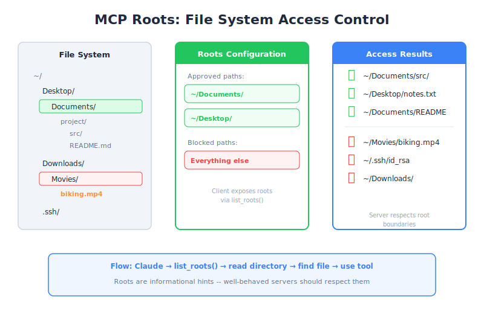

# Roots — Engineering Deep Dive

| Item | Detail |
|------|--------|
| Exam Domain | D2 — Tool Design & MCP Integration (18%) |
| Task Statements | 2.2 (MCP security model), 2.3 (MCP server capabilities) |
| Source | model-context-protocol-advanced-topics / 02-roots-and-messages / Lesson 07 |

---

## One-Liner

Roots grant MCP servers access to specific files and directories, solving the file path discovery problem while providing a security boundary that limits what the server can access.

---




## The Problem Roots Solve

Without roots, an MCP server that works with files faces a fundamental problem: **how does it know where to look?**

- Claude cannot search the entire filesystem
- Users should not need to type full paths like `/Users/reed/Documents/project/src/main.py`
- The server has no context about the user's workspace

Roots solve this by giving the server a list of approved starting points.

---

## How Roots Work

The flow is straightforward:

```
Client                     Server
  |                          |
  |-- list_roots() --------->|  (server asks: "what can I access?")
  |<-- [Root("/projects"),   |
  |     Root("/data")]  -----|  (client answers: "these directories")
  |                          |
  |                          |-- read_dir("/projects") -->
  |                          |-- find target file ------->
  |                          |-- use tool on file ------->
```

1. Server calls `list_roots()` to discover approved directories
2. Server reads those directories to find files
3. Server operates only within the root boundaries

---

## Server-Side: Using Roots

```python
@mcp.tool()
async def find_and_read(ctx: Context, filename: str) -> str:
    # Step 1: Get the approved roots
    roots = await ctx.session.list_roots()

    # Step 2: Search within roots
    for root in roots:
        root_path = Path(root.uri.replace("file://", ""))
        for path in root_path.rglob(filename):
            if path.is_file():
                return path.read_text()

    return f"File '{filename}' not found in any root"
```

Key details:
- Roots are returned as URIs (e.g., `file:///Users/reed/project`)
- The server must convert URIs to filesystem paths
- `rglob()` searches recursively within each root

---

## Client-Side: Declaring Roots

The client defines which directories the server may access:

```python
from mcp import Root

roots = [
    Root(uri="file:///Users/reed/projects/my-app", name="My App"),
    Root(uri="file:///Users/reed/data", name="Data Directory"),
]

# Roots are provided during client session setup
async with ClientSession(read, write) as session:
    await session.initialize()
    # Client exposes roots via list_roots handler
```

The client has full control over what is exposed — this is a security feature.

---

## Security: SDK Does NOT Auto-Enforce

This is the most critical point for the exam:

**The MCP SDK does not automatically enforce root boundaries.** The server receives the root list, but nothing prevents it from accessing files outside those roots. You must implement enforcement yourself:

```python
def is_path_allowed(file_path: str, roots: list[Root]) -> bool:
    """Check if a path falls within an approved root."""
    target = Path(file_path).resolve()
    for root in roots:
        root_path = Path(root.uri.replace("file://", "")).resolve()
        if target.is_relative_to(root_path):
            return True
    return False

@mcp.tool()
async def safe_read(ctx: Context, file_path: str) -> str:
    roots = await ctx.session.list_roots()

    if not is_path_allowed(file_path, roots):
        raise PermissionError(f"Access denied: {file_path} is outside approved roots")

    return Path(file_path).read_text()
```

Always use `.resolve()` to prevent path traversal attacks (e.g., `../../etc/passwd`).

> **Key Insight**
> Roots are a **convention**, not a sandbox. The SDK provides the mechanism to discover approved directories, but the server developer must implement the actual access control. This is a frequent exam topic — the answer is always "implement `is_path_allowed()` yourself."

---

## Benefits of Roots

| Benefit | Explanation |
|---------|-------------|
| **User-friendly** | Users say "look in my project" instead of typing full paths |
| **Focused search** | Server searches specific directories, not the entire filesystem |
| **Security boundary** | Limits what the server should access (when enforced) |
| **Flexibility** | Clients can add/remove roots dynamically |
| **Multi-project support** | Multiple roots can point to different projects |

---

## Path Traversal Prevention

When implementing `is_path_allowed()`, handle these attack vectors:

```python
# Dangerous inputs to guard against:
"../../../etc/passwd"           # Relative path escape
"/Users/reed/projects/../.ssh"  # Mid-path traversal
"./symlink_to_root"             # Symlink escape

# Defense: always resolve to absolute path first
target = Path(file_path).resolve()  # Resolves symlinks and ..
```

---

## CCA Exam Relevance

- **D2 Task 2.2**: MCP security model — roots are the primary filesystem security mechanism
- **D2 Task 2.3**: Server capabilities — `list_roots()` is a fundamental capability
- Expect questions about enforcement — the answer is always "SDK does not auto-enforce, implement manually"
- Path traversal prevention is a common scenario question
- Key exam philosophy: **Validation > Trust** — never assume the server will stay within bounds

---

## Flashcards

| Front | Back |
|-------|------|
| What problem do MCP roots solve? | File path discovery — giving servers approved starting directories instead of searching the entire filesystem |
| Does the MCP SDK automatically enforce root boundaries? | No — the server receives the root list but must implement `is_path_allowed()` enforcement manually |
| What method does a server call to discover approved directories? | `ctx.session.list_roots()` |
| What format are roots returned in? | URIs (e.g., `file:///Users/reed/project`) |
| Why must you call `.resolve()` when checking paths against roots? | To prevent path traversal attacks using `..` or symlinks |
| Who controls which roots are exposed? | The client — it defines the root list during session setup |
| Can roots be changed dynamically? | Yes — clients can add or remove roots during the session |
| What is the security philosophy behind roots? | Convention, not sandbox — the mechanism exists but enforcement is the developer's responsibility |
