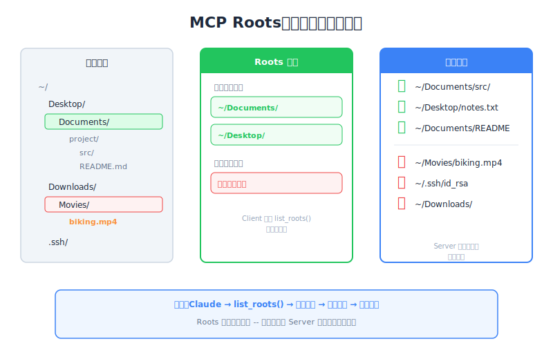

# Roots — Engineering Deep Dive

| Item | Detail |
|------|--------|
| Exam Domain | D2 — Tool Design & MCP Integration (18%) |
| Task Statements | 2.2 (MCP security model), 2.3 (MCP server capabilities) |
| Source | model-context-protocol-advanced-topics / 02-roots-and-messages / Lesson 07 |

---

## One-Liner

Roots 授予 MCP server 存取特定檔案和目錄的權限，解決檔案路徑探索問題，同時提供安全邊界限制 server 可存取的範圍。

---




## Roots 解決的問題

沒有 roots 時，處理檔案的 MCP server 面臨根本性問題：**它怎麼知道該去哪裡找？**

- Claude 無法搜尋整個檔案系統
- 使用者不應該需要輸入完整路徑如 `/Users/reed/Documents/project/src/main.py`
- Server 對使用者的工作空間毫無概念

Roots 透過給 server 一份核准的起始目錄清單來解決問題。

---

## Roots 如何運作

流程很直觀：

```
Client                     Server
  |                          |
  |-- list_roots() --------->|  (server 問：「我能存取什麼？」)
  |<-- [Root("/projects"),   |
  |     Root("/data")]  -----|  (client 答：「這些目錄」)
  |                          |
  |                          |-- read_dir("/projects") -->
  |                          |-- 找到目標檔案 ----------->
  |                          |-- 對檔案使用 tool -------->
```

1. Server 呼叫 `list_roots()` 探索核准的目錄
2. Server 讀取這些目錄尋找檔案
3. Server 只在 root 邊界內操作

---

## Server 端：使用 Roots

```python
@mcp.tool()
async def find_and_read(ctx: Context, filename: str) -> str:
    # 步驟 1：取得核准的 roots
    roots = await ctx.session.list_roots()

    # 步驟 2：在 roots 內搜尋
    for root in roots:
        root_path = Path(root.uri.replace("file://", ""))
        for path in root_path.rglob(filename):
            if path.is_file():
                return path.read_text()

    return f"File '{filename}' not found in any root"
```

重點：
- Roots 以 URI 格式回傳（如 `file:///Users/reed/project`）
- Server 必須將 URI 轉換為檔案系統路徑
- `rglob()` 在每個 root 內遞迴搜尋

---

## Client 端：宣告 Roots

Client 定義 server 可以存取哪些目錄：

```python
from mcp import Root

roots = [
    Root(uri="file:///Users/reed/projects/my-app", name="My App"),
    Root(uri="file:///Users/reed/data", name="Data Directory"),
]

# Roots 在 client session 設定時提供
async with ClientSession(read, write) as session:
    await session.initialize()
    # Client 透過 list_roots handler 暴露 roots
```

Client 完全控制暴露什麼 — 這是安全特性。

---

## 安全性：SDK 不會自動強制執行

這是考試最關鍵的重點：

**MCP SDK 不會自動強制 root 邊界。** Server 收到 root 清單，但沒有任何機制阻止它存取那些 roots 之外的檔案。你必須自己實作強制執行：

```python
def is_path_allowed(file_path: str, roots: list[Root]) -> bool:
    """檢查路徑是否在核准的 root 內。"""
    target = Path(file_path).resolve()
    for root in roots:
        root_path = Path(root.uri.replace("file://", "")).resolve()
        if target.is_relative_to(root_path):
            return True
    return False

@mcp.tool()
async def safe_read(ctx: Context, file_path: str) -> str:
    roots = await ctx.session.list_roots()

    if not is_path_allowed(file_path, roots):
        raise PermissionError(f"Access denied: {file_path} is outside approved roots")

    return Path(file_path).read_text()
```

務必使用 `.resolve()` 防止 path traversal 攻擊（如 `../../etc/passwd`）。

> **Key Insight**
> Roots 是 **慣例**，不是 sandbox。SDK 提供探索核准目錄的機制，但 server 開發者必須自己實作存取控制。這是常考題 — 答案永遠是「自己實作 `is_path_allowed()`」。

---

## Roots 的好處

| 好處 | 說明 |
|------|------|
| **使用者友善** | 使用者說「看我的專案」而不是打完整路徑 |
| **聚焦搜尋** | Server 搜尋特定目錄，非整個檔案系統 |
| **安全邊界** | 限制 server 應存取的範圍（有強制時） |
| **彈性** | Client 可動態新增/移除 roots |
| **多專案支援** | 多個 roots 可指向不同專案 |

---

## Path Traversal 防護

實作 `is_path_allowed()` 時，處理這些攻擊向量：

```python
# 需防範的危險輸入：
"../../../etc/passwd"           # 相對路徑逃脫
"/Users/reed/projects/../.ssh"  # 路徑中段穿越
"./symlink_to_root"             # Symlink 逃脫

# 防禦：永遠先解析為絕對路徑
target = Path(file_path).resolve()  # 解析 symlinks 和 ..
```

---

## CCA Exam Relevance

- **D2 Task 2.2**：MCP 安全模型 — roots 是主要的檔案系統安全機制
- **D2 Task 2.3**：Server capabilities — `list_roots()` 是基礎功能
- 預期考題關於 enforcement — 答案永遠是「SDK 不自動強制，需手動實作」
- Path traversal 防護是常見情境題
- 核心考試哲學：**Validation > Trust** — 不要假設 server 會自律

---

## Flashcards

| Front | Back |
|-------|------|
| MCP roots 解決什麼問題？ | 檔案路徑探索 — 給 server 核准的起始目錄，而非搜尋整個檔案系統 |
| MCP SDK 會自動強制 root 邊界嗎？ | 不會 — server 收到 root 清單但必須手動實作 `is_path_allowed()` 強制執行 |
| Server 呼叫什麼方法探索核准目錄？ | `ctx.session.list_roots()` |
| Roots 以什麼格式回傳？ | URI（如 `file:///Users/reed/project`） |
| 為什麼檢查路徑時必須呼叫 `.resolve()`？ | 防止使用 `..` 或 symlink 的 path traversal 攻擊 |
| 誰控制暴露哪些 roots？ | Client — 在 session 設定時定義 root 清單 |
| Roots 可以動態變更嗎？ | 可以 — client 可在 session 期間新增或移除 roots |
| Roots 背後的安全哲學是什麼？ | 慣例而非 sandbox — 機制存在但 enforcement 是開發者的責任 |
