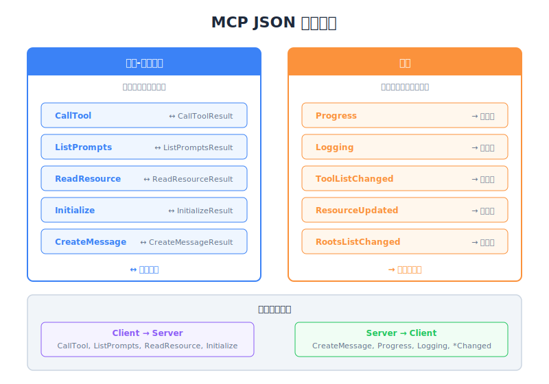

# JSON Message Types — Engineering Deep Dive

| Item | Detail |
|------|--------|
| Exam Domain | D2 — Tool Design & MCP Integration (18%) |
| Task Statements | 2.4 (client-server communication patterns), 2.6 (MCP protocol specification) |
| Source | model-context-protocol-advanced-topics / 02-roots-and-messages / Lesson 10 |

---

## One-Liner

所有 MCP 通信使用 JSON 消息，分为两类：Request-Result 配对（双向、期望响应）和 Notification（单向、fire-and-forget），形成 client 和 server 都能主动发起通信的双向协议。

---




## 两类消息

MCP 中每个消息都属于两类之一：

| 类别 | 模式 | 期望响应？ | 示例 |
|------|------|----------|------|
| **Request-Result** | 发送者送出 request，接收者返回 result | 是 | CallToolRequest/Result, ListPromptsRequest/Result |
| **Notification** | 发送者送出，结束 | 否 | ProgressNotification, LoggingNotification |

这个区别是根本性的 — 它决定了你如何设计错误处理、超时和消息排序。

---

## Request-Result 配对

Request 总是配对一个 Result 类型。发送者 block（或 await）直到 result 到达。

### 常见 Request-Result 配对

| Request | Result | 发起者 | 用途 |
|---------|--------|--------|------|
| `CallToolRequest` | `CallToolResult` | Client | 在 server 上执行 tool |
| `ListPromptsRequest` | `ListPromptsResult` | Client | 发现可用 prompts |
| `ReadResourceRequest` | `ReadResourceResult` | Client | 读取 server resource |
| `InitializeRequest` | `InitializeResult` | Client | 建立连接、协商 capabilities |
| `CreateMessageRequest` | `CreateMessageResult` | Server | Sampling — 请 client 调用 LLM |
| `ListRootsRequest` | `ListRootsResult` | Server | 发现 client 的核准目录 |

```json
// 示例：CallToolRequest
{
  "jsonrpc": "2.0",
  "id": 1,
  "method": "tools/call",
  "params": {
    "name": "search_files",
    "arguments": {
      "query": "config.yaml"
    }
  }
}

// 示例：CallToolResult
{
  "jsonrpc": "2.0",
  "id": 1,
  "result": {
    "content": [
      {
        "type": "text",
        "text": "Found config.yaml at /project/config.yaml"
      }
    ]
  }
}
```

注意 `id` 字段 — 它关联 request 和对应的 result（JSON-RPC 2.0 标准）。

---

## Notifications

Notification 是 fire-and-forget。没有 `id` 字段，不期望响应。

### 常见 Notifications

| Notification | 发送者 | 用途 |
|-------------|--------|------|
| `ProgressNotification` | Server | 汇报 tool 执行进度 |
| `LoggingMessageNotification` | Server | 发送 log 消息给 client |
| `ToolListChangedNotification` | Server | 通知 client 可用 tools 已变更 |
| `ResourceUpdatedNotification` | Server | 通知 client resource 已修改 |
| `RootsListChangedNotification` | Client | 通知 server roots 已更新 |

```json
// 示例：ProgressNotification（没有 "id" 字段）
{
  "jsonrpc": "2.0",
  "method": "notifications/progress",
  "params": {
    "progressToken": "task-123",
    "progress": 75,
    "total": 100
  }
}
```

与 request 的关键差异：**没有 `id` 字段** = notification。

---

## 双向协议

MCP 是双向的 — 两端都能发起通信：

```
Client                          Server
  |                               |
  |-- InitializeRequest --------->|  (Client 发起)
  |<-- InitializeResult ----------|
  |                               |
  |-- CallToolRequest ----------->|  (Client 发起)
  |<-- ProgressNotification ------|  (Server 推送)
  |<-- LoggingNotification -------|  (Server 推送)
  |<-- CallToolResult ------------|
  |                               |
  |<-- CreateMessageRequest ------|  (Server 发起 — sampling！)
  |-- CreateMessageResult ------->|
  |                               |
  |-- RootsListChanged ---------->|  (Client 推送 notification)
```

这不同于简单的 HTTP API（只有 client 发起）。MCP 中双方都是 peer。

---

## 规格文件

MCP 规格在 GitHub 上以 **TypeScript** 撰写。重要背景：

- TypeScript 用于 **类型描述**，非执行
- 规格定义消息结构，非实现语言
- Server 可用任何语言撰写（Python, Go, Rust 等）
- TypeScript 类型作为所有实现的标准参考

```typescript
// 来自规格 — 定义结构，非运行期代码
interface CallToolRequest {
  method: "tools/call";
  params: {
    name: string;
    arguments?: Record<string, unknown>;
  };
}
```

---

## Client vs. Server 消息

理解哪端发送什么：

| Client 发送（给 Server） | Server 发送（给 Client） |
|-------------------------|-------------------------|
| `InitializeRequest` | `InitializeResult` |
| `CallToolRequest` | `CallToolResult` |
| `ListPromptsRequest` | `ListPromptsResult` |
| `ReadResourceRequest` | `ReadResourceResult` |
| `RootsListChangedNotification` | `ProgressNotification` |
| `CreateMessageResult`（响应） | `CreateMessageRequest`（sampling） |
| | `LoggingMessageNotification` |
| | `ToolListChangedNotification` |

---

## 为什么 Transport 选择重要

理解消息类型对选择正确 transport 至关重要：

| Transport | 支持双向？ | 支持 Notification？ |
|-----------|----------|-------------------|
| **stdio** | 是（stdin/stdout） | 是 |
| **SSE** | 是（HTTP POST + SSE stream） | 是 |
| **Streamable HTTP** | 是 | 是 |

所有 MCP transport 都必须支持双向通信，因为协议本质就是双向的。

> **Key Insight**
> MCP 不是 REST API。它是在 transport 层之上的 peer-to-peer 协议。Client 和 server 都可以发送 request 和 notification。理解这个双向本质对设计稳健的 MCP 集成至关重要 — 你必须处理两个方向的传入消息。

---

## CCA Exam Relevance

- **D2 Task 2.4**：Client-server communication patterns — 两类消息定义了协议
- **D2 Task 2.6**：MCP 协议规格 — 知道它用 TypeScript 做类型描述
- 预期考题区分 Request（有 `id`，期望响应）和 Notification（无 `id`，fire-and-forget）
- 知道每端可以发送哪些消息 — sampling 翻转了典型方向
- 核心考试哲学：**理解协议** — 消息类型决定错误处理、超时和 transport 需求

---

## Flashcards

| Front | Back |
|-------|------|
| MCP 消息分为哪两类？ | Request-Result 配对（双向、期望响应）和 Notification（单向、fire-and-forget） |
| JSON 中如何区分 Request 和 Notification？ | Request 有 `id` 字段；Notification 没有 |
| MCP 是单向还是双向？ | 双向 — client 和 server 都能发起 request 和 notification |
| MCP 规格用什么语言撰写？ | TypeScript — 用于类型描述，非执行 |
| 举一个 server 发起 request 的例子？ | `CreateMessageRequest`（sampling）— server 请 client 调用 LLM |
| Server 的 tool 清单变更时发送什么 notification？ | `ToolListChangedNotification` |
| MCP 使用哪个 JSON-RPC 版本？ | JSON-RPC 2.0 |
| 为什么 MCP transport 必须支持双向通信？ | 因为 client 和 server 都能发起 request（如 client 调用 tool，server 请求 sampling） |
