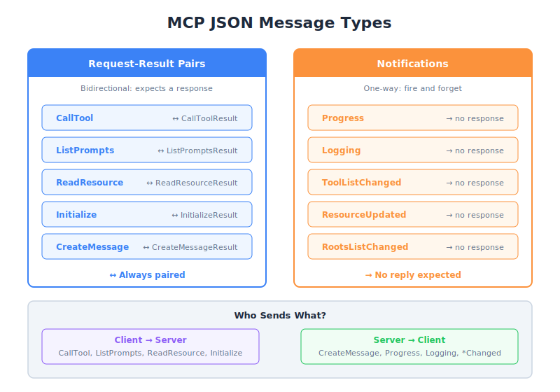

# JSON Message Types — PM Perspective

| Item | Detail |
|------|--------|
| Exam Domain | D2 — Tool Design & MCP Integration (18%) |
| Task Statements | 2.4 (client-server communication patterns), 2.6 (MCP protocol specification) |
| Source | model-context-protocol-advanced-topics / 02-roots-and-messages / Lesson 10 |

---

## One-Liner

MCP communication uses two types of JSON messages — conversations (request-response) and announcements (notifications) — in a bidirectional protocol where both client and server can start talking.

---

## Mental Model: Walkie-Talkies vs. Loudspeakers

| Message Type | Analogy | Behavior |
|-------------|---------|----------|
| **Request-Result** | Walkie-talkie conversation | "Do you copy?" ... "Copy that, here's the info" |
| **Notification** | Loudspeaker announcement | "Attention: progress at 50%" (no response needed) |

The key difference: walkie-talkie messages wait for a reply; loudspeaker announcements do not.

---

## Why PMs Need to Understand Message Types

You do not need to read JSON, but you need to understand the implications:

### 1. Error Handling Requirements

- **Request-Result**: If the response never comes, your product must handle timeouts and retries
- **Notification**: If it is lost, nothing breaks — but the user misses a status update

This affects your acceptance criteria for reliability.

### 2. Product Architecture Decisions

- Knowing MCP is **bidirectional** means your server is not just a passive tool provider — it can actively request things from the client (like sampling)
- This opens product possibilities that simple request-response APIs cannot support

### 3. Transport Selection

Different deployment environments support different transports. Understanding message types helps evaluate which transport fits your product.

---

## The Two Message Categories

### Category 1: Request-Result (Conversations)

Someone asks a question, someone answers.

| Who Asks | What They Ask | Who Answers |
|----------|-------------|-------------|
| Client | "Run this tool" (CallTool) | Server |
| Client | "What tools do you have?" (ListTools) | Server |
| Client | "Give me this resource" (ReadResource) | Server |
| Client | "Let's connect" (Initialize) | Server |
| Server | "Please call Claude for me" (CreateMessage — sampling) | Client |
| Server | "What directories can I access?" (ListRoots) | Client |

Notice that **both sides can ask questions**. This is what makes MCP bidirectional.

### Category 2: Notifications (Announcements)

Someone shares information. No response expected.

| Who Announces | What They Say |
|--------------|---------------|
| Server | "Progress: 50% complete" |
| Server | "Log: Searching database..." |
| Server | "My tool list has changed" |
| Server | "A resource was updated" |
| Client | "My root directories changed" |

---

## Bidirectional: Both Sides Talk

This is the critical architectural insight. MCP is NOT like a web API where only the client initiates:

| Traditional API | MCP Protocol |
|----------------|--------------|
| Client sends request | Client sends request |
| Server responds | Server responds |
| Server cannot initiate | **Server CAN initiate** (sampling, root queries) |
| One-way relationship | **Peer-to-peer relationship** |

> **Key Insight**
> MCP is a two-way street. As a PM, this means you can design product features where the server proactively asks for things — like requesting the client to summarize data via sampling. This is a capability that REST APIs do not natively support.

---

## The Specification Is in TypeScript

The official MCP specification lives on GitHub and is written in TypeScript. Key points for PMs:

- TypeScript is used to **describe data shapes** (like a schema), not as a required language
- Servers and clients can be built in **any language** (Python, Go, JavaScript, Rust)
- The spec is the **source of truth** for what messages look like
- When engineers debate "what fields does this message have?" — the spec is the answer

---

## Product Implications of Each Message Type

| Message Type | Product Implication | PM Concern |
|-------------|-------------------|------------|
| CallToolRequest/Result | Core tool execution | Must define timeouts and error states |
| InitializeRequest/Result | Connection setup | Defines supported capabilities upfront |
| CreateMessageRequest/Result | Sampling (server uses AI) | Cost shifts to client — pricing impact |
| ProgressNotification | UX during long operations | Must design loading states |
| LoggingNotification | Debugging and monitoring | Must define log retention policy |
| ToolListChangedNotification | Dynamic tool discovery | UI must handle tool list updates |

---

## Common Exam Scenarios

### Scenario: Message Lost During Transport

Q: "A progress notification is lost during transmission. What happens?"
A: Nothing breaks — the user misses one status update but the tool continues working. Notifications are fire-and-forget.

Q: "A CallToolResult is lost during transmission. What happens?"
A: The client times out and must retry. Request-Result pairs require responses — a missing result is a failure.

This distinction is frequently tested.

---

## CCA Exam Relevance

- **D2 Task 2.4**: Communication patterns — know the two categories and which side sends what
- **D2 Task 2.6**: Protocol specification — know it is in TypeScript, used for type description
- Key distinction: Requests have an `id` field, Notifications do not
- Know that MCP is bidirectional — server can initiate requests (sampling, list_roots)
- Exam philosophy: **Protocol literacy** — understanding message types informs error handling and architecture

---

## Flashcards

| Front | Back |
|-------|------|
| What are the two categories of MCP messages? | Request-Result pairs (expect a response) and Notifications (fire-and-forget) |
| How does a Request differ from a Notification in the protocol? | Requests have an `id` field and expect a response; Notifications have no `id` and expect nothing back |
| Is MCP a client-only-initiates protocol? | No — it is bidirectional; both client and server can initiate requests |
| What is the MCP specification written in? | TypeScript — for type description, not as a required implementation language |
| What happens if a Notification is lost? | Nothing breaks — the recipient misses an informational update but functionality continues |
| What happens if a Request Result is lost? | The sender must handle the timeout and potentially retry — it is a failure scenario |
| Give an example of a server-initiated request. | CreateMessageRequest (sampling) — the server asks the client to call Claude |
| Why does transport choice matter for MCP? | All transports must support bidirectional communication because both sides can initiate messages |
