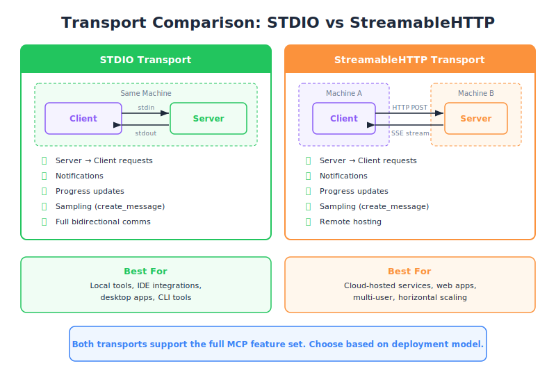

# The STDIO Transport — Engineering Deep Dive

| Item | Detail |
|------|--------|
| Exam Domain | D2 — Tool Design & MCP Integration (18%) |
| Task Statements | 2.1 (MCP transport selection), 2.3 (server lifecycle management) |
| Source | model-context-protocol-advanced-topics / 03-transports / Lesson 11 |

---

## One-Liner

Stdio transport runs an MCP server as a local subprocess, using stdin/stdout for fully bidirectional JSON-RPC message exchange with a three-phase handshake.

---




## What Is a Transport?

A transport is the **communication channel** through which JSON-RPC messages flow between an MCP client and server. Think of it as the pipe — the protocol defines the message format, the transport defines how those messages physically move.

Stdio is the **simplest and most capable** transport in the MCP specification.

---

## How Stdio Works

The client **launches the server as a child process** (subprocess). Once running:

- Client writes JSON-RPC messages to the server's **stdin**
- Server writes JSON-RPC messages to its **stdout**
- Both sides can send messages **at any time** (fully bidirectional)

```
┌────────┐   stdin    ┌────────┐
│ Client │ ─────────→ │ Server │
│        │ ←───────── │        │
└────────┘   stdout   └────────┘
     (same machine, subprocess)
```

> 💡 **Key Insight**
> Stdio only works when client and server are on the **same machine**. The client must be able to spawn the server process directly. This is a hard constraint — no remote hosting possible.

---

## The Three-Message Handshake

Before any tool calls or resource reads, client and server negotiate capabilities:

| Step | Direction | Message Type | Purpose |
|------|-----------|-------------|---------|
| 1 | Client → Server | Initialize Request | Client declares protocol version + capabilities |
| 2 | Server → Client | Initialize Result | Server responds with its capabilities |
| 3 | Client → Server | Initialized Notification | Client confirms — handshake complete |

After step 3, the connection is live and both sides can freely exchange messages.

```python
# Conceptual handshake flow
client.send({"jsonrpc": "2.0", "method": "initialize", "params": {...}})
response = server.receive()  # Initialize Result
client.send({"jsonrpc": "2.0", "method": "notifications/initialized"})
# Now ready for tool calls
```

---

## Four Communication Patterns

Once initialized, Stdio supports all four MCP communication patterns:

| Pattern | Direction | Example |
|---------|-----------|---------|
| Client → Server Request | Client asks server | `tools/call`, `resources/read` |
| Server → Client Response | Server answers | Tool result, resource content |
| Server → Client Request | Server asks client | `sampling/createMessage`, `roots/list` |
| Client → Server Response | Client answers | Sampling result, root list |

This is **full bidirectional MCP** — no features are restricted.

> 💡 **Key Insight**
> Stdio is the only transport that natively supports all four patterns without workarounds. This makes it the **baseline reference** for MCP capability.

---

## When to Use Stdio

| Use Case | Fit |
|----------|-----|
| Local development & testing | Excellent |
| IDE integrations (VS Code, Claude Code) | Excellent |
| CI/CD pipelines | Good |
| Production remote servers | Not possible |
| Multi-user access | Not possible |

Stdio is ideal when the client can directly spawn and manage the server process.

---

## CCA Exam Relevance

- **Transport selection questions**: Stdio = same machine, full capability. If the question mentions "remote" or "scaling", Stdio is wrong.
- **Handshake sequence**: Know the three steps in order — Initialize Request, Initialize Result, Initialized Notification.
- **Capability comparison**: Stdio supports ALL MCP features. Other transports trade features for remote access.
- Exam philosophy: **Stdio is the baseline** — understand what it supports, then learn what other transports sacrifice.

---

## Flashcards

| Front | Back |
|-------|------|
| What is a transport in MCP? | The communication channel for JSON-RPC message exchange between client and server |
| How does Stdio transport physically connect client and server? | Client spawns server as subprocess; messages flow via stdin (client→server) and stdout (server→client) |
| What are the three handshake messages in order? | 1) Initialize Request (client→server) 2) Initialize Result (server→client) 3) Initialized Notification (client→server) |
| Can Stdio transport work across different machines? | No — client must spawn server as a local subprocess on the same machine |
| How many communication patterns does Stdio support? | Four: client→server request, server→client response, server→client request, client→server response |
| What makes Stdio the "baseline" transport? | It supports full bidirectional MCP with zero feature restrictions |
| When is Stdio the wrong choice? | When you need remote hosting, horizontal scaling, or multi-user access |
| What happens after the Initialized Notification is sent? | The connection is live — both sides can freely exchange messages |
