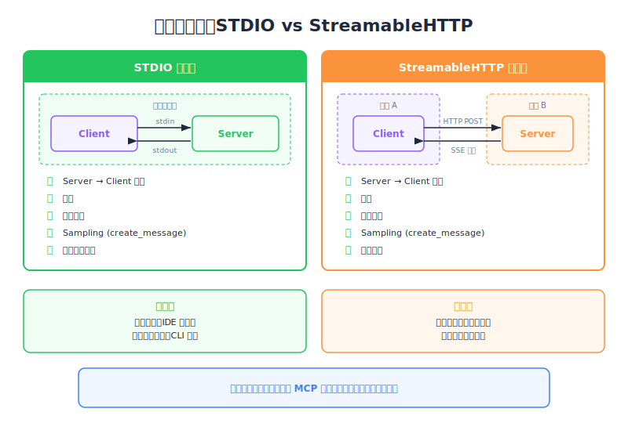

# The STDIO Transport — Engineering Deep Dive

| Item | Detail |
|------|--------|
| Exam Domain | D2 — Tool Design & MCP Integration (18%) |
| Task Statements | 2.1 (MCP transport 选择), 2.3 (server 生命周期管理) |
| Source | model-context-protocol-advanced-topics / 03-transports / Lesson 11 |

---

## One-Liner

Stdio transport 将 MCP server 作为本地 subprocess 执行，通过 stdin/stdout 进行完全双向的 JSON-RPC 消息交换，并使用三步 handshake 建立连接。

---




## 什么是 Transport？

Transport 是 JSON-RPC 消息在 MCP client 和 server 之间流动的**通信通道**。Protocol 定义消息格式，transport 定义消息如何物理传输。

Stdio 是 MCP 规范中**最简单且功能最完整**的 transport。

---

## Stdio 运作方式

Client **将 server 作为 child process（subprocess）启动**。启动后：

- Client 将 JSON-RPC 消息写入 server 的 **stdin**
- Server 将 JSON-RPC 消息写入其 **stdout**
- 双方可以**随时**发送消息（完全双向）

```
┌────────┐   stdin    ┌────────┐
│ Client │ ─────────→ │ Server │
│        │ ←───────── │        │
└────────┘   stdout   └────────┘
     （同一台机器，subprocess）
```

> 💡 **Key Insight**
> Stdio 只能在 client 和 server 位于**同一台机器**时运作。Client 必须能直接 spawn server process。这是硬性限制 — 无法远程托管。

---

## 三步 Handshake

在任何 tool call 或 resource read 之前，client 和 server 需要协商 capabilities：

| 步骤 | 方向 | 消息类型 | 用途 |
|------|------|---------|------|
| 1 | Client → Server | Initialize Request | Client 声明 protocol 版本 + capabilities |
| 2 | Server → Client | Initialize Result | Server 回应其 capabilities |
| 3 | Client → Server | Initialized Notification | Client 确认 — handshake 完成 |

步骤 3 之后，连接正式建立，双方可自由交换消息。

```python
# Handshake 概念流程
client.send({"jsonrpc": "2.0", "method": "initialize", "params": {...}})
response = server.receive()  # Initialize Result
client.send({"jsonrpc": "2.0", "method": "notifications/initialized"})
# 现在可以开始 tool call
```

---

## 四种通信模式

初始化完成后，Stdio 支持所有四种 MCP 通信模式：

| 模式 | 方向 | 示例 |
|------|------|------|
| Client → Server Request | Client 向 server 发起请求 | `tools/call`、`resources/read` |
| Server → Client Response | Server 回应 | Tool 结果、resource 内容 |
| Server → Client Request | Server 向 client 发起请求 | `sampling/createMessage`、`roots/list` |
| Client → Server Response | Client 回应 | Sampling 结果、root 列表 |

这是**完整的双向 MCP** — 没有任何功能限制。

> 💡 **Key Insight**
> Stdio 是唯一原生支持所有四种模式的 transport，不需要任何 workaround。这使其成为 MCP 能力的**基准参考**。

---

## 何时使用 Stdio

| 使用场景 | 适合度 |
|---------|--------|
| 本地开发与测试 | 极佳 |
| IDE 集成（VS Code、Claude Code） | 极佳 |
| CI/CD pipeline | 良好 |
| Production 远程 server | 不可能 |
| 多用户访问 | 不可能 |

---

## CCA 考试重点

- **Transport 选择题**：Stdio = 同一台机器、完整功能。题目提到 "remote" 或 "scaling" → Stdio 就是错的。
- **Handshake 顺序**：三步骤必须按顺序 — Initialize Request、Initialize Result、Initialized Notification。
- **能力比较**：Stdio 支持所有 MCP 功能。其他 transport 以功能换取远程访问。
- 考试哲学：**Stdio 是基准线** — 先理解它支持什么，再学其他 transport 牺牲了什么。

---

## Flashcards

| Front | Back |
|-------|------|
| MCP 中的 transport 是什么？ | Client 与 server 之间 JSON-RPC 消息交换的通信通道 |
| Stdio transport 如何物理连接 client 和 server？ | Client 将 server 作为 subprocess spawn；消息通过 stdin（client→server）和 stdout（server→client）传输 |
| 三步 handshake 的顺序是？ | 1) Initialize Request (client→server) 2) Initialize Result (server→client) 3) Initialized Notification (client→server) |
| Stdio transport 能跨机器运作吗？ | 不能 — client 必须在同一台机器上将 server 作为本地 subprocess spawn |
| Stdio 支持几种通信模式？ | 四种：client→server request、server→client response、server→client request、client→server response |
| 为什么 Stdio 被称为「基准」transport？ | 因为它支持完整的双向 MCP，没有任何功能限制 |
| 什么时候不应该选 Stdio？ | 需要远程托管、水平扩展或多用户访问时 |
| Initialized Notification 发送后会发生什么？ | 连接正式建立 — 双方可以自由交换消息 |
