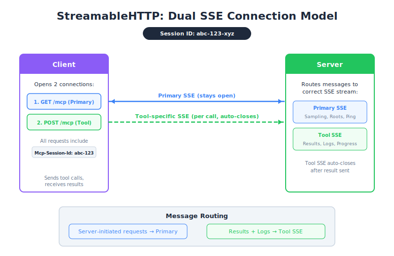

# StreamableHTTP In Depth — PM Perspective

| Item | Detail |
|------|--------|
| Exam Domain | D2 — Tool Design & MCP Integration (18%) |
| Task Statements | 2.1 (MCP transport selection), 2.4 (remote server configuration), 2.5 (SSE streaming patterns) |
| Source | model-context-protocol-advanced-topics / 03-transports / Lesson 13 |

---

## One-Liner

SSE is like giving the server a walkie-talkie back to the client — a workaround that partially restores the "server can talk first" capability that HTTP normally blocks.

---




## The Walkie-Talkie Analogy

Recall the reception desk from Lesson 12:
- HTTP = receptionist stuck at the desk, can only respond to visitors
- **SSE** = the receptionist gets a walkie-talkie. Visitors leave a radio channel open, and the receptionist can push updates whenever needed

But there's a twist: the server gets **two walkie-talkie channels**, not one.

---

## Two Channels, Two Purposes

### Channel 1: The General Broadcast (Primary SSE)

- Always on, runs for the entire session
- Server pushes **general announcements**: "I need you to approve something" or "What files are in your workspace?"
- Business analogy: the office intercom system

### Channel 2: Task-Specific Updates (Tool SSE)

- Opens when a specific task starts, closes when it finishes
- Server pushes **task progress**: "50% done", "Found 3 results", "Here's the final answer"
- Business analogy: a dedicated phone line for a specific project meeting

```
General Broadcast (always on)
├── "I need approval for this action"
├── "What workspace files do you have?"
└── (stays open...)

Task Channel #1 (tool call A)
├── "Processing... 25%"
├── "Processing... 75%"
├── "Here's the result"
└── (auto-closes)

Task Channel #2 (tool call B)
├── "Starting analysis..."
├── "Complete - here's your report"
└── (auto-closes)
```

> 💡 **Key Insight**
> This dual-channel design is why a remote MCP server can show progress bars for individual tasks AND handle approval requests simultaneously. Without SSE, neither would be possible over HTTP.

---

## What This Means for Product Features

| Feature | Requires Which Channel | Works With SSE? |
|---------|----------------------|----------------|
| Progress bars for tool calls | Tool SSE | Yes |
| Real-time log streaming | Tool SSE | Yes |
| Server-initiated approval flows | Primary SSE | Yes |
| Server-side AI reasoning (sampling) | Primary SSE | Yes |
| Basic tool call + response | Neither (plain HTTP) | Always works |

### The Setup Cost

SSE requires:
1. A **session ID** system (server must track clients)
2. A persistent **GET connection** (client keeps a channel open)
3. Proper **message routing** (server sends the right message to the right channel)

This is more infrastructure complexity than basic HTTP.

---

## How Configuration Flags Kill SSE

| Flag | What Dies | Product Impact |
|------|-----------|---------------|
| `stateless_http=true` | Primary SSE channel (no sessions) | No approval flows, no sampling — server becomes "ask-only" |
| `json_response=true` | All SSE channels (no streaming) | No progress bars, no real-time logs — users just wait for final result |
| Both enabled | Everything SSE-related | Back to basic HTTP: ask question, get answer. That's it. |

---

## PM Decision: Is SSE Worth the Complexity?

| If Your Product Needs... | SSE Required? | Complexity Cost |
|--------------------------|---------------|----------------|
| Progress indicators for long operations | Yes | Moderate — need session management |
| Server-initiated human approval | Yes | Moderate — need primary SSE channel |
| Simple tool calls with immediate results | No | Keep it simple, skip SSE |
| Real-time streaming of results | Yes | Moderate — tool SSE channels |
| Maximum scalability | No — SSE makes scaling harder | Consider stateless mode |

---

## The Connection Lifecycle (Simplified)

1. **Setup**: Client and server handshake, get session ID
2. **Open general channel**: Client opens persistent SSE connection
3. **Work**: Each tool call opens its own temporary SSE channel
4. **Cleanup**: Tool channels auto-close; general channel stays until session ends

---

## CCA Exam Relevance

- **Architecture questions**: Know the two SSE channel types and their purposes. Primary = server-initiated. Tool = per-call progress.
- **Message routing**: "Where does a progress notification go?" → Tool SSE. "Where does a sampling request go?" → Primary SSE.
- **Flag impact**: `stateless_http` kills primary SSE. `json_response` kills all SSE. Both = no SSE at all.
- **Trade-off framing**: SSE partially restores server→client capability. It is a workaround, not a complete solution.

---

## Flashcards

| Front | Back |
|-------|------|
| What is SSE in the context of MCP? | A workaround that gives the server a persistent channel to push messages to the client over HTTP |
| What are the two SSE channel types? | Primary SSE (general, persistent, server-initiated messages) and Tool SSE (per-call, temporary, progress/results) |
| What business feature does Primary SSE enable? | Server-initiated approval flows and sampling — the server can ask the client for input |
| What business feature does Tool SSE enable? | Progress bars and real-time logs for individual tool calls |
| What is a session ID used for? | Linking the persistent GET SSE connection to POST requests from the same client |
| Which flag kills the Primary SSE channel? | `stateless_http=true` — no sessions means no persistent server→client channel |
| Which flag kills all SSE streaming? | `json_response=true` — returns only final JSON, no streaming at all |
| Is SSE a complete solution for server→client communication? | No — it is a partial workaround. Full bidirectional communication only exists in Stdio transport |
