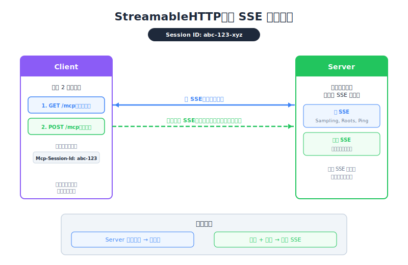

# StreamableHTTP In Depth — PM Perspective

| Item | Detail |
|------|--------|
| Exam Domain | D2 — Tool Design & MCP Integration (18%) |
| Task Statements | 2.1 (MCP transport 選擇), 2.4 (遠端 server 配置), 2.5 (SSE streaming 模式) |
| Source | model-context-protocol-advanced-topics / 03-transports / Lesson 13 |

---

## One-Liner

SSE 就像給 server 一支對講機回 client — 一個 workaround，部分恢復了 HTTP 通常阻擋的「server 可以先開口」的能力。

---




## 對講機類比

回想 Lesson 12 的服務櫃台：
- HTTP = 櫃台人員被固定在櫃台，只能回應來訪者
- **SSE** = 櫃台人員拿到一支對講機。訪客留下一個無線電頻道，櫃台人員隨時可以推送更新

但有個關鍵：server 拿到**兩個對講機頻道**，而非一個。

---

## 兩個頻道，兩個用途

### 頻道 1：通用廣播（Primary SSE）

- 全程開啟，持續整個 session
- Server 推送**通用公告**：「我需要你批准某件事」或「你的 workspace 有哪些檔案？」
- 商業類比：辦公室廣播系統

### 頻道 2：任務專屬更新（Tool SSE）

- 特定任務開始時開啟，完成時關閉
- Server 推送**任務進度**：「完成 50%」、「找到 3 個結果」、「這是最終答案」
- 商業類比：特定專案會議的專線電話

```
通用廣播（一直開著）
├── 「我需要批准這個動作」
├── 「你的 workspace 有哪些檔案？」
└── （持續開啟...）

任務頻道 #1（tool call A）
├── 「處理中... 25%」
├── 「處理中... 75%」
├── 「這是結果」
└── （自動關閉）

任務頻道 #2（tool call B）
├── 「開始分析...」
├── 「完成 — 這是你的報告」
└── （自動關閉）
```

> 💡 **Key Insight**
> 這種雙頻道設計是遠端 MCP server 能同時顯示個別任務進度條 AND 處理批准請求的原因。沒有 SSE，HTTP 上兩者都不可能。

---

## 對產品功能的意義

| 功能 | 需要哪個頻道 | 有 SSE 能用嗎？ |
|------|------------|---------------|
| Tool call 的進度條 | Tool SSE | 可以 |
| 即時 log streaming | Tool SSE | 可以 |
| Server 發起的批准流程 | Primary SSE | 可以 |
| Server 端 AI 推理（sampling） | Primary SSE | 可以 |
| 基本 tool call + 回應 | 都不需要（純 HTTP） | 永遠可以 |

### 建置成本

SSE 需要：
1. **Session ID** 系統（server 必須追蹤 client）
2. 持久的 **GET 連線**（client 保持一個頻道開啟）
3. 正確的**訊息路由**（server 將正確訊息送到正確頻道）

這比基本 HTTP 有更多基礎架構複雜度。

---

## 配置旗標如何殺死 SSE

| 旗標 | 什麼會死 | 產品影響 |
|------|---------|---------|
| `stateless_http=true` | Primary SSE 頻道（無 session） | 無批准流程、無 sampling — server 變成「只能被問」 |
| `json_response=true` | 所有 SSE 頻道（無 streaming） | 無進度條、無即時 log — 使用者只能等最終結果 |
| 兩者都啟用 | 所有 SSE 相關功能 | 回到基本 HTTP：問問題、得答案。就這樣。 |

---

## PM 決策：SSE 值得增加的複雜度嗎？

| 如果你的產品需要... | 需要 SSE？ | 複雜度成本 |
|-------------------|----------|----------|
| 長時間操作的進度指示器 | 需要 | 中等 — 需要 session 管理 |
| Server 發起的人工批准 | 需要 | 中等 — 需要 primary SSE 頻道 |
| 簡單 tool call 加即時結果 | 不需要 | 保持簡單，跳過 SSE |
| 結果的即時串流 | 需要 | 中等 — tool SSE 頻道 |
| 最大可擴展性 | 不需要 — SSE 讓擴展更難 | 考慮 stateless 模式 |

---

## CCA 考試重點

- **架構題**：知道兩種 SSE 頻道類型及其用途。Primary = server-initiated。Tool = per-call progress。
- **訊息路由**：「Progress notification 去哪裡？」→ Tool SSE。「Sampling request 去哪裡？」→ Primary SSE。
- **旗標影響**：`stateless_http` 殺死 primary SSE。`json_response` 殺死所有 SSE。兩者 = 完全沒有 SSE。
- **取捨框架**：SSE 部分恢復 server→client 能力。它是 workaround，不是完整解決方案。

---

## Flashcards

| Front | Back |
|-------|------|
| SSE 在 MCP 的背景下是什麼？ | 一個 workaround，給 server 一個持久頻道透過 HTTP 向 client 推送訊息 |
| 兩種 SSE 頻道類型是？ | Primary SSE（通用、持久、server-initiated 訊息）和 Tool SSE（per-call、暫時、progress/結果） |
| Primary SSE 支援什麼商業功能？ | Server 發起的批准流程和 sampling — server 可以向 client 請求輸入 |
| Tool SSE 支援什麼商業功能？ | 個別 tool call 的進度條和即時 log |
| Session ID 的用途是？ | 將持久 GET SSE 連線與同一 client 的 POST 請求連結起來 |
| 哪個旗標殺死 Primary SSE 頻道？ | `stateless_http=true` — 無 session 代表無持久 server→client 頻道 |
| 哪個旗標殺死所有 SSE streaming？ | `json_response=true` — 只回傳最終 JSON，完全無 streaming |
| SSE 是 server→client 通訊的完整解決方案嗎？ | 不是 — 它是部分 workaround。完整的雙向通訊只存在於 Stdio transport |
