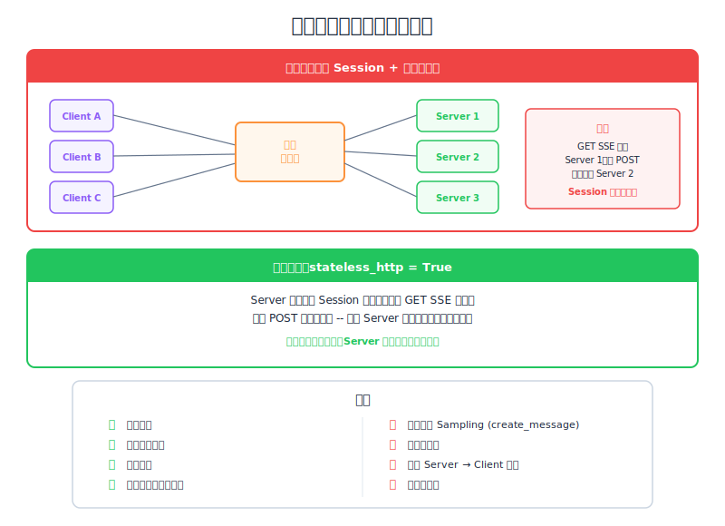

# State and the StreamableHTTP Transport — Engineering Deep Dive

| Item | Detail |
|------|--------|
| Exam Domain | D2 — Tool Design & MCP Integration (18%) |
| Task Statements | 2.1 (MCP transport 選擇), 2.4 (遠端 server 配置), 2.6 (水平擴展模式) |
| Source | model-context-protocol-advanced-topics / 03-transports / Lesson 14 |

---

## One-Liner

水平擴展產生協調問題 — 同一 client 的兩個 SSE 連線可能命中不同 server instance，`stateless_http=true` 透過完全消除狀態來解決此問題，代價是失去主要 MCP 功能。

---




## 擴展問題

當 MCP server 變得熱門時，需要水平擴展 — 多個 server instance 在 load balancer 後面。這產生根本性的協調問題：

```
                    ┌─── Instance A
Client ──→ LB ─────┤
                    ├─── Instance B
                    └─── Instance C
```

回想 Lesson 13：client 維持**兩個連線**：
1. **GET SSE**（持久，用於 server-initiated 訊息）
2. **POST request**（每次 tool call）

Load balancer 可能將它們路由到**不同 instance**：

```
Client ── GET /sse ──→ LB ──→ Instance A  （primary SSE 在這）
Client ── POST /tool ──→ LB ──→ Instance B  （tool call 在這）
```

Instance B 處理 tool call，但 Instance A 持有 SSE 連線。Instance B 如何向 client 發送 progress 更新？

> 💡 **Key Insight**
> 讓 SSE 在單一 server 上運作的雙連線架構，在擴展時變成負擔。Load balancer 不理解 MCP session 語義。

---

## 解決方案：`stateless_http=true`

終極手段：**消除所有狀態**。啟用後：

| 功能 | 狀態 |
|------|------|
| Session ID | 停用 — 無追蹤 |
| Server → Client request | 停用 — 無 CreateMessage、無 ListRoots |
| Sampling | 停用 |
| Progress notification | 停用 |
| Resource subscription | 停用 |
| Initialization handshake | **不需要** — 任何 instance 可處理任何請求 |

```python
# Stateless server — 不需要初始化
mcp_server = MCPServer(
    stateless_http=True,  # 每個請求獨立
    json_response=False,  # 仍可 per-request streaming
)
```

### 關鍵好處

不需要初始化。任何 server instance 可以獨立處理任何請求。Load balancer 直接 round-robin — 不需要 sticky session、不需要 session affinity。

---

## 解決方案：`json_response=true`

消除 streaming 的互補旗標：

| `json_response=false`（預設） | `json_response=true` |
|-------------------------------|---------------------|
| Server 透過 SSE 串流結果 | Server 回傳單一 JSON 回應 |
| Client 即時看到進度 | Client 等待完整結果 |
| 需要保持連線開啟 | 標準 HTTP request-response |

---

## 決策矩陣

| 需求 | `stateless_http` | `json_response` | 結果 |
|------|-----------------|-----------------|------|
| 完整 MCP 功能，單一 server | `false` | `false` | 透過 SSE 使用所有功能 |
| 水平擴展，保留部分 streaming | `true` | `false` | Per-request streaming，無 server-initiated |
| 最大可擴展性，簡單 API | `true` | `true` | 僅基本 request-response |
| 有 streaming 但需要 session | `false` | `false` | LB 需要 sticky session |

### 根本取捨

```
功能性 ◄─────────────────────► 可擴展性

完整 MCP          SSE workaround      Stateless         Stateless + JSON
（Stdio）        （單一 server）      （可擴展）        （最簡單）
```

---

## 失去什麼 vs 得到什麼

### `stateless_http=true` 失去的

- 無 session ID
- 無 server → client request（CreateMessage、ListRoots）
- 無 sampling 能力
- 無 progress 回報
- 無 resource subscription

### `stateless_http=true` 得到的

- 不需要 initialization handshake
- 任何 instance 處理任何請求
- 標準 load balancer 即可運作（無需 sticky session）
- 更簡單的 server 實作
- 更好的容錯性（instance 故障不會遺失 session）

---

## CCA 考試重點

- **擴展題**：知道雙連線模型與 load balancer 衝突 → `stateless_http` 是標準解決方案。
- **功能損失矩陣**：記住 `stateless_http=true` 確切停用什麼 — 這是常考目標。
- **無需初始化**：Stateless 模式完全跳過三步 handshake。
- **旗標組合**：兩者都 `true` = 最簡單的 MCP server（基本 HTTP request-response）。
- 考試哲學：**可擴展性與功能性在 MCP transport 設計中成反比**。

---

## Flashcards

| Front | Back |
|-------|------|
| StreamableHTTP 面臨什麼擴展問題？ | 來自同一 client 的兩個連線（GET SSE + POST）可能命中 load balancer 後面的不同 server instance |
| `stateless_http=true` 如何解決擴展問題？ | 消除所有狀態 — 無 session、無 SSE，任何 instance 獨立處理任何請求 |
| `stateless_http=true` 停用哪五個功能？ | Session ID、server→client request、sampling、progress notification、resource subscription |
| Stateless 模式的關鍵好處是？ | 不需要初始化 — 任何 server instance 無需事先 handshake 即可處理任何請求 |
| `json_response=true` 做什麼？ | 消除 streaming — server 回傳單一最終 JSON 回應而非 SSE 事件 |
| 最簡單的 MCP server 配置是？ | 兩者都設為 `true` — 僅基本 HTTP request-response |
| 何時應該保持兩個旗標都為 false？ | 單一 server 部署且需要完整 MCP 功能（包括 SSE、sampling 和 progress）時 |
| 什麼 load balancer 策略適用於 stateless MCP？ | Round-robin — 不需要 sticky session 或 session affinity |
