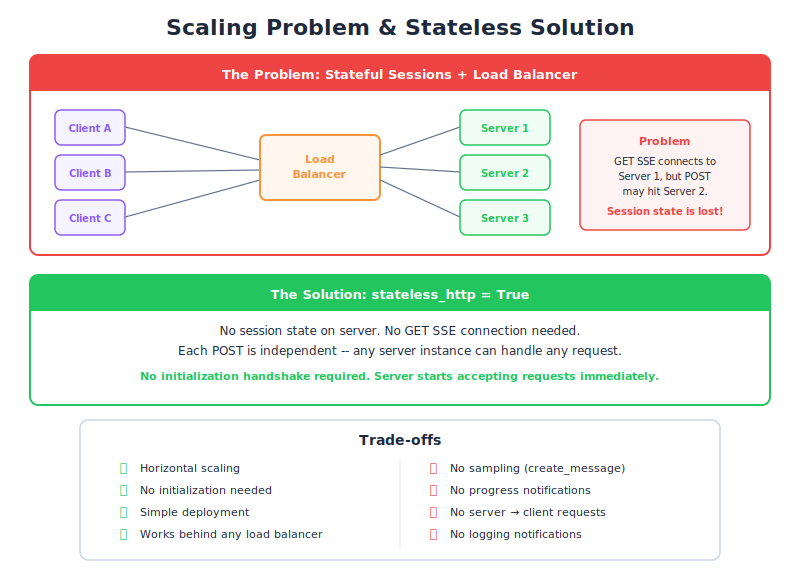

# State and the StreamableHTTP Transport — PM Perspective

| Item | Detail |
|------|--------|
| Exam Domain | D2 — Tool Design & MCP Integration (18%) |
| Task Statements | 2.1 (MCP transport selection), 2.4 (remote server configuration), 2.6 (horizontal scaling patterns) |
| Source | model-context-protocol-advanced-topics / 03-transports / Lesson 14 |

---

## One-Liner

When your MCP server gets popular and needs to scale, you face a choice: keep rich features with complex infrastructure, or go stateless for simple scaling but lose key capabilities like progress tracking and AI sampling.

---

## The Restaurant Chain Analogy

Imagine your MCP server is a restaurant:

- **Single location** (one server instance): The waiter remembers your order, can check on your food's progress, and proactively suggests dessert. Full service.
- **Chain expansion** (horizontal scaling): You open multiple locations behind a dispatcher. A customer calls for a reservation at Location A, but their food order goes to Location B. Location B has no idea about the reservation.

This is the **coordination problem** of scaling MCP servers.

---

## Why This Matters for Your Product

As your user base grows, a single MCP server instance won't handle the load. You need multiple instances behind a load balancer. But MCP's session model assumes a single server:

| What the Client Does | Which Instance Handles It |
|---------------------|--------------------------|
| Opens SSE connection (persistent) | Instance A |
| Makes a tool call (POST) | Instance B (random!) |
| Expects progress updates | Instance A has the SSE... but B has the task |

The load balancer doesn't understand MCP sessions. It just distributes requests.

> 💡 **Key Insight**
> This is not a bug — it's a fundamental tension between stateful protocols (MCP with sessions) and stateless infrastructure (HTTP load balancers). Every team building production MCP servers hits this wall.

---

## The Two Scaling Strategies

### Strategy 1: Sticky Sessions (Keep Features)

Force the load balancer to always route the same client to the same server instance.

| Pros | Cons |
|------|------|
| Keep all MCP features | Uneven load distribution |
| No code changes needed | Single point of failure per client |
| Familiar pattern | Harder to auto-scale |

### Strategy 2: Go Stateless (Easy Scaling)

Enable `stateless_http=true` — each request is independent.

| Pros | Cons |
|------|------|
| Any instance handles any request | No progress tracking |
| Standard load balancing works | No server-initiated features |
| Easy auto-scaling | No sampling (server can't call AI) |
| Better fault tolerance | No initialization = no capability negotiation |

---

## Feature Impact Summary for Stakeholders

| Feature | With State | Stateless | Business Impact |
|---------|-----------|-----------|----------------|
| Progress bars | Available | Lost | Users wait blindly during long operations |
| Sampling (AI reasoning) | Available | Lost | Server can't ask AI to help with decisions |
| Approval workflows | Available | Lost | No human-in-the-loop from server side |
| Basic tool calls | Available | Available | Core functionality preserved |
| Resource reads | Available | Available | Data access preserved |
| Auto-scaling | Complex | Simple | Infra team can use standard tools |
| Fault tolerance | Poor (session lost) | Excellent (no state to lose) | Better uptime during instance failures |

---

## When to Choose Each Approach

| Scenario | Recommended Approach |
|----------|---------------------|
| < 100 concurrent users | Single server, both flags false (full features) |
| 100-10K users, features matter | Sticky sessions (keep state) |
| 10K+ users, basic tool access | Stateless mode |
| Simple API integration | Stateless + JSON response |
| Prototype/MVP | Single server, all features |

---

## The `json_response` Flag (Bonus Simplification)

On top of stateless, you can also enable `json_response=true`:

| Without (default) | With `json_response=true` |
|-------------------|--------------------------|
| Results stream in real-time | One response at the end |
| Users see partial progress | Users wait, then get everything |
| More complex infrastructure | Standard REST API behavior |

Both flags on = the simplest possible MCP server. It's essentially a REST API with MCP message format.

---

## CCA Exam Relevance

- **Scaling scenario questions**: "MCP server behind a load balancer" → the two-connection problem → stateless is the typical answer.
- **Trade-off analysis**: Know exactly what's lost with `stateless_http=true` — five features disabled.
- **No initialization**: Stateless mode skips the handshake — any instance, any request, no setup.
- **Combined flags**: Both true = simplest server. Exam may ask "which config for maximum scalability?"
- Exam philosophy: **Scale up = feature down** in MCP transport design.

---

## Flashcards

| Front | Back |
|-------|------|
| What scaling problem does MCP face? | Two connections (SSE + POST) from one client may hit different server instances behind a load balancer |
| What is the standard solution for MCP horizontal scaling? | `stateless_http=true` — eliminates session state so any instance handles any request |
| What do users lose when you go stateless? | Progress bars, sampling, server-initiated approval flows, resource subscriptions |
| What do users keep when you go stateless? | Basic tool calls and resource reads — all client-initiated features |
| What infrastructure benefit does stateless provide? | Standard round-robin load balancing, easy auto-scaling, better fault tolerance |
| What does `json_response=true` add on top of stateless? | Eliminates streaming — just final JSON response, making it behave like a standard REST API |
| When should a PM choose sticky sessions over stateless? | When the product needs progress tracking, sampling, or approval flows and user count is manageable |
| What is the simplest possible MCP server configuration? | Both `stateless_http=true` and `json_response=true` — basic HTTP request-response with MCP message format |
