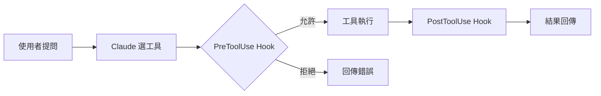

# Markdown 格式選擇指南

## Quick Reference

根據內容語境選擇 markdown 呈現方式的決策指南。

1. 觸發時先問用戶：**通用版**（emoji blockquote）或 **GitHub Alerts 版**（`[!TIP]` 語法）
2. 查「快速決策表」選格式 → 查「格式詳解」看規則 → 查「Common Mistakes」避坑
3. 通用版適用任何渲染器；GitHub Alerts 版僅限 GitHub 原生環境

| 內容類型 | 格式 | 判斷依據 |
|---------|------|---------|
| 多維度比較/屬性 | 表格 | ≥ 2 個維度可對齊 |
| 重點提醒 | Blockquote（見所選版本） | 打斷閱讀節奏 |
| 流向/分支/架構 | 圖片或 Mermaid | 文字無法表達拓撲 |
| 有順序步驟 | `1. 2. 3.` | 順序重要 |
| 平行選項 | `- - -` | 無優先級 |
| 明確 N 個 | 帶數字子標題 | 追蹤進度 |
| 概念解釋 | 一句話 + 類比表格 | 先結論再展開 |
| 程式碼 | ```` ```lang ```` | 永遠標示語言 |
| 長內容 | `<details>` 折疊 | 不打斷主線 |

---

## Parameters

| Param | Required | Description |
|-------|----------|-------------|
| format | Yes | `universal`（通用 emoji blockquote）或 `github-alerts`（GitHub 原生 alert）|

觸發此指南時，用 AskUserQuestion 詢問：

> **這份文件的目標渲染環境？**
> - **通用版**（Recommended）— VS Code / Obsidian / Notion / 任何 markdown 渲染器
> - **GitHub Alerts 版** — GitHub README / Issues / PR / Wiki

---

## When to Use / When NOT to Use

| 情境 | 使用 | 原因 |
|------|------|------|
| 撰寫技術文件、教材、README | ✅ | 格式決策指南 |
| 純程式碼註解 | ❌ | 註解不用 markdown 排版 |

---

## Execution Flow

### Step 1: 確認渲染環境

詢問用戶選擇 `universal` 或 `github-alerts`，決定提示框語法。

### Step 2: 查快速決策表選格式

根據內容類型，從 Quick Reference 表格中選擇對應格式。

### Step 3: 套用格式規則

依所選格式，查「格式詳解」中對應的 section 執行。

### Step 4: 檢查 Common Mistakes

寫完後對照 Common Mistakes 表格自查。

---

## 格式詳解（共用）

以下規則兩個版本共用，與提示框語法無關。

### 1. 表格

**適用**：多維度屬性、比較、決策矩陣、API 欄位說明。

**不適用**：
- 只有一個維度 → 清單
- 儲存格 > 2-3 行 → 子標題分段
- 步驟流程 → 有序清單（表格暗示平行）

### 2. 有序 vs 無序清單

| 情境 | 格式 | 原因 |
|------|------|------|
| 有先後的步驟 | `1. 2. 3.` | 暗示順序重要 |
| 平行的選項 | `- - -` | 暗示無優先級 |
| 明確「N 種/個」| 有序 + 數字子標題 | 追蹤進度 |
| 巢狀分類 | 無序 + 縮排 | 層級關係 |

### 3. 概念解釋

先**一句話結論**，再表格展開類比：

```markdown
Middleware 就是 HTTP pipeline 上的 **攔截器**。

| 你熟悉的技術 | 對應概念 | 行為 |
|------------|---------|------|
| Express middleware | Middleware | 在 handler 前後執行 |
```

### 4. 程式碼

| 情境 | 格式 |
|------|------|
| 完整片段/設定檔 | ```` ```language ```` |
| 行內名稱 | `` `variableName` `` |
| 終端指令 | ```` ```bash ```` |
| 輸出結果 | ```` ```text ```` |
| 差異對比 | ```` ```diff ```` |

**永遠標示語言**。長代碼（> 30 行）用 `<details>` 折疊。

### 5. 可折疊內容

`<details>` 適用於：答案解析、冗長設定、補充說明、故障排除。

### 6. 標題層級

| 層級 | 用途 |
|------|------|
| `#` H1 | 文件標題，全文一次 |
| `##` H2 | 主要章節（TOC 骨幹）|
| `###` H3 | 子節 |
| `####` H4 | 段落小標（勿超過）|

不跳級。標題不含句號。

### 7. 強調標記

| 標記 | 語意 |
|------|------|
| **粗體** | 關鍵術語首次出現、重要結論（≤ 2-3 詞/句）|
| *斜體* | 引用、外來詞 |
| ~~刪除線~~ | 已廢棄、錯誤示範 |
| `代碼` | 變數名、函式名、路徑、指令 |

### 8. 圖片 / 圖表

**適用**：Pipeline、分支決策、架構圖、時序圖、狀態機。

| 工具 | 場景 | 優點 |
|------|------|------|
| Mermaid ```` ```mermaid ```` | GitHub/GitLab 原生渲染 | 版本控制友善 |
| 外部工具（Figma、Excalidraw） | 複雜/美觀需求 | 設計自由度高 |
| nanobanana | CCA 教材專用 | 與教材風格一致 |

---

## 提示框語法：通用版（`format: universal`）

適用於任何 markdown 渲染器。

| Emoji | 語境 | 用法 |
|-------|------|------|
| 💡 | 技巧、口訣、最佳實踐 | `> 💡 **技巧名稱**` |
| ⚠️ | 踩坑、誤區、破壞性操作 | `> ⚠️ **注意**` |
| 🎯 | 核心重點、高頻考點 | `> 🎯 **重點**` |
| 📌 | 前置條件、必讀背景 | `> 📌 **前提**` |
| 🔗 | 跨文件/跨主題關聯 | `> 🔗 **延伸閱讀**` |
| 🎬 | 影片/外部資源補充 | `> 🎬 **影片補充**` |

範例：

```markdown
> 💡 **判斷口訣**
>
> 出現「must / always / guaranteed」→ deterministic 方案。
> 出現「prefer / usually」→ probabilistic 即可。
```

---

## 提示框語法：GitHub Alerts 版（`format: github-alerts`）

僅適用於 GitHub 原生渲染環境。

### Alert 類型（嚴重度遞增）

```
NOTE → TIP → IMPORTANT → WARNING → CAUTION
 ↑                                      ↑
補充說明                            不可逆風險
```

| 語境 | Alert | 原因 |
|------|-------|------|
| 背景知識、額外脈絡 | `[!NOTE]` | 可跳過 |
| 技巧、口訣、最佳實踐 | `[!TIP]` | 提升效率 |
| 前置條件、核心概念 | `[!IMPORTANT]` | 缺了會卡住 |
| 常見錯誤、易踩的坑 | `[!WARNING]` | 預防勝於修復 |
| 資料遺失、不可逆操作 | `[!CAUTION]` | 最高警戒 |

選擇原則：**用最低夠用的嚴重度**。能用 NOTE 就不用 WARNING。

### Alert 語法

```markdown
> [!NOTE]
> 補充資訊，讀者可以跳過也無妨。

> [!TIP]
> 實用建議，幫助讀者做得更好。

> [!IMPORTANT]
> 關鍵資訊，影響任務成敗。

> [!WARNING]
> 需要立即注意，可能導致問題。

> [!CAUTION]
> 風險操作，可能造成不可逆後果。
```

### Emoji → Alert 對照表

從通用版遷移到 GitHub Alerts 時，按此表轉換：

| 通用版 Emoji | GitHub Alert | 語境 |
|-------------|-------------|------|
| 💡 技巧 | `[!TIP]` | 判斷框架、口訣、最佳實踐 |
| ⚠️ 踩坑 | `[!WARNING]` | 常見錯誤、誤區 |
| 🎯 核心重點 | `[!IMPORTANT]` | 必記概念、關鍵決策 |
| 📌 前置條件 | `[!IMPORTANT]` | 必讀背景、依賴關係 |
| 🔗 延伸閱讀 | `[!NOTE]` | 跨文件關聯、補充脈絡 |
| 🎬 影片補充 | `[!NOTE]` | 外部資源、影片內容 |
| 🚨 破壞性操作 | `[!CAUTION]` | 資料遺失、不可逆後果 |

### Mermaid 圖表

GitHub 原生渲染 Mermaid，優先用 Mermaid 取代外部圖片。

| 圖表類型 | 語法 | 適用 |
|---------|------|------|
| 流程圖 | `graph TD` / `graph LR` | Pipeline、決策流程 |
| 時序圖 | `sequenceDiagram` | API 互動、多方通訊 |
| 狀態圖 | `stateDiagram-v2` | 狀態機、生命週期 |
| 甘特圖 | `gantt` | 時程規劃 |
| 類別圖 | `classDiagram` | 物件關係、資料模型 |

範例：

````markdown

````

複雜圖（> 20 節點）建議用 Figma/Excalidraw 產圖再嵌入。

---

## 文章結構範本

| 順序 | 區塊 | 推薦格式 |
|------|------|---------|
| 1 | 元資料/概覽 | 表格 |
| 2 | 一句話摘要 | 粗體關鍵詞短段落 |
| 3 | 核心概念 | 圖 + 類比表格 |
| 4 | 分項詳解 | 數字子標題 + code block + 提示框 |
| 5 | 實際應用 | 表格（情境 → 方案）|
| 6 | 注意事項 | 提示框警示 + `<details>` |
| 7 | 延伸閱讀 | 超連結清單 |

---

## Common Mistakes

| Mistake | Why it fails | Fix |
|---------|-------------|-----|
| 用表格放步驟流程 | 表格暗示平行，步驟需要順序 | 改用有序清單 |
| 用 blockquote 放正文 | 讀者誤以為引用或警示 | 普通段落 |
| 無語言標示的 code block | 無語法高亮，難以閱讀 | 加 `json`/`bash`/`python` |
| 所有重點都加粗 | 等於沒有重點 | 只粗體最關鍵的 2-3 詞 |
| 清單超過 10 項不分組 | 認知負載過高 | 用子標題分組 |
| 標題用問句 | 標題應該是答案/結論 | 改為陳述句 |
| 超連結文字寫 "click here" | 無語意、影響 accessibility | 用描述性文字 |
| 每段都放提示框 | 「聖誕樹」效應，讀者麻木 | 每 section 最多 1-2 個 |
| 用 `[!CAUTION]` 放一般提醒 | 狼來了效應（GitHub Alerts 版）| 降級到 `[!NOTE]` 或 `[!TIP]` |
| 在非 GitHub 平台用 `[!TIP]` | 渲染成純文字，失去高亮 | 改用 emoji blockquote |
| Alert 內放表格或 code block | 部分渲染器排版錯亂 | Alert 只放短文字 |
| 混用 emoji blockquote 和 GitHub alert | 風格不一致 | 同一份文件只用一種系統 |

---

## Relationship

| 相關文件 | 關係 |
|---------|------|
| CCA 教材三版（zh/pm/en） | 本指南的主要消費者 |
| GitHub Docs — [Alerts](https://docs.github.com/en/get-started/writing-on-github/getting-started-with-writing-and-formatting-on-github/basic-writing-and-formatting-syntax#alerts) | GitHub Alert 官方語法定義 |
| GitHub Docs — [Mermaid](https://docs.github.com/en/get-started/writing-on-github/working-with-advanced-formatting/creating-diagrams) | Mermaid 渲染支援 |
